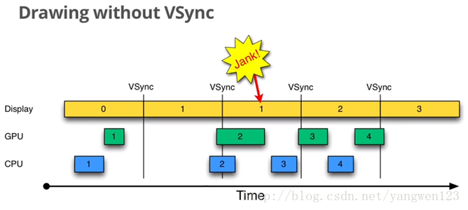
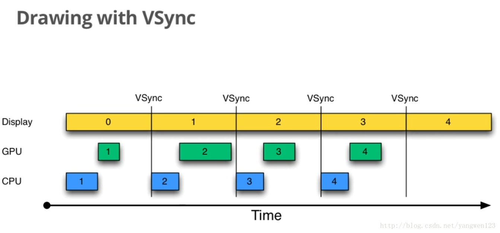
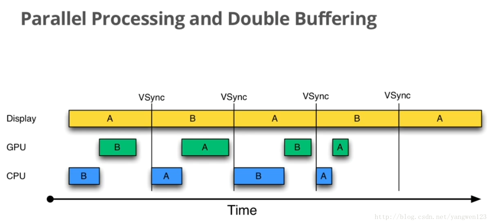
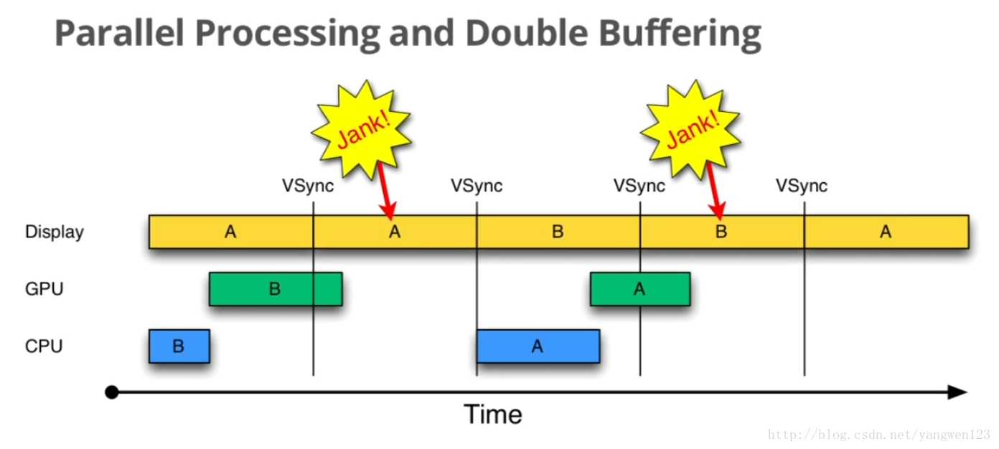
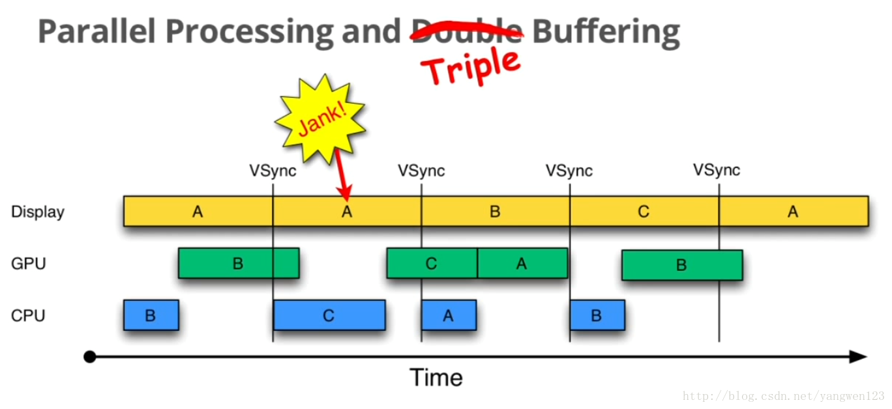

# Android 5.1 SurfaceFlinger 研究学习


## Android 图形组件


## 数据流


## EGL

build-server上, 可以看到哪些文件夹会编译出哪些库

```server
frameworks/native/opengl/libagl

Install: out/target/product/ipd8000l/system/lib/egl/libGLES_android.so


frameworks/native/opengl/libs

Install: out/target/product/ipd8000l/system/lib/libGLES_trace.so

Install: out/target/product/ipd8000l/system/lib/libEGL.so

Install: out/target/product/ipd8000l/system/lib/libGLESv1_CM.so

Install: out/target/product/ipd8000l/system/lib/libGLESv2.so

Install: out/target/product/ipd8000l/system/lib/libETC1.so

```


平台上可以找到egl相关的文件和库

```console
# ll /system/lib/egl/                                          
-rw-r--r-- root     root           21 2019-01-17 16:43 egl.cfg
-rw-r--r-- root     root        79204 2019-01-17 16:58 libGLES_android.so
-rw-r--r-- root     root      1125244 2019-01-17 16:45 libGLES_mali.so

可以看到egl.cfg中同时配置多个库, 优先级是随着航顺序而逐步递减的, 一般会把最佳实现库放在最上面
第一个数字表示显示屏编号, Android目前为止还只能支持一个, 所以这个数值必须为0
第二个数字指明是硬件库(1)还是软件库(0)
第三个参数是库的名字
# cat /system/lib/egl/egl.cfg                                  
0 0 android
0 1 mali

```


egl函数的调用流程

```cflow
egl_init_drivers@Egl.cpp 
/**
 * 开机起来会被调用多次, 分别是以下几个process, 且其中个别process还不止一次调用egl
 * /system/bin/surfaceflinger; 
 * zygote; 
 * 有一个找不到, 跑完就没了的感觉; 
 * system_server; 
 * com.android.systemui; 
 * com.grandbeing.kmediaplayer
 **/
-->
egl_init_drivers_locked@Egl.cpp
-->
Loader::Loader@Loader.cpp (加载egl.cfg)
-->
open@Loader.cpp
/**
 * 会去找/system/lib/egl/下的所有库, 没有管egl.cfg的内容, 并且还跳过了libGLES_android.so, 就相 
 * 当于肯定会用libGLES_mali.so
 * libGLES_mali.so则是厂商自己实现, 没有源码提供
 * if (!strcmp(e->d_name, "libGLES_android.so")) {
 *     // always skip the software renderer
 *     continue;
 * }
 **/
-->
load_driver@Loader.cpp (加载对应的open gl库)
```


然后egl就是hook住libGLES_mali.so里边关于EGL跟GLES的相关api实现, egl.h声明了具体的api

```c
一般且是最普通的调用flow
1. eglGetDisplay // 获取默认显示屏
2. eglInitialize(EGLDisplay) // 对EGL进行初始化
3. eglGetConfigs(EGLDisplay, EGLConfig *) // 查询当前系统中所有的配置
4. eglGetConfigAttrib
5. eglCreateWindowSurface / eglCreatePbufferSurface
6. eglCreateContext
7. eglMakeCurrent
```


通过SurfaceFlinger的init方法, 学习到EGL的初始化流程

```c
void SurfaceFlinger::init() {
    // initialize EGL for the default display
    mEGLDisplay = eglGetDisplay(EGL_DEFAULT_DISPLAY);
    eglInitialize(mEGLDisplay, NULL, NULL);
    
    // get a RenderEngine for the given display / config (can't fail)
    mRenderEngine = RenderEngine::create(mEGLDisplay, mHwc->getVisualID());
}

/**
 * 只是做了eglCreateContext, 不清楚另外的起什么作用
 **/
RenderEngine* RenderEngine::create(EGLDisplay display, int hwcFormat) {
    // Also create our EGLContext
    EGLContext ctxt = eglCreateContext(display, config, NULL, contextAttributes);
    
    EGLint attribs[] = { EGL_WIDTH, 1, EGL_HEIGHT, 1, EGL_NONE, EGL_NONE };
    EGLSurface dummy = eglCreatePbufferSurface(display, dummyConfig, attribs);
    
    EGLBoolean success = eglMakeCurrent(display, dummy, dummy, ctxt);
    
    eglMakeCurrent(display, EGL_NO_SURFACE, EGL_NO_SURFACE, EGL_NO_CONTEXT);
    eglDestroySurface(display, dummy);
}
```

 SurfaceFlinger分析起来也很复杂, 其中EGL的调用没有集中在一块, 所以也暂时没厘清关系

```console
开机log关于surfaceflinger的部分
/ # logcat | grep SurfaceFlinger
01-01 08:00:06.520  1148  1148 I SurfaceFlinger: SurfaceFlinger is starting
01-01 08:00:06.520  1148  1148 I SurfaceFlinger: SurfaceFlinger's main thread ready to run. Initializing graphics H/W...
01-01 08:00:06.696  1148  1148 I SurfaceFlinger: enable eglSwapBuffersWithDamageEXT
01-01 08:00:06.933  1148  1148 I SurfaceFlinger: Using composer version 1.4
01-01 08:00:06.935  1148  1148 I SurfaceFlinger: EGL information:
01-01 08:00:06.935  1148  1148 I SurfaceFlinger: vendor    : Android
01-01 08:00:06.935  1148  1148 I SurfaceFlinger: version   : 1.4 Android META-EGL
01-01 08:00:06.935  1148  1148 I SurfaceFlinger: extensions: EGL_KHR_get_all_proc_addresses EGL_ANDROID_presentation_time EGL_KHR_image EGL_KHR_image_base EGL_KHR_image_pixmap EGL_KHR_gl_texture_2D_image EGL_KHR_gl_texture_cubemap_image EGL_KHR_gl_renderbuffer_image EGL_KHR_fence_sync EGL_KHR_create_context EGL_EXT_create_context_robustness EGL_ANDROID_image_native_buffer EGL_ANDROID_recordable EGL_EXT_swap_buffers_with_damage 
01-01 08:00:06.935  1148  1148 I SurfaceFlinger: Client API: OpenGL_ES
01-01 08:00:06.935  1148  1148 I SurfaceFlinger: EGLSurface: 8-8-8-8, config=0x60000016
01-01 08:00:06.938  1148  1148 I SurfaceFlinger: OpenGL ES informations:
01-01 08:00:06.938  1148  1148 I SurfaceFlinger: vendor    : ARM
01-01 08:00:06.938  1148  1148 I SurfaceFlinger: renderer  : Mali-450 MP
01-01 08:00:06.938  1148  1148 I SurfaceFlinger: version   : OpenGL ES 2.0
01-01 08:00:06.938  1148  1148 I SurfaceFlinger: extensions: GL_EXT_debug_marker GL_OES_texture_npot GL_OES_vertex_array_object GL_OES_compressed_ETC1_RGB8_texture GL_EXT_compressed_ETC1_RGB8_sub_texture GL_OES_standard_derivatives GL_OES_EGL_image GL_OES_depth24 GL_ARM_rgba8 GL_ARM_mali_shader_binary GL_OES_depth_texture GL_OES_packed_depth_stencil GL_EXT_texture_format_BGRA8888 GL_OES_vertex_half_float GL_EXT_blend_minmax GL_OES_EGL_image_external GL_OES_EGL_sync GL_OES_rgb8_rgba8 GL_EXT_multisampled_render_to_texture GL_EXT_discard_framebuffer GL_OES_get_program_binary GL_ARM_mali_program_binary GL_EXT_shader_texture_lod GL_EXT_robustness GL_OES_depth_texture_cube_map GL_KHR_debug GL_ARM_shader_framebuffer_fetch GL_ARM_shader_framebuffer_fetch_depth_stencil GL_OES_mapbuffer GL_KHR_no_error
01-01 08:00:06.938  1148  1148 I SurfaceFlinger: GL_MAX_TEXTURE_SIZE = 4096
01-01 08:00:06.938  1148  1148 I SurfaceFlinger: GL_MAX_VIEWPORT_DIMS = 4096
01-01 08:00:06.941  1148  1148 I SurfaceFlinger: [AT][AN][start anim][6941]
01-01 08:00:06.943  1148  1148 D SurfaceFlinger: Set power mode=2, type=0 flinger=0xb589b000
01-01 08:00:07.004  1148  1148 D SurfaceFlinger: shader cache generated - 24 shaders in 53.853416 ms
01-01 08:00:13.005  1148  1420 D SurfaceFlinger: SurfaceFlinger::setPowerMode = 2 begin 
01-01 08:00:13.006  1148  1148 D SurfaceFlinger: Set power mode=2, type=0 flinger=0xb589b000
01-01 08:00:13.006  1148  1148 D SurfaceFlinger: Screen type=0 is already mode=2
01-01 08:00:13.006  1148  1420 D SurfaceFlinger: SurfaceFlinger::setPowerMode = 2 end 
01-01 08:00:15.311  1148  1420 I SurfaceFlinger: Boot is finished (8803 ms)
01-01 08:00:15.311  1148  1420 I SurfaceFlinger: [AT][AN][finish boot][15311]
```


## HAL

HAL就是android独特的东西, 也是跟硬件相关的东西, EGL的api最终一定会调用到HAL, 才可以让图片显示出来

### Gralloc

```server
hardware/libhardware/modules/gralloc

Install: out/target/product/ipd8000l/system/lib/hw/gralloc.default.so
```

看看gralloc的结构声明gralloc_module_t, 它是hw_module_t的子类

```c
hardware/libhardware/include/hardware/gralloc.h
    
typedef struct gralloc_module_t {
    struct hw_module_t common;
    ...
} gralloc_module_t;


hardware/libhardware/include/hardware/hardware.h

typedef struct hw_module_t {
	uint32_t tag;
	...
	struct hw_module_methods_t* methods;
	...
} hw_module_t;

/**
 * 每个HAL都必须实现open函数
 **/
typedef struct hw_module_methods_t {
    /** Open a specific device */
    int (*open)(const struct hw_module_t* module, const char* id,
            struct hw_device_t** device);
} hw_module_methods_t;

/**
 * 当上层使用者调用hw_get_module时, 系统首先在指定目录中查找并加载正确的HAL库,
 * 然后通过open函数来打开指定的设备
 **/
/**
 * Get the module info associated with a module by id.
 *
 * @return: 0 == success, <0 == error and *module == NULL
 */
int hw_get_module(const char *id, const struct hw_module_t **module);

/**
 * gralloc提供静态函数gralloc_open用来打开GPU0
 **/
static inline int gralloc_open(const struct hw_module_t* module, 
        struct alloc_device_t** device) {
    return module->methods->open(module, 
            GRALLOC_HARDWARE_GPU0, (struct hw_device_t**)device);
}
```


看一个何使用Gralloc的例子, 

frameworks/native/libs/ui/FramebufferNativeWindow.cpp 

```c
FramebufferNativeWindow::FramebufferNativeWindow() 
    : BASE(), fbDev(0), grDev(0), mUpdateOnDemand(false) {
	hw_module_t const* module;
    if (hw_get_module(GRALLOC_HARDWARE_MODULE_ID, &module) == 0) {
        int err;
        err = framebuffer_open(module, &fbDev);
        err = gralloc_open(module, &grDev);
        ...
    }
}

hw_get_module@hardware/libhardware/hardware.c
-->
hw_get_module_by_class@hardware/libhardware/hardware.c
int hw_get_module_by_class(const char *class_id, const char *inst,
                           const struct hw_module_t **module) {
    // 要找名字是class_id的hardware, 譬如是gralloc
    strlcpy(name, class_id, PATH_MAX);
    
    // 第一步是找环境变量ro.hardware.gralloc指定的so
    snprintf(prop_name, sizeof(prop_name), "ro.hardware.%s", name);
    if (property_get(prop_name, prop, NULL) > 0) {
        if (hw_module_exists(path, sizeof(path), name, prop) == 0) {
            /**
             * base可能是/system/lib/hw/, 或者是/vendor/lib/hw/
             * base + name + prop
             * /system/lib/hw/gralloc.prop.so
             * /vendor/lib/hw/gralloc.prop.so
             * 当然这个平台是没有的
             **/
        	goto found;
        }
    }
    
    // 第二步是找另一种环境变量, 数组variant_keys[i]里边的
    for (i=0 ; i<HAL_VARIANT_KEYS_COUNT; i++) {
        /**
         * static const char *variant_keys[] = {
         *     "ro.hardware",
         *     "ro.product.board",
         *     "ro.board.platform",
         *     "ro.arch",
         * }
         **/
        if (property_get(variant_keys[i], prop, NULL) == 0) {
            /**
             * # getprop ro.hardware
             * curry
             */
            continue;
        }
        if (hw_module_exists(path, sizeof(path), name, prop) == 0) {
            /**
             * 这里会找到一个so, /vendor/lib/hw/gralloc.curry.so
             * 所以是不会load到android默认的/system/lib/hw/gralloc.default.so
             **/
            goto found;
        }
    }
    
    // 第三步就是android原生的gralloc.default.so, 但是走不到这里
    if (hw_module_exists(path, sizeof(path), name, "default") == 0) {
        goto found;
    }
    
    // 最后, 通过找到的/vendor/lib/hw/gralloc.curry.so, 会加载出一个module
    return load(class_id, path, module);
}

-->
static int load(const char *id, const char *path, const struct hw_module_t **pHmi) {
    // 打开/vendor/lib/hw/gralloc.curry.so
    handle = dlopen(path, RTLD_NOW);
    
    /**
     * 寻找到HAL_MODULE_INFO_SYM_AS_STR的地址
     * #define HAL_MODULE_INFO_SYM_AS_STR  "HMI"
     **/
    const char *sym = HAL_MODULE_INFO_SYM_AS_STR;
    hmi = (struct hw_module_t *)dlsym(handle, sym);
}
```


关于/vendor/lib/hw/gralloc.curry.so, 是方案商自己实现的gralloc

```server
hardware/mstar/gralloc2

Install: out/target/product/ipd8000l/system/vendor/lib/hw/gralloc.curry.so
```


看完hw_get_module, 接下来先看gralloc_open

```c
hardware/libhardware/include/hardware/gralloc.h

static inline int gralloc_open(const struct hw_module_t* module, 
        struct alloc_device_t** device) {
    return module->methods->open(module, 
            GRALLOC_HARDWARE_GPU0, (struct hw_device_t**)device);
}
```


由于module是gralloc.curry.so里边的某个地址, 那么open也是在hardware/mstar/gralloc2里边实现的

```c
hardware/mstar/gralloc2/gralloc_module.cpp

/**
 * 显然没看懂这里C语法
 **/
static struct hw_module_methods_t gralloc_module_methods =
{
    open: gralloc_device_open
};

private_module_t::private_module_t() {
	...
	base.common.methods = &gralloc_module_methods;
	...
}
/**
 * #define HAL_MODULE_INFO_SYM         HMI
 **/
struct private_module_t HAL_MODULE_INFO_SYM;
```


不过我们可以得出以下关系

```cflow
module->methods->open
-->
gralloc_device_open@hardware/mstar/gralloc2/gralloc_module.cpp
```


具体看下入参是GRALLOC_HARDWARE_GPU0的case

```c
hardware/mstar/gralloc2/gralloc_module.cpp

static int gralloc_device_open(const hw_module_t* module, const char* name, hw_device_t** device)
{
    int status = -EINVAL;

    if (!strncmp(name, GRALLOC_HARDWARE_GPU0, MALI_GRALLOC_HARDWARE_MAX_STR_LEN))
    {
        status = alloc_device_open(module, name, device);
    }
    else if (!strncmp(name, GRALLOC_HARDWARE_FB0, MALI_GRALLOC_HARDWARE_MAX_STR_LEN))
    {
        status = framebuffer_device_open(module, name, device);
    }
#ifdef ENABLE_HWCURSOR
    else if (!strncmp(name, GRALLOC_HARDWARE_HWCURSOR0, MALI_GRALLOC_HARDWARE_MAX_STR_LEN))
    {
        status = hwcursor_device_open(module, name, device);
    }
#endif

    return status;
}

alloc_device_open@hardware/mstar/gralloc2/alloc_device.cpp

int alloc_device_open(hw_module_t const* module, const char* name, hw_device_t** 		device) {
	/**
	 * device就是一个出参了, 初始化好它
	 **/
	alloc_device_t *dev;
	
	dev = new alloc_device_t;
	
	...
	dev->common.module = const_cast<hw_module_t*>(module);
    dev->common.close = alloc_backend_close;
    /**
     * 申请内存空间
     **/
    dev->alloc = alloc_device_alloc;
    /**
     * 释放内存空间
     **/
    dev->free = alloc_device_free;
    
    /**
     * 打开设备节点/dev/ion
     **/
    if (0 != alloc_backend_open(dev)) {
        delete dev;
        return -1;
    }

    *device = &dev->common;

    return 0;
}
```


关于设备节点的细节知识, 以后再深入探究


### Framebuffer

看完gralloc_open, 接下来先看framebuffer_open


```c
/include/hardware/fb.h

static inline int framebuffer_open(const struct hw_module_t* module,
        struct framebuffer_device_t** device) {
    return module->methods->open(module,
            GRALLOC_HARDWARE_FB0, (struct hw_device_t**)device);
}
```


当然, open也是在hardware/mstar/gralloc2里边实现的, 这次看入参是GRALLOC_HARDWARE_FB0的case

```c
hardware/mstar/gralloc2/gralloc_module.cpp

static int gralloc_device_open(const hw_module_t* module, const char* name, hw_device_t** device)
{
    int status = -EINVAL;

    if (!strncmp(name, GRALLOC_HARDWARE_GPU0, MALI_GRALLOC_HARDWARE_MAX_STR_LEN))
    {
        status = alloc_device_open(module, name, device);
    }
    else if (!strncmp(name, GRALLOC_HARDWARE_FB0, MALI_GRALLOC_HARDWARE_MAX_STR_LEN))
    {
        status = framebuffer_device_open(module, name, device);
    }
#ifdef ENABLE_HWCURSOR
    else if (!strncmp(name, GRALLOC_HARDWARE_HWCURSOR0, MALI_GRALLOC_HARDWARE_MAX_STR_LEN))
    {
        status = hwcursor_device_open(module, name, device);
    }
#endif

    return status;
}

framebuffer_device_open@hardware/mstar/gralloc2/framebuffer_device.cpp
int framebuffer_device_open(hw_module_t const* module, const char* name, hw_device_t**     device) {
	alloc_device_t* gralloc_device;
	
	/**
	 * 这里又会打开一次gpu0
	 **/
	status = gralloc_open(module, &gralloc_device);
	
	private_module_t* m = (private_module_t*)module;
	/**
	 * 用gpu0对应的module作为入参
	 **/
    status = init_frame_buffer(m);
    
    // 这里用了malloc替代new, 也是一些C语法的问题, 没搞清楚
    framebuffer_device_t *dev =  reinterpret_cast<framebuffer_device_t*> 					(malloc(sizeof(framebuffer_device_t)));
    
    ...
    dev->common.close = fb_close;
    dev->setSwapInterval = fb_set_swap_interval;
    dev->post = fb_post;
    dev->setUpdateRect = 0;
    dev->compositionComplete = &compositionComplete;
    ...
    
    *device = &dev->common;
	return status;
}

init_frame_buffer@hardware/mstar/gralloc2/framebuffer_device.cpp
-->
init_frame_buffer_locked@hardware/mstar/gralloc2/framebuffer_device.cpp

int init_frame_buffer_locked(struct private_module_t* module) {
	char const * const device_template[] = {
        "/dev/graphics/fb%u",
        "/dev/fb%u",
        NULL
    };
    
    while ((fd == -1) && device_template[i]) {
		snprintf(name, 64, device_template[i], 0);
		/**
		 * 由于编译条件, 实际上是调用了fbdev_open
		 * 平台上实际没有/dev/graphics/fb0节点, 这就相当于脱离的标准linux
		 **/
#ifdef MSTAR_FAKE_FBDEV
        fd = fbdev_open(name, O_RDWR);
#else
        fd = open(name, O_RDWR, 0);
#endif
        i++;
    }
    
    struct fb_fix_screeninfo finfo;
#ifdef MSTAR_FAKE_FBDEV
    if (fbdev_ioctl(fd, FBIOGET_FSCREENINFO, &finfo) == -1)
#else
    if (ioctl(fd, FBIOGET_FSCREENINFO, &finfo) == -1)
#endif
	{
        return -errno;
    }
    
    struct fb_var_screeninfo info;
#ifdef MSTAR_FAKE_FBDEV
    if (fbdev_ioctl(fd, FBIOGET_VSCREENINFO, &info) == -1)
#else
    if (ioctl(fd, FBIOGET_VSCREENINFO, &info) == -1)
#endif
    {
        return -errno;
    }

#ifdef MSTAR_FAKE_FBDEV
    if (get_framebuffer_format() == HAL_PIXEL_FORMAT_RGB_565)
    {
        info.bits_per_pixel = 16;
        info.red.offset     = 11;
        info.red.length     = 5;
        info.green.offset   = 5;
        info.green.length   = 6;
        info.blue.offset    = 0;
        info.blue.length    = 5;
        info.transp.offset  = 0;
        info.transp.length  = 0;
    }
    else
    {
        info.bits_per_pixel = 32;
        info.red.offset     = 16;
        info.red.length     = 8;
        info.green.offset   = 8;
        info.green.length   = 8;
        info.blue.offset    = 0;
        info.blue.length    = 8;
        info.transp.offset  = 0;
        info.transp.length  = 0;
    }
#else
	...
#endif

	/*
     * Request NUM_BUFFERS screens (at lest 2 for page flipping)
     */
    info.yres_virtual = info.yres * NUM_BUFFERS;

	uint32_t flags = PAGE_FLIP;
#ifdef MSTAR_FAKE_FBDEV
    if (fbdev_ioctl(fd, FBIOPUT_VSCREENINFO, &info) == -1)
#else
    if (ioctl(fd, FBIOPUT_VSCREENINFO, &info) == -1)
#endif
    {
        info.yres_virtual = info.yres;
        flags &= ~PAGE_FLIP;
        AWAR( "FBIOPUT_VSCREENINFO failed, page flipping not supported fd: %d", fd );
    }
    
#ifdef MSTAR_FAKE_FBDEV
    if (fbdev_ioctl(fd, FBIOGET_VSCREENINFO, &info) == -1)
#else
    if (ioctl(fd, FBIOGET_VSCREENINFO, &info) == -1)
#endif
    {
        return -errno;
    }
    
#ifdef MSTAR_FAKE_FBDEV
    if (fbdev_ioctl(fd, FBIOGET_FSCREENINFO, &finfo) == -1)
#else
    if (ioctl(fd, FBIOGET_FSCREENINFO, &finfo) == -1)
#endif
    {
        return -errno;
    }

	/*
     * map the framebuffer
     */
#ifdef MSTAR_FAKE_FBDEV
    size_t fbSize = round_up_to_page_size(finfo.smem_len);
    void *vaddr = fbdev_mmap(0, fbSize, PROT_READ | PROT_WRITE, MAP_SHARED, fd, 0);
#else
    size_t fbSize = round_up_to_page_size(finfo.line_length * info.yres_virtual);
    void* vaddr = mmap(0, fbSize, PROT_READ|PROT_WRITE, MAP_SHARED, fd, 0);
#endif
    if (vaddr == MAP_FAILED)
    {
        AERR( "Error mapping the framebuffer (%s)", strerror(errno) );
        return -errno;
    }
    
	// Create a "fake" buffer object for the entire frame buffer memory, and store 	it in the module
#ifdef MSTAR_FAKE_FBDEV
    module->framebuffer = new 																private_handle_t(private_handle_t::PRIV_FLAGS_FRAMEBUFFER, 
    	GRALLOC_USAGE_HW_FB, fbSize, vaddr, 0, finfo.smem_start, 0);
#else
    module->framebuffer = new 																private_handle_t(private_handle_t::PRIV_FLAGS_FRAMEBUFFER, 
    	GRALLOC_USAGE_HW_FB, fbSize, vaddr,0, dup(fd), 0, 0);
#endif
}
```

可以看出, 整条初始化fb的整条flow都被方案商改掉了, 没想明白这里是用什么来替代了原本的fb, 也许是为了用一块特殊的内存空间? 别人是用不了的, 所以可以避免fb内存被踩的危险?


### 小结

```c
// Gralloc主要是提供了两支api
dev->alloc = alloc_device_alloc;
dev->free = alloc_device_free;

// Framebuffer主要是提供了四支api
dev->setSwapInterval = fb_set_swap_interval;
dev->post = fb_post;
dev->setUpdateRect = 0;
dev->compositionComplete = &compositionComplete;
```


## 本地窗口

该怎么理解本地窗口的概念呢, 它跟EGL和HAL(Gralloc, Framebuffer)之间有什么关联, 应该说, EGL只是一些api的声明, 它需要通过某个东西来控制HAL, 这里的某个东西, 我们就称它为本地窗口, 所以本地窗口是在EGL的api之下.

但是前面有介绍到, EGL的实现是在libGLES_mali.so里边, 那么, 本地窗口在libGLES_mali.so里边吗?

绕懵了, 先来看看, 大家都认为的本地窗口FramebufferNativeWindow

### FramebufferNativeWindow

很遗憾, Lollipop中, android不再使用FramebufferNativeWindow

```c
frameworks/native/include/ui/FramebufferNativeWindow.h

#warning "FramebufferNativeWindow is deprecated"
```

但是我们仍然有学习的意义, 因为我们需要理解它原来是干嘛用的, 流程是怎样, 可供我们对替代者有进一步思考

先从EGL的api入手

```c
frameworks/native/opengl/include/EGL/egl.h

/**
 * 值得留意的是入参, EGLNativeWindowType win
 * 类型EGLNativeWindowType
 **/
EGLAPI EGLSurface EGLAPIENTRY eglCreateWindowSurface(EGLDisplay dpy, EGLConfig config,
				  EGLNativeWindowType win,
				  const EGLint *attrib_list);

-->
frameworks/native/opengl/include/EGL/eglplatform.h

typedef struct ANativeWindow*           EGLNativeWindowType;

--->
system/core/include/system/window.h

struct ANativeWindow
{
	...
    struct android_native_base_t common;

    /* flags describing some attributes of this surface or its updater */
    const uint32_t flags;

    /* min swap interval supported by this updated */
    const int   minSwapInterval;

    /* max swap interval supported by this updated */
    const int   maxSwapInterval;

    /* horizontal and vertical resolution in DPI */
    const float xdpi;
    const float ydpi;

    /* Some storage reserved for the OEM's driver. */
    intptr_t    oem[4];

    /*
     * Set the swap interval for this surface.
     * 
     * Returns 0 on success or -errno on error.
     */
    /**
     * 设置交换间隔时间
     **/
    int     (*setSwapInterval)(struct ANativeWindow* window,
                int interval);

    /*
     * Hook called by EGL to acquire a buffer. After this call, the buffer
     * is not locked, so its content cannot be modified. This call may block if
     * no buffers are available.
     *
     * The window holds a reference to the buffer between dequeueBuffer and
     * either queueBuffer or cancelBuffer, so clients only need their own
     * reference if they might use the buffer after queueing or canceling it.
     * Holding a reference to a buffer after queueing or canceling it is only
     * allowed if a specific buffer count has been set.
     *
     * Returns 0 on success or -errno on error.
     *
     * XXX: This function is deprecated.  It will continue to work for some
     * time for binary compatibility, but the new dequeueBuffer function that
     * outputs a fence file descriptor should be used in its place.
     */
    int     (*dequeueBuffer_DEPRECATED)(struct ANativeWindow* window,
                struct ANativeWindowBuffer** buffer);

    /*
     * hook called by EGL to lock a buffer. This MUST be called before modifying
     * the content of a buffer. The buffer must have been acquired with
     * dequeueBuffer first.
     *
     * Returns 0 on success or -errno on error.
     *
     * XXX: This function is deprecated.  It will continue to work for some
     * time for binary compatibility, but it is essentially a no-op, and calls
     * to it should be removed.
     */
    int     (*lockBuffer_DEPRECATED)(struct ANativeWindow* window,
                struct ANativeWindowBuffer* buffer);

    /*
     * Hook called by EGL when modifications to the render buffer are done.
     * This unlocks and post the buffer.
     *
     * The window holds a reference to the buffer between dequeueBuffer and
     * either queueBuffer or cancelBuffer, so clients only need their own
     * reference if they might use the buffer after queueing or canceling it.
     * Holding a reference to a buffer after queueing or canceling it is only
     * allowed if a specific buffer count has been set.
     *
     * Buffers MUST be queued in the same order than they were dequeued.
     *
     * Returns 0 on success or -errno on error.
     *
     * XXX: This function is deprecated.  It will continue to work for some
     * time for binary compatibility, but the new queueBuffer function that
     * takes a fence file descriptor should be used in its place (pass a value
     * of -1 for the fence file descriptor if there is no valid one to pass).
     */
    int     (*queueBuffer_DEPRECATED)(struct ANativeWindow* window,
                struct ANativeWindowBuffer* buffer);

    /*
     * hook used to retrieve information about the native window.
     *
     * Returns 0 on success or -errno on error.
     */
    /**
     * 用于向本地窗口咨询相关信息
     **/
    int     (*query)(const struct ANativeWindow* window,
                int what, int* value);

    /*
     * hook used to perform various operations on the surface.
     * (*perform)() is a generic mechanism to add functionality to
     * ANativeWindow while keeping backward binary compatibility.
     *
     * DO NOT CALL THIS HOOK DIRECTLY.  Instead, use the helper functions
     * defined below.
     *
     *  (*perform)() returns -ENOENT if the 'what' parameter is not supported
     *  by the surface's implementation.
     *
     * The valid operations are:
     *     NATIVE_WINDOW_SET_USAGE
     *     NATIVE_WINDOW_CONNECT               (deprecated)
     *     NATIVE_WINDOW_DISCONNECT            (deprecated)
     *     NATIVE_WINDOW_SET_CROP              (private)
     *     NATIVE_WINDOW_SET_BUFFER_COUNT
     *     NATIVE_WINDOW_SET_BUFFERS_GEOMETRY  (deprecated)
     *     NATIVE_WINDOW_SET_BUFFERS_TRANSFORM
     *     NATIVE_WINDOW_SET_BUFFERS_TIMESTAMP
     *     NATIVE_WINDOW_SET_BUFFERS_DIMENSIONS
     *     NATIVE_WINDOW_SET_BUFFERS_FORMAT
     *     NATIVE_WINDOW_SET_SCALING_MODE       (private)
     *     NATIVE_WINDOW_LOCK                   (private)
     *     NATIVE_WINDOW_UNLOCK_AND_POST        (private)
     *     NATIVE_WINDOW_API_CONNECT            (private)
     *     NATIVE_WINDOW_API_DISCONNECT         (private)
     *     NATIVE_WINDOW_SET_BUFFERS_USER_DIMENSIONS (private)
     *     NATIVE_WINDOW_SET_POST_TRANSFORM_CROP (private)
     *
     */
	/**
	 * 用于执行本地窗口支持的各种操作, 比如:
	 * NATIVE_WINDOW_SET_USAGE
	 * NATIVE_WINDOW_SET_CROP
	 * NATIVE_WINDOW_SET_BUFFER_COUNT
	 * NATIVE_WINDOW_SET_BUFFERS_TRANSFORM
	 * NATIVE_WINDOW_SET_BUFFERS_TIMESTAMP
	 **/
    int     (*perform)(struct ANativeWindow* window,
                int operation, ... );

    /*
     * Hook used to cancel a buffer that has been dequeued.
     * No synchronization is performed between dequeue() and cancel(), so
     * either external synchronization is needed, or these functions must be
     * called from the same thread.
     *
     * The window holds a reference to the buffer between dequeueBuffer and
     * either queueBuffer or cancelBuffer, so clients only need their own
     * reference if they might use the buffer after queueing or canceling it.
     * Holding a reference to a buffer after queueing or canceling it is only
     * allowed if a specific buffer count has been set.
     *
     * XXX: This function is deprecated.  It will continue to work for some
     * time for binary compatibility, but the new cancelBuffer function that
     * takes a fence file descriptor should be used in its place (pass a value
     * of -1 for the fence file descriptor if there is no valid one to pass).
     */
    int     (*cancelBuffer_DEPRECATED)(struct ANativeWindow* window,
                struct ANativeWindowBuffer* buffer);

    /*
     * Hook called by EGL to acquire a buffer. This call may block if no
     * buffers are available.
     *
     * The window holds a reference to the buffer between dequeueBuffer and
     * either queueBuffer or cancelBuffer, so clients only need their own
     * reference if they might use the buffer after queueing or canceling it.
     * Holding a reference to a buffer after queueing or canceling it is only
     * allowed if a specific buffer count has been set.
     *
     * The libsync fence file descriptor returned in the int pointed to by the
     * fenceFd argument will refer to the fence that must signal before the
     * dequeued buffer may be written to.  A value of -1 indicates that the
     * caller may access the buffer immediately without waiting on a fence.  If
     * a valid file descriptor is returned (i.e. any value except -1) then the
     * caller is responsible for closing the file descriptor.
     *
     * Returns 0 on success or -errno on error.
     */
    /**
     * EGL通过这个接口来申请一个buffer. 两个本地窗口所提供的buffer分别来自于"帧缓冲区"和内存空间
     * dequeue从侧面告诉我们, 一个window所包含的buffer很可能不止一份
     **/
    int     (*dequeueBuffer)(struct ANativeWindow* window,
                struct ANativeWindowBuffer** buffer, int* fenceFd);

    /*
     * Hook called by EGL when modifications to the render buffer are done.
     * This unlocks and post the buffer.
     *
     * The window holds a reference to the buffer between dequeueBuffer and
     * either queueBuffer or cancelBuffer, so clients only need their own
     * reference if they might use the buffer after queueing or canceling it.
     * Holding a reference to a buffer after queueing or canceling it is only
     * allowed if a specific buffer count has been set.
     *
     * The fenceFd argument specifies a libsync fence file descriptor for a
     * fence that must signal before the buffer can be accessed.  If the buffer
     * can be accessed immediately then a value of -1 should be used.  The
     * caller must not use the file descriptor after it is passed to
     * queueBuffer, and the ANativeWindow implementation is responsible for
     * closing it.
     *
     * Returns 0 on success or -errno on error.
     */
    /**
     * 当EGL对一块buffer渲染完成后, 它调用这个接口来unlock和post buffer
     **/
    int     (*queueBuffer)(struct ANativeWindow* window,
                struct ANativeWindowBuffer* buffer, int fenceFd);

    /*
     * Hook used to cancel a buffer that has been dequeued.
     * No synchronization is performed between dequeue() and cancel(), so
     * either external synchronization is needed, or these functions must be
     * called from the same thread.
     *
     * The window holds a reference to the buffer between dequeueBuffer and
     * either queueBuffer or cancelBuffer, so clients only need their own
     * reference if they might use the buffer after queueing or canceling it.
     * Holding a reference to a buffer after queueing or canceling it is only
     * allowed if a specific buffer count has been set.
     *
     * The fenceFd argument specifies a libsync fence file decsriptor for a
     * fence that must signal before the buffer can be accessed.  If the buffer
     * can be accessed immediately then a value of -1 should be used.
     *
     * Note that if the client has not waited on the fence that was returned
     * from dequeueBuffer, that same fence should be passed to cancelBuffer to
     * ensure that future uses of the buffer are preceded by a wait on that
     * fence.  The caller must not use the file descriptor after it is passed
     * to cancelBuffer, and the ANativeWindow implementation is responsible for
     * closing it.
     *
     * Returns 0 on success or -errno on error.
     */
    /**
     * 这个接口可以用来取消一个已经dequeued的buffer, 但要特别注意同步的问题
     **/
    int     (*cancelBuffer)(struct ANativeWindow* window,
                struct ANativeWindowBuffer* buffer, int fenceFd);
};
```


#### Constructor

构造函数里边应该完成如下初始化操作

* 加载GRALLOC_HARDWARE_MODULE_ID模块
* 分别打开fb和gralloc设备, 打开后的设备由全局变量fbDev和grDev管理
* 根据设备的属性来给FramebufferNativeWindow赋初值
* 根据FramebufferNativeWindow的实现来填充ANativeWindow中的"协议"
* 其他一些必要的初始化

```c
frameworks/native/libs/ui/FramebufferNativeWindow.cpp

FramebufferNativeWindow::FramebufferNativeWindow() 
    : BASE(), fbDev(0), grDev(0), mUpdateOnDemand(false) {
    
    // 加载GRALLOC_HARDWARE_MODULE_ID模块
	hw_module_t const* module;
    if (hw_get_module(GRALLOC_HARDWARE_MODULE_ID, &module) == 0) {
        int stride;
        int err;
        int i;
        // 分别打开fb和gralloc设备
        err = framebuffer_open(module, &fbDev);
        ALOGE_IF(err, "couldn't open framebuffer HAL (%s)", strerror(-err));
        
        err = gralloc_open(module, &grDev);
        ALOGE_IF(err, "couldn't open gralloc HAL (%s)", strerror(-err));

        // bail out if we can't initialize the modules
        if (!fbDev || !grDev)
            return;
        
        mUpdateOnDemand = (fbDev->setUpdateRect != 0);
        
        // initialize the buffer FIFO
        if(fbDev->numFramebuffers >= MIN_NUM_FRAME_BUFFERS &&
           fbDev->numFramebuffers <= MAX_NUM_FRAME_BUFFERS){
            // 根据fb设备属性获得buffer数
            mNumBuffers = fbDev->numFramebuffers;
        } else {
            // 否则就采用最少的buffer数值, 即2
            mNumBuffers = MIN_NUM_FRAME_BUFFERS;
        }
        // 可用buffer的个数, 初始时是所有buffer可用
        mNumFreeBuffers = mNumBuffers;
        mBufferHead = mNumBuffers-1;

        /*
         * This does not actually change the framebuffer format. It merely
         * fakes this format to surfaceflinger so that when it creates
         * framebuffer surfaces it will use this format. It's really a giant
         * HACK to allow interworking with buggy gralloc+GPU driver
         * implementations. You should *NEVER* need to set this for shipping
         * devices.
         */
#ifdef FRAMEBUFFER_FORCE_FORMAT
        *((uint32_t *)&fbDev->format) = FRAMEBUFFER_FORCE_FORMAT;
#endif

        // 给每个buffer初始化
        for (i = 0; i < mNumBuffers; i++)
        {
                buffers[i] = new NativeBuffer(
                        fbDev->width, fbDev->height, fbDev->format, GRALLOC_USAGE_HW_FB);
        }

        // 给每个buffer分配空间, 通过gralloc来申请空间
        for (i = 0; i < mNumBuffers; i++)
        {
				// GRALLOC_USAGE_HW_FB 代表所要申请的缓冲区的用途
                err = grDev->alloc(grDev,
                        fbDev->width, fbDev->height, fbDev->format,
                        GRALLOC_USAGE_HW_FB, &buffers[i]->handle, &buffers[i]->stride);

                ALOGE_IF(err, "fb buffer %d allocation failed w=%d, h=%d, err=%s",
                        i, fbDev->width, fbDev->height, strerror(-err));

                if (err)
                {
                        mNumBuffers = i;
                        mNumFreeBuffers = i;
                        mBufferHead = mNumBuffers-1;
                        break;
                }
        }

        // 根据设备的属性来给FramebufferNativeWindow赋初值
        const_cast<uint32_t&>(ANativeWindow::flags) = fbDev->flags; 
        const_cast<float&>(ANativeWindow::xdpi) = fbDev->xdpi;
        const_cast<float&>(ANativeWindow::ydpi) = fbDev->ydpi;
        const_cast<int&>(ANativeWindow::minSwapInterval) = 
            fbDev->minSwapInterval;
        const_cast<int&>(ANativeWindow::maxSwapInterval) = 
            fbDev->maxSwapInterval;
    } else {
        ALOGE("Couldn't get gralloc module");
    }

    // 根据FramebufferNativeWindow的实现来填充ANativeWindow中的"协议"
    ANativeWindow::setSwapInterval = setSwapInterval;
    ANativeWindow::dequeueBuffer = dequeueBuffer;
    ANativeWindow::queueBuffer = queueBuffer;
    ANativeWindow::query = query;
    ANativeWindow::perform = perform;

    ANativeWindow::dequeueBuffer_DEPRECATED = dequeueBuffer_DEPRECATED;
    ANativeWindow::lockBuffer_DEPRECATED = lockBuffer_DEPRECATED;
    ANativeWindow::queueBuffer_DEPRECATED = queueBuffer_DEPRECATED;
}

hardware/libhardware/include/hardware/gralloc.h

enum {
	...
	/* buffer will be used as an OpenGL ES texture */
	// 缓冲区将用于OpenGL ES Texture
    GRALLOC_USAGE_HW_TEXTURE            = 0x00000100,
    /* buffer will be used as an OpenGL ES render target */
    // 缓冲区将用于OpenGL ES的渲染
    GRALLOC_USAGE_HW_RENDER             = 0x00000200,
    /* buffer will be used by the 2D hardware blitter */
    // 缓冲区会提供给2D硬件图形设备
    GRALLOC_USAGE_HW_2D                 = 0x00000400,
    /* buffer will be used by the HWComposer HAL module */
    // 缓冲区用于HWComposer HAL模块
    GRALLOC_USAGE_HW_COMPOSER           = 0x00000800,
    /* buffer will be used with the framebuffer device */
    // 缓冲区用于framebuffer设备
    GRALLOC_USAGE_HW_FB                 = 0x00001000,
    /* buffer will be used with the HW video encoder */
    // 缓冲区用于硬件视频编码器
    GRALLOC_USAGE_HW_VIDEO_ENCODER      = 0x00010000,
    ...
};

-->
alloc_device_alloc@hardware/mstar/gralloc2/alloc_device.cpp

static int alloc_device_alloc(alloc_device_t* dev, int w, int h, int format, int usage, 	buffer_handle_t* pHandle, int* pStride) {
	// 以后再分析, 里边主要涉及很多非标准的东西, 不好理解
}
```


#### DequeueBuffer

OpenGL ES通过dequeueBuffer来分配一个可用于渲染的缓冲区的

```c
frameworks/native/libs/ui/FramebufferNativeWindow.cpp

int FramebufferNativeWindow::dequeueBuffer(ANativeWindow* window, 
        ANativeWindowBuffer** buffer, int* fenceFd) {
    // Step1
    FramebufferNativeWindow* self = getSelf(window);
    // Step2
    Mutex::Autolock _l(self->mutex);
    framebuffer_device_t* fb = self->fbDev;

    // Step3 计算mBufferHead
    int index = self->mBufferHead++;
    if (self->mBufferHead >= self->mNumBuffers)
        self->mBufferHead = 0;

    // Step4 如果当前没有可用缓冲区
    // wait for a free non-front buffer
    while (self->mNumFreeBuffers < 2) {
        self->mCondition.wait(self->mutex);
    }
    ALOG_ASSERT(self->buffers[index] != self->front);

    // Step5 如果有人释放了缓冲区
    // get this buffer
    self->mNumFreeBuffers--;
    self->mCurrentBufferIndex = index;

    *buffer = self->buffers[index].get();
    *fenceFd = -1;

    return 0;
}
```


### Surface

另一个本地窗口就是Surface

#### Constructor

```c
frameworks/native/include/gui/Surface.h

// Surface继承了ANativeWindow
class Surface : public ANativeObjectBase<ANativeWindow, Surface, RefBase> {
	...
}

frameworks/native/libs/gui/Surface.cpp

Surface::Surface(const sp<IGraphicBufferProducer>& bufferProducer,bool controlledByApp)
    : mGraphicBufferProducer(bufferProducer) {
	// 根据Surface的实现来填充ANativeWindow中的"协议"
	// Initialize the ANativeWindow function pointers.
    ANativeWindow::setSwapInterval  = hook_setSwapInterval;
    ANativeWindow::dequeueBuffer    = hook_dequeueBuffer;
    ANativeWindow::cancelBuffer     = hook_cancelBuffer;
    ANativeWindow::queueBuffer      = hook_queueBuffer;
    ANativeWindow::query            = hook_query;
    ANativeWindow::perform          = hook_perform;

    // 为各内部变量赋值, 因为此时用户还没有发起申请, 所以大部分变量的初始值是0
    mReqWidth = 0;
    mReqHeight = 0;
    mReqFormat = 0;
    mReqUsage = 0;
    ...
}
```

Surface是面向Android系统中所有UI应用程序的, 即它承担着应用进程中的UI显示需求. 可以推测出其内部实现至少要考虑以下几点.

* 面向上层实现(主要是java层)提供绘制图像的"画板"
* 这个本地窗口分配的内存空间不属于帧缓冲区, 那么具体是由谁来分配的, 又是如何管理的呢?
* 它与SurfaceFlinger间是如何分工的

先来看看Surface中一些重要的成员变量

```c
frameworks/native/include/gui/Surface.h

class Surface : public ANativeObjectBase<ANativeWindow, Surface, RefBase> {
	...
	
	/**
     * 这个变量是Surface的核心, 很多"协议"就是通过它实现的. 值得一提的是, 它已经多次改名, 4.1的版本
     * 中叫作mSurfaceTexture, 后更名为mBufferProducer, 而目前则是mGraphicBufferProducer. 从
     * 中也可以看出, Google开发人员希望为它取一个更容易理解的名称. "Producer"很好地解释了这个变量的
     * 作用
     **/
	// mSurfaceTexture is the interface to the surface texture server. All
    // operations on the surface texture client ultimately translate into
    // interactions with the server using this interface.
    // TODO: rename to mBufferProducer
    sp<IGraphicBufferProducer> mGraphicBufferProducer;
    
    /**
     * 从名称上不难看出, 这是Surface内部用于存储buffer的地方, 容量NUM_BUFFER_SLOTS最多可达32个.
     * BufferSlot类的内部又由一个GraphicBuffer和一个dirtyRegion组成, 当用于dequeueBuffer时才
     * 会分配真正的空间
     **/
    // mSlots stores the buffers that have been allocated for each buffer slot.
    // It is initialized to null pointers, and gets filled in with the result of
    // IGraphicBufferProducer::requestBuffer when the client dequeues a buffer from a
    // slot that has not yet been used. The buffer allocated to a slot will also
    // be replaced if the requested buffer usage or geometry differs from that
    // of the buffer allocated to a slot.
    BufferSlot mSlots[NUM_BUFFER_SLOTS];
    
    /**
     * Surface中有多组相似的宽/高变量, 它们之间是有区别的. 这里的宽和高是指一下次dequeue时将会申请
     * 的尺寸, 初始值都是1
     **/
    // mReqWidth is the buffer width that will be requested at the next dequeue
    // operation. It is initialized to 1.
    uint32_t mReqWidth;
    // mReqHeight is the buffer height that will be requested at the next
    // dequeue operation. It is initialized to 1.
    uint32_t mReqHeight;
    
    /**
     * 和上面两个变量类似, 这是指下次dequeue时将会申请的buffer的像素格式, 初始值是
     * PIX_FORMAT_RGBA_8888
     **/
    // mReqFormat is the buffer pixel format that will be requested at the next
    // deuque operation. It is initialized to PIXEL_FORMAT_RGBA_8888.
    uint32_t mReqFormat;
    
    /**
     * 指下次dequeue时将会指定的usage类型
     **/
    // mReqUsage is the set of buffer usage flags that will be requested
    // at the next deuque operation. It is initialized to 0.
    uint32_t mReqUsage;
    
    /**
     * Crop表示"修剪", 这个变量将在下次queue时用于修剪缓冲区, 可以调用setCrop来设置具体的值
     **/
    // mCrop is the crop rectangle that will be used for the next buffer
    // that gets queued. It is set by calling setCrop.
    Rect mCrop;
    
    /**
     * 这个变量将用于下次queue时对缓冲区进行scale, 可以调用setScalingMode来设置具体的值
     **/
    // mScalingMode is the scaling mode that will be used for the next
    // buffers that get queued. It is set by calling setScalingMode.
    int mScalingMode;
    
    /**
     * 用于下次queue时的图形翻转等操作(Transform)
     **/
    // mTransform is the transform identifier that will be used for the next
    // buffer that gets queued. It is set by calling setTransform.
    uint32_t mTransform;
    
    /**
     * 默认情况下的缓冲区宽高值
     **/
    // mDefaultWidth is default width of the buffers, regardless of the
    // native_window_set_buffers_dimensions call.
    uint32_t mDefaultWidth;
    // mDefaultHeight is default height of the buffers, regardless of the
    // native_window_set_buffers_dimensions call.
    uint32_t mDefaultHeight;
    
    /**
     * 如果不为零的话, 就是应用层指定的值, 而且会覆盖前面的mDefaultWidth/mDefaultHeight
     **/
    // mUserWidth, if non-zero, is an application-specified override
    // of mDefaultWidth.  This is lower priority than the width set by
    // native_window_set_buffers_dimensions.
    uint32_t mUserWidth;
    // mUserHeight, if non-zero, is an application-specified override
    // of mDefaultHeight.  This is lower priority than the height set
    // by native_window_set_buffers_dimensions.
    uint32_t mUserHeight;
    
    /**
     * 访问这4个变量需要资源锁的保护
     **/
    // must be used from the lock/unlock thread
    sp<GraphicBuffer>           mLockedBuffer;
    sp<GraphicBuffer>           mPostedBuffer;
    bool                        mConnectedToCpu;
    // must be accessed from lock/unlock thread only
    Region mDirtyRegion;
}
```

可以了解两点: Surface将通过mGraphicBufferProducer来获取buffer, 而且这些缓冲区会被记录在mSlots数组中.

#### DequeueBuffer

```c
hook_dequeueBuffer@frameworks/native/libs/gui/Surface.cpp
-->
dequeueBuffer@frameworks/native/libs/gui/Surface.cpp

int Surface::dequeueBuffer(android_native_buffer_t** buffer, int* fenceFd) {
    ATRACE_CALL();
    ALOGV("Surface::dequeueBuffer");

    int reqW;
    int reqH;
    bool swapIntervalZero;
    uint32_t reqFormat;
    uint32_t reqUsage;

    {
        Mutex::Autolock lock(mMutex);

		// Step1 计算宽高
        reqW = mReqWidth ? mReqWidth : mUserWidth;
        reqH = mReqHeight ? mReqHeight : mUserHeight;

        swapIntervalZero = mSwapIntervalZero;
        reqFormat = mReqFormat;
        reqUsage = mReqUsage;
    } // Drop the lock so that we can still touch the Surface while blocking in IGBP::dequeueBuffer

    int buf = -1;
    sp<Fence> fence;
    // Step2 dequeueBuffer得到一个缓冲区
    status_t result = mGraphicBufferProducer->dequeueBuffer(&buf, &fence, swapIntervalZero,
            reqW, reqH, reqFormat, reqUsage);

	...

    Mutex::Autolock lock(mMutex);

	// 注意buf是一个int值, 代表的是mSlots数组序号
    sp<GraphicBuffer>& gbuf(mSlots[buf].buffer);

    ...

    if (result & IGraphicBufferProducer::RELEASE_ALL_BUFFERS) {
        freeAllBuffers();
    }

    if ((result & IGraphicBufferProducer::BUFFER_NEEDS_REALLOCATION) || gbuf == 0) {
    	// 申请空间
        result = mGraphicBufferProducer->requestBuffer(buf, &gbuf);
        ...
    }

    ...

    *buffer = gbuf.get();
    return OK;
}
```

Step1@Surface::dequeueBuffer. 图形缓冲区一定有宽高属性, 具体的值由mReqWidth/mReqHeight或者mUserWidth/mUserHeight决定, 其中前者的优先级比后者高.

Step2@Surface::dequeueBuffer. 如前面所述, 真正执行dequeueBuffer操作的确实是mGraphicBufferProducer(IGraphicBufferProducer). Surface中的这个核心成员变量的来源可以有两个:作为Surface的构造函数参数传入; 或者Surface的子类通过直接调用setIGraphicBufferProducer来生成. 在应用进程环境中, 属于后者. 不过Lollipop没有了后者.

### 小结

Lollipop中已经抛弃了FramebufferNativeWindow作为本地窗口, 它原本是给SurfaceFlinger用的. 那么替代者是谁呢?

Lollipop中另一个本地窗口Surface已经抛弃调用setIGraphicBufferProducer来设置mGraphicBufferProducer的方法, 以前是供应用进程使用, 现在应用进程的flow改成怎样了呢?

## 应用进程创建Surface1

从ViewRootImpl开始往下追, 再上层的等以后再分析

```java
/**
 * ViewRootImpl持有一个Java层的Surface对象(即mSurface), 初始时是空的
 **/
frameworks/base/core/java/android/view/ViewRootImpl.java
public final class ViewRootImpl implements ViewParent,View.AttachInfo.Callbacks,           HardwareRenderer.HardwareDrawCallbacks {
    ...
    // These can be accessed by any thread, must be protected with a lock.
    // Surface can never be reassigned or cleared (use Surface.clear()).
    final Surface mSurface = new Surface();
	...
}

/**
 * 后续ViewRootImpl将向WindowManagerService发起relayout请求, 此时mSurface才被赋予真正有效值
 **/
performTraversals@frameworks/base/core/java/android/view/ViewRootImpl.java
private void performTraversals() {
	...
 	relayoutResult = relayoutWindow(params, viewVisibility, insetsPending);
 	...
}
-->
relayoutWindow@frameworks/base/core/java/android/view/ViewRootImpl.java
private int relayoutWindow(WindowManager.LayoutParams params, int viewVisibility,
	boolean insetsPending) throws RemoteException {
	...
    int relayoutResult = mWindowSession.relayout( mWindow, mSeq, params,
		(int) (mView.getMeasuredWidth() * appScale + 0.5f),
		(int) (mView.getMeasuredHeight() * appScale + 0.5f),
		viewVisibility, insetsPending ? 
		WindowManagerGlobal.RELAYOUT_INSETS_PENDING : 0,
		mWinFrame, mPendingOverscanInsets, mPendingContentInsets, 							mPendingVisibleInsets, mPendingStableInsets, mPendingConfiguration, mSurface);
    ...
}

/**
 * WindowManagerService会先让WindowStateAnimator生成一个SurfaceControl, 然后通过
 * Surface.copyFrom()函数将其复制到mSurface中
 **/
relayout@frameworks/base/services/core/java/com/android/server/wm/Session.java
public int relayout(IWindow window, int seq, WindowManager.LayoutParams attrs,
	int requestedWidth, int requestedHeight, int viewFlags,int flags, Rect outFrame, 	 Rect outOverscanInsets, Rect outContentInsets, Rect outVisibleInsets, 
    Rect outStableInsets, Configuration outConfig, Surface outSurface) {
    
    int res = mService.relayoutWindow(this, window, seq, attrs, requestedWidth,                 requestedHeight, viewFlags, flags, outFrame, outOverscanInsets,                         outContentInsets, outVisibleInsets, outStableInsets, outConfig, outSurface);
    return res;
}
-->
relayoutWindow@frameworks/base/services/core/java/com/android/server/wm/WindowManagerService.java
public int relayoutWindow(Session session, IWindow client, int seq,                         WindowManager.LayoutParams attrs, int requestedWidth, int requestedHeight,             int viewVisibility, int flags, Rect outFrame, Rect outOverscanInsets,                   Rect outContentInsets, Rect outVisibleInsets, Rect outStableInsets,                     Configuration outConfig, Surface outSurface) {
    ...
    SurfaceControl surfaceControl = winAnimator.createSurfaceLocked();
    if (surfaceControl != null) {
        outSurface.copyFrom(surfaceControl);
    }
    ...
}

/**
 * 这个复制函数会通过native接口nativeCreate来生成本地SurfaceControl(C++)对象
 *
 * native边, 通过SurfaceComposerClient的createSurface方法来获取SurfaceControl
 *
 * SurfaceComposerClient先通过sp<ISurfaceComposerClient> mClient的createSurface来获取
 * IGraphicBufferProducer, 再把IGraphicBufferProducer绑入SurfaceControl中, 最后返回
 *
 **/
createSurfaceLocked@frameworks/base/services/core/java/com/android/server/wm/WindowStateAnimator.java
SurfaceControl createSurfaceLocked() {
	...
	mSurfaceControl = new SurfaceControl(mSession.mSurfaceSession,                             attrs.getTitle().toString(), width, height, format, flags);
	...
}
-->
SurfaceControl@frameworks/base/core/java/android/view/SurfaceControl.java
public SurfaceControl(SurfaceSession session, String name, int w, int h, int format,       int flags) {
	...
	mNativeObject = nativeCreate(session, name, w, h, format, flags);
	...
}
-->
nativeCreate@frameworks/base/core/jni/android_view_SurfaceControl.cpp
static jlong nativeCreate(JNIEnv* env, jclass clazz, jobject sessionObj,
    jstring nameStr, jint w, jint h, jint format, jint flags) {
    ScopedUtfChars name(env, nameStr);
    sp<SurfaceComposerClient> client(android_view_SurfaceSession_getClient(env,                 sessionObj));
    sp<SurfaceControl> surface = client->createSurface(
            String8(name.c_str()), w, h, format, flags);
    if (surface == NULL) {
        jniThrowException(env, OutOfResourcesException, NULL);
        return 0;
    }
    surface->incStrong((void *)nativeCreate);
    return reinterpret_cast<jlong>(surface.get());
}
-->
createSurface@frameworks/native/libs/gui/SurfaceComposerClient.cpp
sp<SurfaceControl> SurfaceComposerClient::createSurface(const String8& name,               uint32_t w, uint32_t h, PixelFormat format, uint32_t flags) {
    sp<SurfaceControl> sur;
    if (mStatus == NO_ERROR) {
        sp<IBinder> handle;
        sp<IGraphicBufferProducer> gbp;
        status_t err = mClient->createSurface(name, w, h, format, flags,
                &handle, &gbp);
        ALOGE_IF(err, "SurfaceComposerClient::createSurface error %s", strerror(-err));
        if (err == NO_ERROR) {
            sur = new SurfaceControl(this, handle, gbp);
        }
    }
    return sur;
}
-->
createSurface@frameworks/native/include/gui/ISurfaceComposerClient.h

/**
 * 看来这里涉及了binder的内容, 因为要进入到surfaceflinger进程了, 以后我会详细介绍binder
 *
 * mClient的类型是sp<ISurfaceComposerClient>
 * gbp的类型是sp<IGraphicBufferProducer>
 **/
createSurface@frameworks/native/libs/gui/ISurfaceComposerClient.cpp
class BpSurfaceComposerClient : public BpInterface<ISurfaceComposerClient> {
	virtual status_t createSurface(const String8& name, uint32_t w, uint32_t h,                 PixelFormat format, uint32_t flags, sp<IBinder>* handle,                               sp<IGraphicBufferProducer>* gbp) {
        Parcel data, reply;
        data.writeInterfaceToken(ISurfaceComposerClient::getInterfaceDescriptor());
        data.writeString8(name);
        data.writeInt32(w);
        data.writeInt32(h);
        data.writeInt32(format);
        data.writeInt32(flags);
        remote()->transact(CREATE_SURFACE, data, &reply);
        *handle = reply.readStrongBinder();
        *gbp = interface_cast<IGraphicBufferProducer>(reply.readStrongBinder());
        return reply.readInt32();
    }
}
-->
BnSurfaceComposerClient::onTransact@frameworks/native/libs/gui/ISurfaceComposerClient.cpp
status_t BnSurfaceComposerClient::onTransact(
    uint32_t code, const Parcel& data, Parcel* reply, uint32_t flags) {
    switch(code) {
        case CREATE_SURFACE: {
            ...
            sp<IGraphicBufferProducer> gbp;
            status_t result = createSurface(name, w, h, format, flags, &handle, &gbp);
            ...
        } break;
        ...
    }
    ...
}
-->
createSurface@frameworks/native/services/surfaceflinger/Client.h
class Client : public BnSurfaceComposerClient {
 	// ISurfaceComposerClient interface
    virtual status_t createSurface(
            const String8& name,
            uint32_t w, uint32_t h,PixelFormat format, uint32_t flags,
            sp<IBinder>* handle,
            sp<IGraphicBufferProducer>* gbp);
}
-->
createSurface@frameworks/native/services/surfaceflinger/Client.cpp
status_t Client::createSurface(const String8& name, uint32_t w, uint32_t h,                 PixelFormat format, uint32_t flags, sp<IBinder>* handle,                               sp<IGraphicBufferProducer>* gbp) {

	sp<MessageBase> msg = new MessageCreateLayer(mFlinger.get(),
            name, this, w, h, format, flags, handle, gbp);
    mFlinger->postMessageSync(msg);
    return static_cast<MessageCreateLayer*>( msg.get() )->getResult(); 
}
-->
/**
 * 造一个消息类, 发送给SurfaceFlinger且等待返回
 * 这种调用有点类似java层的looper跟handler跟messager的意思
 * 只是为了在那个指定的thread里边做这件事
 **/
handler@frameworks/native/services/surfaceflinger/Client.cpp
virtual bool handler() {
	result = flinger->createLayer(name, client, w, h, format, flags, handle, gbp);
	return true;
}

```

### 小结

虽然并没有看到Surface实例的创建, 但是也知道了应用进程从sf进程中拿到了IGraphicBufferProducer, 猜测,

Surface估计只在sf进程里边, 且与IGraphicBufferProducer一一对应

或者我们遗漏了outSurface.copyFrom(surfaceControl)导致没有看到跟底层Surface相关的东西

## BufferQueue

BufferQueue是Surface实现本地窗口的关键. 从逻辑上推断, BufferQueue应该是驻留在SurfaceFlinger这边的进程中. 我们需要进一步解决的疑惑是:

* 每个应用程序可以有几个BufferQueue, 即它们的关系是一对一, 多对一, 还是一对多?
* 应用程序绘制UI所需的内存空间是由谁来分配的?
* 应用程序与SurfaceFlinger如何互斥共享数据区?


那么我们可以从上面的尾巴入手, 进入SurfaceFlinger里边追踪BufferQueue的全貌

```c
createLayer@frameworks/native/services/surfaceflinger/SurfaceFlinger.cpp

status_t SurfaceFlinger::createLayer(const String8& name, const sp<Client>& client,
    uint32_t w, uint32_t h, PixelFormat format, uint32_t flags, sp<IBinder>* handle,       sp<IGraphicBufferProducer>* gbp) {
    ...
    sp<Layer> layer;
    result = createNormalLayer(client, name, w, h, flags, format, handle, gbp, &layer);
}
-->
createNormalLayer@frameworks/native/services/surfaceflinger/SurfaceFlinger.cpp

status_t SurfaceFlinger::createNormalLayer(const sp<Client>& client,
        const String8& name, uint32_t w, uint32_t h, uint32_t flags, PixelFormat& format,
        sp<IBinder>* handle, sp<IGraphicBufferProducer>* gbp, sp<Layer>* outLayer)
{
    // initialize the surfaces
    switch (format) {
    case PIXEL_FORMAT_TRANSPARENT:
    case PIXEL_FORMAT_TRANSLUCENT:
        format = PIXEL_FORMAT_RGBA_8888;
        break;
    case PIXEL_FORMAT_OPAQUE:
        format = PIXEL_FORMAT_RGBX_8888;
        break;
    }

    // Step1 创建一个Layout实例
    *outLayer = new Layer(this, client, name, w, h, flags);
    // Step2 为Layout设置buffer属性, 暂时不分配
    status_t err = (*outLayer)->setBuffers(w, h, format, flags);
    if (err == NO_ERROR) {
        // 获取layout的标识符
        *handle = (*outLayer)->getHandle();
        // 获取layout的producer
        *gbp = (*outLayer)->getProducer();
    }

    ALOGE_IF(err, "createNormalLayer() failed (%s)", strerror(-err));
    return err;
}
Step1@createNormalLayer@frameworks/native/services/surfaceflinger/SurfaceFlinger.cpp-->
Layer@frameworks/native/services/surfaceflinger/Layer.cpp

Layer::Layer(SurfaceFlinger* flinger, const sp<Client>& client, const String8& name,       uint32_t w, uint32_t h, uint32_t flags) {
    ...
    /**
     * 有点像OpenGL ES的操作, 涉及SurfaceFlinger更细节的东西, 所以后面再深究
     **/
    mFlinger->getRenderEngine().genTextures(1, &mTextureName);
    mTexture.init(Texture::TEXTURE_EXTERNAL, mTextureName);
    ...
    /**
     * 方案商用来区别开普通layer还是video layer的重要标识
     **/
    // MStar Android Patch Begin
    mOutDirtyRegion.clear();
    mIsMMOverlay = false;
    mIsTVOverlay = false;
    mAutoStereo = true;
    // MStar Android Patch End
}
/**
 * 由于Layer是继承virtual RefBase的, 所以在构造函数结束后, 会进入onFirstRef
 * 重点是在这里, layer会创建一个BufferQueue, 且拿到对应的producer和consumer
 * producer会作为入参新建MonitoredProducer
 * consumer会作为入参新建SurfaceFlingerConsumer
 **/
onFirstRef@frameworks/native/services/surfaceflinger/Layer.cpp

void Layer::onFirstRef() {
	// Creates a custom BufferQueue for SurfaceFlingerConsumer to use
    sp<IGraphicBufferProducer> producer;
    sp<IGraphicBufferConsumer> consumer;
    BufferQueue::createBufferQueue(&producer, &consumer);
    mProducer = new MonitoredProducer(producer, mFlinger);
    mSurfaceFlingerConsumer = new SurfaceFlingerConsumer(consumer, mTextureName);
    mSurfaceFlingerConsumer->setConsumerUsageBits(getEffectiveUsage(0));
    mSurfaceFlingerConsumer->setContentsChangedListener(this);
    mSurfaceFlingerConsumer->setName(mName);
	...
    const sp<const DisplayDevice> hw(mFlinger->getDefaultDisplayDevice());
    updateTransformHint(hw);
}
Step2@createNormalLayer@frameworks/native/services/surfaceflinger/SurfaceFlinger.cpp-->
setBuffers@frameworks/native/services/surfaceflinger/Layer.cpp

status_t Layer::setBuffers(uint32_t w, uint32_t h, PixelFormat format, uint32_t flags){
	
	...
	mSurfaceFlingerConsumer->setDefaultBufferSize(w, h);
    mSurfaceFlingerConsumer->setDefaultBufferFormat(format);
    mSurfaceFlingerConsumer->setConsumerUsageBits(getEffectiveUsage(0));
    ...
}
```

我们终于知道, surfaceflinger会新建layer, layer则是创建BufferQueue, 且获取producer和consumer

### createBufferQueue

```c
createBufferQueue@frameworks/native/libs/gui/BufferQueue.cpp
// static
void BufferQueue::createBufferQueue(sp<IGraphicBufferProducer>* outProducer,
        sp<IGraphicBufferConsumer>* outConsumer,
        const sp<IGraphicBufferAlloc>& allocator = NULL) {
    
    sp<BufferQueueCore> core(new BufferQueueCore(allocator));

    sp<IGraphicBufferProducer> producer(new BufferQueueProducer(core));

    sp<IGraphicBufferConsumer> consumer(new BufferQueueConsumer(core));

    *outProducer = producer;
    *outConsumer = consumer;
}
```

显然, 我们讨论的BufferQueue, 其实是由3部分组成, BufferQueueCore, BufferQueueProducer, BufferQueueConsumer

### BufferQueueCore

```c
BufferQueueCore@frameworks/native/libs/gui/BufferQueueCore.cpp

/**
 * 如果没有指定sp<IGraphicBufferAlloc>, Core其实就是指定一个默认的allocator
 * composer其实就是surfaceflinger, 也就是向surfaceflinger要一个allocator
 **/
BufferQueueCore::BufferQueueCore(const sp<IGraphicBufferAlloc>& allocator) {
	if (allocator == NULL) {
        sp<ISurfaceComposer> composer(ComposerService::getComposerService());
        mAllocator = composer->createGraphicBufferAlloc();
        if (mAllocator == NULL) {
            BQ_LOGE("createGraphicBufferAlloc failed");
        }
    }
}
-->
createGraphicBufferAlloc@frameworks/native/services/surfaceflinger/SurfaceFlinger.cpp
sp<IGraphicBufferAlloc> SurfaceFlinger::createGraphicBufferAlloc()
{
    sp<GraphicBufferAlloc> gba(new GraphicBufferAlloc());
}
-->
GraphicBufferAllocator@frameworks/native/libs/gui/GraphicBufferAlloc.cpp
GraphicBufferAlloc::GraphicBufferAlloc() {
	/**
	 * 啥东西都没有, 它应该不是真正做事的人
	 **/
}
```


### BufferQueueConsumer

```c
BufferQueueConsumer@frameworks/native/libs/gui/BufferQueueConsumer.cpp

BufferQueueConsumer::BufferQueueConsumer(const sp<BufferQueueCore>& core):mCore(core),     ... {
	/**
     * 主要也是把core保存下来
     **/
}
```


### BufferQueueProducer

```c
BufferQueueProducer@frameworks/native/libs/gui/BufferQueueProducer.cpp

BufferQueueProducer::BufferQueueProducer(const sp<BufferQueueCore>& core)
    : mCore(core), mSlots(core->mSlots),
    ... {
    /**
     * 主要是把core保存下来
     * 还把core的buffer数组保存下来
     **/
}

/**
 * 看看BufferSlot的结构
 * 真正的buffer是sp<GraphicBuffer> mGraphicBuffer
 * BufferState mBufferState用于跟踪每个缓冲区的状态
 **/
frameworks/native/include/gui/BufferSlot.h

struct BufferSlot {

    BufferSlot()
    : mEglDisplay(EGL_NO_DISPLAY),
      mBufferState(BufferSlot::FREE),
      mRequestBufferCalled(false),
      mFrameNumber(0),
      mEglFence(EGL_NO_SYNC_KHR),
      mAcquireCalled(false),
      mNeedsCleanupOnRelease(false),
      mAttachedByConsumer(false) {
    }

    // mGraphicBuffer points to the buffer allocated for this slot or is NULL
    // if no buffer has been allocated.
    sp<GraphicBuffer> mGraphicBuffer;

    // mEglDisplay is the EGLDisplay used to create EGLSyncKHR objects.
    EGLDisplay mEglDisplay;

    // BufferState represents the different states in which a buffer slot
    // can be.  All slots are initially FREE.
    enum BufferState {
        // FREE indicates that the buffer is available to be dequeued
        // by the producer.  The buffer may be in use by the consumer for
        // a finite time, so the buffer must not be modified until the
        // associated fence is signaled.
        //
        // The slot is "owned" by BufferQueue.  It transitions to DEQUEUED
        // when dequeueBuffer is called.
        /**
         * Buffer当前可用, 也就是说可以被dequeued. 此时Buffer的owner可认为是BufferQueue
         **/
        FREE = 0,

        // DEQUEUED indicates that the buffer has been dequeued by the
        // producer, but has not yet been queued or canceled.  The
        // producer may modify the buffer's contents as soon as the
        // associated ready fence is signaled.
        //
        // The slot is "owned" by the producer.  It can transition to
        // QUEUED (via queueBuffer) or back to FREE (via cancelBuffer).
        /**
         * Buffer已经被dequeued, 还未被queued或canceled. 此时Buffer的owner可认为是
         * producer(应用程序), 这意味着BufferQueue和SurfaceFlinger(consumer)此时都不可以
         * 操作这块缓冲区
         **/
        DEQUEUED = 1,

        // QUEUED indicates that the buffer has been filled by the
        // producer and queued for use by the consumer.  The buffer
        // contents may continue to be modified for a finite time, so
        // the contents must not be accessed until the associated fence
        // is signaled.
        //
        // The slot is "owned" by BufferQueue.  It can transition to
        // ACQUIRED (via acquireBuffer) or to FREE (if another buffer is
        // queued in asynchronous mode).
        /**
         * Buffer已经被客户端queued, 不过还不能对它进行dequeue, 但可以acquired. 此时的owner
         * 是BufferQueue
         **/
        QUEUED = 2,

        // ACQUIRED indicates that the buffer has been acquired by the
        // consumer.  As with QUEUED, the contents must not be accessed
        // by the consumer until the fence is signaled.
        //
        // The slot is "owned" by the consumer.  It transitions to FREE
        // when releaseBuffer is called.
        /**
         * Buffer的owner改为consumer, 可以被released, 然后状态又返回FREE
         **/
        ACQUIRED = 3
    };

    static const char* bufferStateName(BufferState state);

    // mBufferState is the current state of this buffer slot.
    BufferState mBufferState;

    // mRequestBufferCalled is used for validating that the producer did
    // call requestBuffer() when told to do so. Technically this is not
    // needed but useful for debugging and catching producer bugs.
    bool mRequestBufferCalled;

    // mFrameNumber is the number of the queued frame for this slot.  This
    // is used to dequeue buffers in LRU order (useful because buffers
    // may be released before their release fence is signaled).
    uint64_t mFrameNumber;

    // mEglFence is the EGL sync object that must signal before the buffer
    // associated with this buffer slot may be dequeued. It is initialized
    // to EGL_NO_SYNC_KHR when the buffer is created and may be set to a
    // new sync object in releaseBuffer.  (This is deprecated in favor of
    // mFence, below.)
    EGLSyncKHR mEglFence;

    // mFence is a fence which will signal when work initiated by the
    // previous owner of the buffer is finished. When the buffer is FREE,
    // the fence indicates when the consumer has finished reading
    // from the buffer, or when the producer has finished writing if it
    // called cancelBuffer after queueing some writes. When the buffer is
    // QUEUED, it indicates when the producer has finished filling the
    // buffer. When the buffer is DEQUEUED or ACQUIRED, the fence has been
    // passed to the consumer or producer along with ownership of the
    // buffer, and mFence is set to NO_FENCE.
    sp<Fence> mFence;

    // Indicates whether this buffer has been seen by a consumer yet
    bool mAcquireCalled;

    // Indicates whether this buffer needs to be cleaned up by the
    // consumer.  This is set when a buffer in ACQUIRED state is freed.
    // It causes releaseBuffer to return STALE_BUFFER_SLOT.
    bool mNeedsCleanupOnRelease;

    // Indicates whether the buffer was attached on the consumer side.
    // If so, it needs to set the BUFFER_NEEDS_REALLOCATION flag when dequeued
    // to prevent the producer from using a stale cached buffer.
    bool mAttachedByConsumer;

    // MStar Android Patch Begin
    // For Detile Use
    sp<GraphicBuffer> mYUVBuffer;
    // MStar Android Patch End
};
```

从上面的状态描述可以看出, 一块Buffer在处理过程中经历的生命周期依次是FREE->DEQUEUED->QUEUED->ACQUIRED->FREE


* Producer

生产者就是填充Buffer数据的人, 通常情况下当然就是应用程序. 因为应用程序不断地刷新UI, 从而将生产的显示数据源源不绝地写到Buffer中. 当Producer需要使用一块Buffer时, 它首先会向中介BufferQueueCore发起dequeue申请, 然后才能对指定的缓冲区进行操作. 经过dequeue后Buffer就属于producer的了, 它可以对Buffer进行任何必要的操作, 而其他Owner此刻绝不能擅自插手.

当生产者认为一块Buffer已经写入完成后, 将进一步调用BufferQueueCore的queue接口. 从字面上看这个函数是"入列"的意思, 形象地表达了Buffer此时的操作, 把Buffer归还到BufferQueueCore的队列中. 一旦queue成功, owner也就随之改变为BufferQueue了.

* Consumer

消费者是与生产者相对应的, 它的操作同样受到BufferQueueCore的管控. 当一块Buffer已经就绪后, Consumer就可以开始工作了, 细节我们会在后续SurfaceFlinger中描述. Consumer对Buffer则是"被动"的, "等待式的", 它必须要等到一块Buffer填充完成后才能工作. 在这样的模型下, 我们怎么保证Consumer可以及时处理Buffer呢? 换句话说, 当一块Buffer数据ready后, 应该怎么告知Consumer来操作呢?

```c
frameworks/native/include/gui/BufferQueue.h

/**
 * BufferQueue里同时提供了一个特别的类ProxyConsumerListener
 * 当有一帧数据准备就绪后, BufferQueue就会调用onFrameAvailable()来通知Consumer进行消费
 **/
// ProxyConsumerListener is a ConsumerListener implementation that keeps a weak
// reference to the actual consumer object.  It forwards all calls to that
// consumer object so long as it exists.
//
// This class exists to avoid having a circular reference between the
// BufferQueue object and the consumer object.  The reason this can't be a weak
// reference in the BufferQueue class is because we're planning to expose the
// consumer side of a BufferQueue as a binder interface, which doesn't support
// weak references.
class ProxyConsumerListener : public BnConsumerListener {
public:
	ProxyConsumerListener(const wp<ConsumerListener>& consumerListener);
    virtual ~ProxyConsumerListener();
    /**
     * 当一块buffer可以被消费时, 这个函数会被调用, 特别注意此时没有共享锁的保护
     **/
    virtual void onFrameAvailable(const android::BufferItem& item);
    /**
     * BufferQueue通知consumer它已经释放其slot中的一个或多个GraphicBuffer引用
     **/
    virtual void onBuffersReleased();
    virtual void onSidebandStreamChanged();
private:
    // mConsumerListener is a weak reference to the IConsumerListener.  This is
    // the raison d'etre of ProxyConsumerListener.
    wp<ConsumerListener> mConsumerListener;
};
```


目前看来, createBufferQueue阶段似乎没有太多的内容, 为BufferCore分配了一个allocator, Producer和Consumer都将Core保存成自己的成员变量

但是, 上层只需要回传producer给他, 并不需要consumer, 所以, 我们将producer提供的api作为角度进一步分析

```c
frameworks/native/include/gui/BufferQueueProducer.h

class BufferQueueProducer : public BnGraphicBufferProducer,                                 private IBinder::DeathRecipient {

    // requestBuffer returns the GraphicBuffer for slot N.
    //
    // In normal operation, this is called the first time slot N is returned
    // by dequeueBuffer.  It must be called again if dequeueBuffer returns
    // flags indicating that previously-returned buffers are no longer valid.
    virtual status_t requestBuffer(int slot, sp<GraphicBuffer>* buf);

    // setBufferCount updates the number of available buffer slots.  If this
    // method succeeds, buffer slots will be both unallocated and owned by
    // the BufferQueue object (i.e. they are not owned by the producer or
    // consumer).
    //
    // This will fail if the producer has dequeued any buffers, or if
    // bufferCount is invalid.  bufferCount must generally be a value
    // between the minimum undequeued buffer count (exclusive) and NUM_BUFFER_SLOTS
    // (inclusive).  It may also be set to zero (the default) to indicate
    // that the producer does not wish to set a value.  The minimum value
    // can be obtained by calling query(NATIVE_WINDOW_MIN_UNDEQUEUED_BUFFERS,
    // ...).
    //
    // This may only be called by the producer.  The consumer will be told
    // to discard buffers through the onBuffersReleased callback.
    virtual status_t setBufferCount(int bufferCount);

    // dequeueBuffer gets the next buffer slot index for the producer to use.
    // If a buffer slot is available then that slot index is written to the
    // location pointed to by the buf argument and a status of OK is returned.
    // If no slot is available then a status of -EBUSY is returned and buf is
    // unmodified.
    //
    // The outFence parameter will be updated to hold the fence associated with
    // the buffer. The contents of the buffer must not be overwritten until the
    // fence signals. If the fence is Fence::NO_FENCE, the buffer may be
    // written immediately.
    //
    // The width and height parameters must be no greater than the minimum of
    // GL_MAX_VIEWPORT_DIMS and GL_MAX_TEXTURE_SIZE (see: glGetIntegerv).
    // An error due to invalid dimensions might not be reported until
    // updateTexImage() is called.  If width and height are both zero, the
    // default values specified by setDefaultBufferSize() are used instead.
    //
    // The pixel formats are enumerated in graphics.h, e.g.
    // HAL_PIXEL_FORMAT_RGBA_8888.  If the format is 0, the default format
    // will be used.
    //
    // The usage argument specifies gralloc buffer usage flags.  The values
    // are enumerated in gralloc.h, e.g. GRALLOC_USAGE_HW_RENDER.  These
    // will be merged with the usage flags specified by setConsumerUsageBits.
    //
    // The return value may be a negative error value or a non-negative
    // collection of flags.  If the flags are set, the return values are
    // valid, but additional actions must be performed.
    //
    // If IGraphicBufferProducer::BUFFER_NEEDS_REALLOCATION is set, the
    // producer must discard cached GraphicBuffer references for the slot
    // returned in buf.
    // If IGraphicBufferProducer::RELEASE_ALL_BUFFERS is set, the producer
    // must discard cached GraphicBuffer references for all slots.
    //
    // In both cases, the producer will need to call requestBuffer to get a
    // GraphicBuffer handle for the returned slot.
    virtual status_t dequeueBuffer(int *outSlot, sp<Fence>* outFence, bool async,
            uint32_t width, uint32_t height, uint32_t format, uint32_t usage);

    // See IGraphicBufferProducer::detachBuffer
    virtual status_t detachBuffer(int slot);

    // See IGraphicBufferProducer::detachNextBuffer
    virtual status_t detachNextBuffer(sp<GraphicBuffer>* outBuffer,
            sp<Fence>* outFence);

    // See IGraphicBufferProducer::attachBuffer
    virtual status_t attachBuffer(int* outSlot, const sp<GraphicBuffer>& buffer);

    // queueBuffer returns a filled buffer to the BufferQueue.
    //
    // Additional data is provided in the QueueBufferInput struct.  Notably,
    // a timestamp must be provided for the buffer. The timestamp is in
    // nanoseconds, and must be monotonically increasing. Its other semantics
    // (zero point, etc) are producer-specific and should be documented by the
    // producer.
    //
    // The caller may provide a fence that signals when all rendering
    // operations have completed.  Alternatively, NO_FENCE may be used,
    // indicating that the buffer is ready immediately.
    //
    // Some values are returned in the output struct: the current settings
    // for default width and height, the current transform hint, and the
    // number of queued buffers.
    virtual status_t queueBuffer(int slot,
            const QueueBufferInput& input, QueueBufferOutput* output);

    // cancelBuffer returns a dequeued buffer to the BufferQueue, but doesn't
    // queue it for use by the consumer.
    //
    // The buffer will not be overwritten until the fence signals.  The fence
    // will usually be the one obtained from dequeueBuffer.
    virtual void cancelBuffer(int slot, const sp<Fence>& fence);

    // Query native window attributes.  The "what" values are enumerated in
    // window.h (e.g. NATIVE_WINDOW_FORMAT).
    virtual int query(int what, int* outValue);

    // connect attempts to connect a producer API to the BufferQueue.  This
    // must be called before any other IGraphicBufferProducer methods are
    // called except for getAllocator.  A consumer must already be connected.
    //
    // This method will fail if connect was previously called on the
    // BufferQueue and no corresponding disconnect call was made (i.e. if
    // it's still connected to a producer).
    //
    // APIs are enumerated in window.h (e.g. NATIVE_WINDOW_API_CPU).
    virtual status_t connect(const sp<IProducerListener>& listener,
            int api, bool producerControlledByApp, QueueBufferOutput* output);

    // disconnect attempts to disconnect a producer API from the BufferQueue.
    // Calling this method will cause any subsequent calls to other
    // IGraphicBufferProducer methods to fail except for getAllocator and connect.
    // Successfully calling connect after this will allow the other methods to
    // succeed again.
    //
    // This method will fail if the the BufferQueue is not currently
    // connected to the specified producer API.
    virtual status_t disconnect(int api);

    // Attaches a sideband buffer stream to the IGraphicBufferProducer.
    //
    // A sideband stream is a device-specific mechanism for passing buffers
    // from the producer to the consumer without using dequeueBuffer/
    // queueBuffer. If a sideband stream is present, the consumer can choose
    // whether to acquire buffers from the sideband stream or from the queued
    // buffers.
    //
    // Passing NULL or a different stream handle will detach the previous
    // handle if any.
    virtual status_t setSidebandStream(const sp<NativeHandle>& stream);

    // See IGraphicBufferProducer::allocateBuffers
    virtual void allocateBuffers(bool async, uint32_t width, uint32_t height,
            uint32_t format, uint32_t usage);

}
```

### 缓冲区分配

 我们知道, BufferQueueCore中有一个mSlots数组用于管理其内的个缓冲区, 最大容量为64. 从它声明的方式来看, 这个mSlots在程序一开始就静态分配了64个BufferSlot大小的空间. 不过这并不代表其中的数据缓冲区也是一次性静态分配的, 恰恰相反, 从BufferSlot的内部变量指针mGraphicBuffer可以看出, 缓冲区的空间分配应当是动态的

```c
frameworks/native/include/gui/BufferSlot.h

struct BufferSlot {
	...
	// mGraphicBuffer points to the buffer allocated for this slot or is NULL
    // if no buffer has been allocated.
    sp<GraphicBuffer> mGraphicBuffer;
    ...
}
```

现在的问题转化为: 在什么情况下会给一个Slot分配实际的空间呢?

首先能想到的就是dequeueBuffer, 理由如下:

* 缓冲区的空间分配应该既要满足使用者的需求, 又要防止浪费. 后面这一点mSlots已经满足了, 因为它并没有才去一开始就静态预分配的方式
* 既然Producer对buffer的操作是"主动"的, 那么就意味着它是整个需求的发起者. 换句话说, 只要它没有dequueBuffer, 或者dequeueBuffer时能获取到可用的缓冲区, 那当然就没有必要再重新分配空间了.

详细分析这个函数, 并验证我们上面的猜测

```c
frameworks/native/libs/gui/BufferQueueProducer.cpp

status_t BufferQueueProducer::dequeueBuffer(int *outSlot,
        sp<android::Fence> *outFence, bool async,
        uint32_t width, uint32_t height, uint32_t format, uint32_t usage) {
    ATRACE_CALL();
    { // Autolock scope
        Mutex::Autolock lock(mCore->mMutex);
        mConsumerName = mCore->mConsumerName;
    } // Autolock scope

    BQ_LOGV("dequeueBuffer: async=%s w=%u h=%u format=%#x, usage=%#x",
            async ? "true" : "false", width, height, format, usage);

    if ((width && !height) || (!width && height)) {
        BQ_LOGE("dequeueBuffer: invalid size: w=%u h=%u", width, height);
        return BAD_VALUE;
    }

    status_t returnFlags = NO_ERROR;
    EGLDisplay eglDisplay = EGL_NO_DISPLAY;
    EGLSyncKHR eglFence = EGL_NO_SYNC_KHR;
    bool attachedByConsumer = false;

    { // Autolock scope
        Mutex::Autolock lock(mCore->mMutex);
        mCore->waitWhileAllocatingLocked();

        if (format == 0) {
            format = mCore->mDefaultBufferFormat;
        }

        // Enable the usage bits the consumer requested
        usage |= mCore->mConsumerUsageBits;

        int found;
        // MStar Android Patch Begin
        /**
         * 看样子像是等待一个状态是Free的BufferSlot
         **/
        status_t status = waitForFreeSlotThenRelock("dequeueBuffer", async,
                &found, &returnFlags, usage);
        // MStar Android Patch End
        if (status != NO_ERROR) {
            return status;
        }

        // This should not happen
        if (found == BufferQueueCore::INVALID_BUFFER_SLOT) {
            BQ_LOGE("dequeueBuffer: no available buffer slots");
            return -EBUSY;
        }

        /**
         * 返回值
         * 成功找到可用的Slot序号, 接下来就开始对这个指定的Slot进行初始操作, 及状态变迁等
         **/
        *outSlot = found;
        ATRACE_BUFFER_INDEX(found);

        attachedByConsumer = mSlots[found].mAttachedByConsumer;

        const bool useDefaultSize = !width && !height;
        if (useDefaultSize) {
            width = mCore->mDefaultWidth;
            height = mCore->mDefaultHeight;
        }

        /**
         * Step6 Buffer状态改变
         **/
        mSlots[found].mBufferState = BufferSlot::DEQUEUED;

        const sp<GraphicBuffer>& buffer(mSlots[found].mGraphicBuffer);
        if ((buffer == NULL) ||
                (static_cast<uint32_t>(buffer->width) != width) ||
                (static_cast<uint32_t>(buffer->height) != height) ||
                (static_cast<uint32_t>(buffer->format) != format) ||
                ((static_cast<uint32_t>(buffer->usage) & usage) != usage))
        {
            /**
             * Step7 为BufferSlot对象做初始化
             **/
            mSlots[found].mAcquireCalled = false;
            mSlots[found].mGraphicBuffer = NULL;
            mSlots[found].mRequestBufferCalled = false;
            mSlots[found].mEglDisplay = EGL_NO_DISPLAY;
            mSlots[found].mEglFence = EGL_NO_SYNC_KHR;
            mSlots[found].mFence = Fence::NO_FENCE;

            // 需要重新分配
            returnFlags |= BUFFER_NEEDS_REALLOCATION;
        }

        if (CC_UNLIKELY(mSlots[found].mFence == NULL)) {
            BQ_LOGE("dequeueBuffer: about to return a NULL fence - "
                    "slot=%d w=%d h=%d format=%u",
                    found, buffer->width, buffer->height, buffer->format);
        }

        eglDisplay = mSlots[found].mEglDisplay;
        eglFence = mSlots[found].mEglFence;
        *outFence = mSlots[found].mFence;
        mSlots[found].mEglFence = EGL_NO_SYNC_KHR;
        mSlots[found].mFence = Fence::NO_FENCE;
    } // Autolock scope

    /**
     * Step8 如果上述判断结果是需要重新分配空间的话
     **/
    if (returnFlags & BUFFER_NEEDS_REALLOCATION) {
        status_t error;
        BQ_LOGV("dequeueBuffer: allocating a new buffer for slot %d", *outSlot);
        // MStar Android Patch Begin
        sp<GraphicBuffer> graphicBuffer;
        // 分配空间
        graphicBuffer = mCore->mAllocator->createGraphicBuffer(width, height, format, usage, &error);
        if (graphicBuffer == 0) {
            BQ_LOGW("dequeueBuffer: out of dedicated memory, fallback to system memory");
            usage &= ~GRALLOC_USAGE_ION_MASK;
            graphicBuffer = mCore->mAllocator->createGraphicBuffer(width, height, format, usage, &error);
        }
        //sp<GraphicBuffer> graphicBuffer(mCore->mAllocator->createGraphicBuffer(
        //            width, height, format, usage, &error));
        // MStar Android Patch End
        if (graphicBuffer == NULL) {
            BQ_LOGE("dequeueBuffer: createGraphicBuffer failed");
            return error;
        }

        { // Autolock scope
            Mutex::Autolock lock(mCore->mMutex);

            if (mCore->mIsAbandoned) {
                BQ_LOGE("dequeueBuffer: BufferQueue has been abandoned");
                return NO_INIT;
            }

            mSlots[*outSlot].mFrameNumber = UINT32_MAX;
            mSlots[*outSlot].mGraphicBuffer = graphicBuffer;
        } // Autolock scope
    }

    if (attachedByConsumer) {
        returnFlags |= BUFFER_NEEDS_REALLOCATION;
    }

    if (eglFence != EGL_NO_SYNC_KHR) {
        EGLint result = eglClientWaitSyncKHR(eglDisplay, eglFence, 0,
                1000000000);
        // If something goes wrong, log the error, but return the buffer without
        // synchronizing access to it. It's too late at this point to abort the
        // dequeue operation.
        if (result == EGL_FALSE) {
            BQ_LOGE("dequeueBuffer: error %#x waiting for fence",
                    eglGetError());
        } else if (result == EGL_TIMEOUT_EXPIRED_KHR) {
            BQ_LOGE("dequeueBuffer: timeout waiting for fence");
        }
        eglDestroySyncKHR(eglDisplay, eglFence);
    }

    BQ_LOGV("dequeueBuffer: returning slot=%d/%" PRIu64 " buf=%p flags=%#x",
            *outSlot,
            mSlots[*outSlot].mFrameNumber,
            mSlots[*outSlot].mGraphicBuffer->handle, returnFlags);

    // MStar Android Patch Begin
#ifdef BUILD_MSTARTV
    if ((usage & GRALLOC_USAGE_PRIVATE_2) && (mCore->mConsumerName == "SurfaceView")) {
        void *vaddr=NULL;
        status_t err = mSlots[*outSlot].mGraphicBuffer->lock(GRALLOC_USAGE_SW_READ_MASK, (void**)(&vaddr));
        if (err==0) {
            MS_DispFrameFormat dff;
            if (vaddr) {
                memcpy(&dff, vaddr, sizeof(MS_DispFrameFormat));
            }
            mSlots[*outSlot].mGraphicBuffer->unlock();

            if (vaddr && dff.CodecType) {
                MS_Video_Disp_Wait(MS_Win_ID(dff.OverlayID), MS_WAIT_FRAME_DONE, &dff);
            }
        } else {
           ALOGE("mGraphicBuffer->lock(...) failed: %d\n", err);
        }
    }
#endif
    // MStar Android Patch End

    /**
     * Step9 如果重新分配了空间, 那么最后的返回值中已经加上BUFFER_NEEDS_REALLOCATION标志. 客户端
     * 在发现这个标志后, 还应调用requestBuffer()来取得最新的buffer地址
     **/
    return returnFlags;
}

-->
waitForFreeSlotThenRelock@frameworks/native/libs/gui/BufferQueueProducer.cpp

// MStar Android Patch Begin
status_t BufferQueueProducer::waitForFreeSlotThenRelock(const char* caller,
        bool async, int* found, status_t* returnFlags, uint32_t usage) const {
// MStar Android Patch End
    bool tryAgain = true;

    // MStar Android Patch Begin
#ifdef RENDER_IN_QUEUE_BUFFER
    int found2 = -1;
#endif
    // MStar Android Patch End
    /**
     * Step1 循环查找符合要求的Slot
     **/
    while (tryAgain) {
        if (mCore->mIsAbandoned) {
            BQ_LOGE("%s: BufferQueue has been abandoned", caller);
            return NO_INIT;
        }

        const int maxBufferCount = mCore->getMaxBufferCountLocked(async);
        if (async && mCore->mOverrideMaxBufferCount) {
            // FIXME: Some drivers are manually setting the buffer count
            // (which they shouldn't), so we do this extra test here to
            // handle that case. This is TEMPORARY until we get this fixed.
            if (mCore->mOverrideMaxBufferCount < maxBufferCount) {
                BQ_LOGE("%s: async mode is invalid with buffer count override",
                        caller);
                return BAD_VALUE;
            }
        }

        // Free up any buffers that are in slots beyond the max buffer count
        for (int s = maxBufferCount; s < BufferQueueDefs::NUM_BUFFER_SLOTS; ++s) {
            assert(mSlots[s].mBufferState == BufferSlot::FREE);
            if (mSlots[s].mGraphicBuffer != NULL) {
                mCore->freeBufferLocked(s);
                *returnFlags |= RELEASE_ALL_BUFFERS;
            }
        }

        // Look for a free buffer to give to the client
        // 初始值
        *found = BufferQueueCore::INVALID_BUFFER_SLOT;

        // MStar Android Patch Begin
#ifdef RENDER_IN_QUEUE_BUFFER
        found2 = BufferQueueCore::INVALID_BUFFER_SLOT;
#endif
        // MStar Android Patch End

        int dequeuedCount = 0;
        int acquiredCount = 0;
        for (int s = 0; s < maxBufferCount; ++s) {
            switch (mSlots[s].mBufferState) {
                case BufferSlot::DEQUEUED:
                    // Step2 统计dequeued buffer数量, 后面会用到
                    ++dequeuedCount;
                    break;
                case BufferSlot::ACQUIRED:
                    ++acquiredCount;
                    break;
                case BufferSlot::FREE:
                    // We return the oldest of the free buffers to avoid
                    // stalling the producer if possible, since the consumer
                    // may still have pending reads of in-flight buffers
                    /**
                     * Step3 寻找符合要求的Slot
                     **/
                    if (*found == BufferQueueCore::INVALID_BUFFER_SLOT ||
                            mSlots[s].mFrameNumber < mSlots[*found].mFrameNumber) {
                        *found = s;
                    }
                    break;
                default:
                    break;
            }

            // MStar Android Patch Begin
#ifdef RENDER_IN_QUEUE_BUFFER
            if ((usage & GRALLOC_USAGE_PRIVATE_2) && (mCore->mConsumerName == "SurfaceView")) {
                if (mSlots[s].mBufferState == BufferSlot::QUEUED
                    || mSlots[s].mBufferState == BufferSlot::ACQUIRED) {
                    bool isOlder = mSlots[s].mFrameNumber <
                            mSlots[found2].mFrameNumber;
                    if (found2 < 0 || isOlder) {
                        found2 = s;
                    }
                }
            }
#endif
            // MStar Android Patch End
        }

        // MStar Android Patch Begin
#ifdef RENDER_IN_QUEUE_BUFFER
        if ((usage & GRALLOC_USAGE_PRIVATE_2) && (mCore->mConsumerName == "SurfaceView") && found2 != -1) {
            if (*found == -1 || (mSlots[*found].mFrameNumber != UINT32_MAX && mSlots[found2].mFrameNumber < mSlots[*found].mFrameNumber)) {
                if (mSlots[found2].mBufferState == BufferSlot::QUEUED) {
                    BufferQueueCore::Fifo::iterator front(mCore->mQueue.begin());
                    mCore->mQueue.erase(front);
                    mSlots[found2].mBufferState = BufferSlot::FREE;
                }
                *found = found2;
            }
        }
#endif
        if (usage & GRALLOC_USAGE_PRIVATE_3) {
            if (prev_found >= 0) {
                for (int i = 0; i < maxBufferCount; i++) {
                    prev_found = (prev_found + 1) % maxBufferCount;
                    if (mSlots[prev_found].mBufferState == BufferSlot::FREE) {
                        *found = prev_found;
                        break;
                    }
                }
            } else {
                prev_found = *found;
            }
        }

        // MStar Android Patch End

        // Producers are not allowed to dequeue more than one buffer if they
        // did not set a buffer count
        /**
         * Step4 如果Client没有设置buffer count的话, 就不允许dequeue一个以上的buffer
         **/
        if (!mCore->mOverrideMaxBufferCount && dequeuedCount) {
            BQ_LOGE("%s: can't dequeue multiple buffers without setting the "
                    "buffer count", caller);
            return INVALID_OPERATION;
        }

        // See whether a buffer has been queued since the last
        // setBufferCount so we know whether to perform the min undequeued
        // buffers check below
        if (mCore->mBufferHasBeenQueued) {
            // Make sure the producer is not trying to dequeue more buffers
            // than allowed
            const int newUndequeuedCount =
                maxBufferCount - (dequeuedCount + 1);
            const int minUndequeuedCount =
                mCore->getMinUndequeuedBufferCountLocked(async);
            if (newUndequeuedCount < minUndequeuedCount) {
                BQ_LOGE("%s: min undequeued buffer count (%d) exceeded "
                        "(dequeued=%d undequeued=%d)",
                        caller, minUndequeuedCount,
                        dequeuedCount, newUndequeuedCount);
                return INVALID_OPERATION;
            }
        }

        // If we disconnect and reconnect quickly, we can be in a state where
        // our slots are empty but we have many buffers in the queue. This can
        // cause us to run out of memory if we outrun the consumer. Wait here if
        // it looks like we have too many buffers queued up.
        bool tooManyBuffers = mCore->mQueue.size()
                            > static_cast<size_t>(maxBufferCount);
        if (tooManyBuffers) {
            BQ_LOGV("%s: queue size is %zu, waiting", caller,
                    mCore->mQueue.size());
        }

        // If no buffer is found, or if the queue has too many buffers
        // outstanding, wait for a buffer to be acquired or released, or for the
        // max buffer count to change.
        /**
         * Step5 判断是否要重试
         **/
        tryAgain = (*found == BufferQueueCore::INVALID_BUFFER_SLOT) ||
                   tooManyBuffers;
        if (tryAgain) {
            // Return an error if we're in non-blocking mode (producer and
            // consumer are controlled by the application).
            // However, the consumer is allowed to briefly acquire an extra
            // buffer (which could cause us to have to wait here), which is
            // okay, since it is only used to implement an atomic acquire +
            // release (e.g., in GLConsumer::updateTexImage())
            if (mCore->mDequeueBufferCannotBlock &&
                    (acquiredCount <= mCore->mMaxAcquiredBufferCount)) {
                return WOULD_BLOCK;
            }
            mCore->mDequeueCondition.wait(mCore->mMutex);
        }
    } // while (tryAgain)

    return NO_ERROR;
}
```

当mGraphicBufferProducer->dequeueBuffer成功返回后, buf得到了mSlots中可用数组成员的序号, 但是一个很明显的问题是, 既然客户端和BufferQueue运行于两个不同的进程中(app和sf或者 mediaserver和sf), 那么它们的mSlot[buf]会指向同一块物理内存吗? 显然不能, 这就是requestBuffer存在的意义. 看看Surface是如何做的.

```c
frameworks/native/libs/gui/Surface.cpp

int Surface::dequeueBuffer(android_native_buffer_t** buffer, int* fenceFd) {
    ATRACE_CALL();
    ALOGV("Surface::dequeueBuffer");

    int reqW;
    int reqH;
    bool swapIntervalZero;
    uint32_t reqFormat;
    uint32_t reqUsage;

    {
        Mutex::Autolock lock(mMutex);

		/**
		 * Step1 宽高计算
		 **/
        reqW = mReqWidth ? mReqWidth : mUserWidth;
        reqH = mReqHeight ? mReqHeight : mUserHeight;

        swapIntervalZero = mSwapIntervalZero;
        reqFormat = mReqFormat;
        reqUsage = mReqUsage;
    } // Drop the lock so that we can still touch the Surface while blocking in IGBP::dequeueBuffer

    int buf = -1;
    /**
     * Step2 dequeueBuffer得到一个缓冲区
     **/
    sp<Fence> fence;
    status_t result = mGraphicBufferProducer->dequeueBuffer(&buf, &fence, swapIntervalZero,
            reqW, reqH, reqFormat, reqUsage);

    if (result < 0) {
        ALOGV("dequeueBuffer: IGraphicBufferProducer::dequeueBuffer(%d, %d, %d, %d, %d)"
             "failed: %d", swapIntervalZero, reqW, reqH, reqFormat, reqUsage,
             result);
        return result;
    }

    Mutex::Autolock lock(mMutex);

    sp<GraphicBuffer>& gbuf(mSlots[buf].buffer);

    // this should never happen
    ALOGE_IF(fence == NULL, "Surface::dequeueBuffer: received null Fence! buf=%d", buf);

    if (result & IGraphicBufferProducer::RELEASE_ALL_BUFFERS) {
        freeAllBuffers();
    }

    if ((result & IGraphicBufferProducer::BUFFER_NEEDS_REALLOCATION) || gbuf == 0) {
    	/**
    	 * 因为这个buffer是需要重新分配得到的, 所以还需要进一步调用requestBuffer
    	 **/
        result = mGraphicBufferProducer->requestBuffer(buf, &gbuf);
        if (result != NO_ERROR) {
            ALOGE("dequeueBuffer: IGraphicBufferProducer::requestBuffer failed: %d", result);
            return result;
        }
    }

    if (fence->isValid()) {
        *fenceFd = fence->dup();
        if (*fenceFd == -1) {
            ALOGE("dequeueBuffer: error duping fence: %d", errno);
            // dup() should never fail; something is badly wrong. Soldier on
            // and hope for the best; the worst that should happen is some
            // visible corruption that lasts until the next frame.
        }
    } else {
        *fenceFd = -1;
    }

    *buffer = gbuf.get();
    return OK;
}

-->
BpGraphicBufferProducer:requestBuffer@frameworks/native/libs/gui/IGraphicBufferProducer.cpp

class BpGraphicBufferProducer : public BpInterface<IGraphicBufferProducer> {
	/**
	 * bufferIdx是入参, buf是出参
	 **/
	virtual status_t requestBuffer(int bufferIdx, sp<GraphicBuffer>* buf) {
        Parcel data, reply;
        data.writeInterfaceToken(IGraphicBufferProducer::getInterfaceDescriptor());
        /**
         * 只写入了bufferIdx值, 也就是说BnGraphicBufferProducer中实际上是看不到buf变量的
         **/
        data.writeInt32(bufferIdx);
        /**
         * 进行跨进程操作
         **/
        status_t result =remote()->transact(REQUEST_BUFFER, data, &reply);
        if (result != NO_ERROR) {
            return result;
        }
        /**
         * 这里读取的是什么? 我们稍后可以去BnGraphicBufferProducer中确认下
         **/
        bool nonNull = reply.readInt32();
        if (nonNull) {
        	/**
        	 * 生成一个GraphicBuffer, 看到没, 这是一个本地实例
        	 **/
            *buf = new GraphicBuffer();
            /**
             * buf是一个sp指针, 那么**sp实际上得到的就是这个智能指针所指向的对象. 
             * 在这个例子中指的是mSlots[buf].buffer
             **/
            result = reply.read(**buf);
            if(result != NO_ERROR) {
                (*buf).clear();
                return result;
            }
        }
        /**
         * 读取结果
         **/
        result = reply.readInt32();
        return result;
    }
}
```

从BpGraphicBufferProducer::requestBuffer这个函数实现中可以看到, Client端向Server端请求了一个REQUEST_BUFFER服务, 然后通过读取返回值来获得缓冲区信息. 再分析一下BnGraphicBufferProducer具体是如何响应这个服务请求的

```c
frameworks/native/libs/gui/IGraphicBufferProducer.cpp

status_t BnGraphicBufferProducer::onTransact(uint32_t code, const Parcel& data,             Parcel* reply, uint32_t flags) {
	switch(code) {
		case REQUEST_BUFFER: {
            CHECK_INTERFACE(IGraphicBufferProducer, data, reply);
            // 首先读取要处理的Slot序号
            int bufferIdx   = data.readInt32();
            // 生成一个GraphicBuffer智能指针
            sp<GraphicBuffer> buffer;
            // 调用本地端的实现
            int result = requestBuffer(bufferIdx, &buffer);
            // 第一个写入的值是判断buffer不为空, 也就是一个bool值
            reply->writeInt32(buffer != 0);
            if (buffer != 0) {
            	// 真正的内容写在这里, 后面详细解释
                reply->write(*buffer);
            }
            // 写入结果值
            reply->writeInt32(result);
            return NO_ERROR;
        } break;
	}
	...
}
```

Server端写入的GraphicBuffer对象需要在Client中完整地复现出来, 需要继承Flattenable的binder对象才有这种能力. 实际上

```c
frameworks/native/include/ui/GraphicBuffer.h

class GraphicBuffer
    : public ANativeObjectBase< ANativeWindowBuffer, GraphicBuffer, RefBase >,
	public Flattenable<GraphicBuffer> {
    ...
    /**
     * 看看如何实现Flattenable
     **/
}

flatten@frameworks/native/libs/ui/GraphicBuffer.cpp

status_t GraphicBuffer::flatten(void*& buffer, size_t& size, int*& fds, size_t& count) const {
    ...
	/**
	 * 最值得关心的是handle这个变量的flatten, 它实际上是GraphicBuffer中打开的一个ashmem句柄, 这
	 * 是两边进程实现共享缓冲区的关键. 与handle相关的变量分别是buf[8]-buf[10]以及fds
	 **/
    if (handle) {
        buf[8] = handle->numFds;
        buf[9] = handle->numInts;
        native_handle_t const* const h = handle;
        memcpy(fds,     h->data,             h->numFds*sizeof(int));
        memcpy(&buf[10], h->data + h->numFds, h->numInts*sizeof(int));
    }

    buffer = reinterpret_cast<void*>(static_cast<int*>(buffer) + sizeNeeded);
    size -= sizeNeeded;
    if (handle) {
        fds += handle->numFds;
        count -= handle->numFds;
    }

    return NO_ERROR;
}

/**
 * 再来看看Client端是如何还原出一个GraphicBuffer的
 **/
 
unflatten@frameworks/native/libs/ui/GraphicBuffer.cpp

status_t GraphicBuffer::unflatten(
        void const*& buffer, size_t& size, int const*& fds, size_t& count) {
    ...

    const size_t numFds  = buf[8];
    const size_t numInts = buf[9];

    ...

    if (numFds || numInts) {
        ...
        /**
         * 生成native_handle实例, 并将相关数据复制到其内部
         **/
        native_handle* h = native_handle_create(numFds, numInts);
        if (!h) {
            width = height = stride = format = usage = 0;
            handle = NULL;
            ALOGE("unflatten: native_handle_create failed");
            return NO_MEMORY;
        }
        memcpy(h->data,          fds,     numFds*sizeof(int));
        memcpy(h->data + numFds, &buf[10], numInts*sizeof(int));
        handle = h;
    } else {
        width = height = stride = format = usage = 0;
        handle = NULL;
    }

    ...

    if (handle != 0) {
        /**
         * registerBuffer属于GraphicBufferMapper类中的实现, 成员变量mBufferMapper是在
         * GraphicBuffer构造函数中生成的, 它所承担的任务是和Gralloc打交道
         **/
        status_t err = mBufferMapper.registerBuffer(handle);
        if (err != NO_ERROR) {
            width = height = stride = format = usage = 0;
            handle = NULL;
            ALOGE("unflatten: registerBuffer failed: %s (%d)",
                    strerror(-err), err);
            return err;
        }
    }

    buffer = reinterpret_cast<void const*>(static_cast<int const*>(buffer) + sizeNeeded);
    size -= sizeNeeded;
    fds += numFds;
    count -= numFds;

    return NO_ERROR;
}

-->
registerBuffer@frameworks/native/libs/ui/GraphicBufferMapper.cpp

status_t GraphicBufferMapper::registerBuffer(buffer_handle_t handle)
{
    ATRACE_CALL();
    status_t err;

    /**
     * gralloc_module_t const *mAllocMod;
     * 所以直接调入Gralloc module中
     **/
    err = mAllocMod->registerBuffer(mAllocMod, handle);

    ALOGW_IF(err, "registerBuffer(%p) failed %d (%s)",
            handle, err, strerror(-err));
    return err;
}

-->
gralloc_register_buffer@hardware/mstar/gralloc2/gralloc_module.cpp

static int gralloc_register_buffer(gralloc_module_t const* module, buffer_handle_t handle)
{
    if (private_handle_t::validate(handle) < 0)
    {
        AERR("Registering invalid buffer %p, returning error", handle);
        return -EINVAL;
    }

    // if this handle was created in this process, then we keep it as is.
    private_handle_t* hnd = (private_handle_t*)handle;

    if (hnd->pid == getpid())
    {
        // If the handle is created and registered in the same process this is valid,
        // but it could also be that application is registering twice which is illegal.
        AWAR("Registering handle %p coming from the same process: %d.", hnd, hnd->pid);
    }

    int retval = -EINVAL;

    pthread_mutex_lock(&s_map_lock);

    hnd->pid = getpid();

    if (hnd->flags & private_handle_t::PRIV_FLAGS_FRAMEBUFFER)
    {
        AERR( "Can't register buffer %p as it is a framebuffer", handle );
    }
    else if (hnd->flags & (private_handle_t::PRIV_FLAGS_USES_UMP |
                           private_handle_t::PRIV_FLAGS_USES_ION))
    {
        retval = gralloc_backend_register(hnd);
    }
    else
    {
        AERR("registering non-UMP buffer not supported. flags = %d", hnd->flags );
    }

    pthread_mutex_unlock(&s_map_lock);
    return retval;
}

-->
gralloc_backend_register@hardware/mstar/gralloc2/gralloc_module_ion.cpp

int gralloc_backend_register(private_handle_t* hnd)
{
    int retval = -EINVAL;

    switch (hnd->flags & (private_handle_t::PRIV_FLAGS_USES_UMP |
                          private_handle_t::PRIV_FLAGS_USES_ION))
    {
    case private_handle_t::PRIV_FLAGS_USES_UMP:
        AERR("Gralloc does not support UMP. Unable to register UMP memory for handle %p", hnd );
        break;
    case private_handle_t::PRIV_FLAGS_USES_ION:
        unsigned char *mappedAddress;
        size_t size = hnd->size;
        hw_module_t * pmodule = NULL;
        private_module_t *m=NULL;
        if (hw_get_module(GRALLOC_HARDWARE_MODULE_ID, (const hw_module_t **)&pmodule) == 0)
        {
            m = reinterpret_cast<private_module_t *>(pmodule);
        }
        else
        {
            AERR("Could not get gralloc module for handle: %p", hnd);
            retval = -errno;
            break;
        }
        /* the test condition is set to m->ion_client <= 0 here, because:
         * 1) module structure are initialized to 0 if no initial value is applied
         * 2) a second user process should get a ion fd greater than 0.
         */
        if (m->ion_client <= 0)
        {
            /* a second user process must obtain a client handle first via ion_open before it can obtain the shared ion buffer*/
            m->ion_client = ion_open();

            if (m->ion_client < 0)
            {
                AERR( "Could not open ion device for handle: %p", hnd );
                retval = -errno;
                break;
            }
        }

        /**
         * 通过handle句柄Client端可以将指定的内存区域映射到自己的进程空间中, 而这块区域与
         * BufferQueue中所指向的物理空间是一致的, 从而成功地实现了两者的缓冲区共享
         **/
        mappedAddress = (unsigned char*)mmap( NULL, size, PROT_READ | PROT_WRITE,
                                              MAP_SHARED, hnd->share_fd, 0 );
        hnd->base = (void*)(uintptr_t(mappedAddress) + hnd->offset);
        retval = 0;
        break;
    }

    return retval;
}
```

这样在Surface::dequeueBuffer()函数的处理过程中, 一旦遇到mGraphicBufferProducer->requestBuffer结果中包含有BUFFER_NEEDS_REALLOCATION的情况, 就需要通过requestBuffer()得到的结果来"刷新"Client这端mSlots[]所管辖的缓冲区信息, 以保证Surface与BufferQueue在任何情况下都能在64个BufferSlot中保持数据缓冲区上的高度一致.


### 小结


## BootAnimation


## SurfaceFlinger

内容组织如下:

* 首先介绍从Android4.1版本起引入的一个新特性(Project Butter). 理解这个项目是必要的, 可以说SurfaceFlinger有很大一部分内容就是围绕它展开的
* SurfaceFlinger的启动过程及工作方式
* SurfaceFlinger与BufferQueue及应用程序间的关系
* SurfaceFlinger对VSYNC信号的处理过程

### Project Butter

由下面几幅图可以清楚理解三缓冲的必要性
















### SurfaceFlinger的启动

SurfaceFlinger的启动和ServiceManager有点类似, 它们都属于系统的底层支撑服务, 因而必须在设备开机的早期就运行起来, 首先是main_surfaceflinger.cpp的bin档被运行

```c
main@frameworks/native/services/surfaceflinger/main_surfaceflinger.cpp

int main(int, char**) {
    // When SF is launched in its own process, limit the number of
    // binder threads to 4.
    ProcessState::self()->setThreadPoolMaxThreadCount(4);

    // start the thread pool
    sp<ProcessState> ps(ProcessState::self());
    ps->startThreadPool();

    // instantiate surfaceflinger
    /**
     * Step1
     **/
    sp<SurfaceFlinger> flinger = new SurfaceFlinger();

#if defined(HAVE_PTHREADS)
    setpriority(PRIO_PROCESS, 0, PRIORITY_URGENT_DISPLAY);
#endif
    set_sched_policy(0, SP_FOREGROUND);

    // initialize before clients can connect
    /**
     * Step2
     **/
    flinger->init();

    // publish surface flinger
    sp<IServiceManager> sm(defaultServiceManager());
    sm->addService(String16(SurfaceFlinger::getServiceName()), flinger, false);

    // run in this thread
    /**
     * Step3
     **/
    flinger->run();

    return 0;
}

Step1-->
onFirstRef@frameworks/native/services/surfaceflinger/SurfaceFlinger.cpp
void SurfaceFlinger::onFirstRef()
{
    mEventQueue.init(this);
}
-->
init@frameworks/native/services/surfaceflinger/MessageQueue.cpp
void MessageQueue::init(const sp<SurfaceFlinger>& flinger)
{
    mFlinger = flinger;
    mLooper = new Looper(true);
    mHandler = new Handler(*this);
}

Step2-->
init@frameworks/native/services/surfaceflinger/SurfaceFlinger.cpp
void SurfaceFlinger::init() {
	...
    // initialize EGL for the default display
    // Step1@init@SurfaceFlinger
    mEGLDisplay = eglGetDisplay(EGL_DEFAULT_DISPLAY);
    eglInitialize(mEGLDisplay, NULL, NULL);

    // Initialize the H/W composer object.  There may or may not be an
    // actual hardware composer underneath.
    // Step2@init@SurfaceFlinger
    mHwc = new HWComposer(this,
            *static_cast<HWComposer::EventHandler *>(this));

    // get a RenderEngine for the given display / config (can't fail)
    // Step3@init@SurfaceFlinger
    mRenderEngine = RenderEngine::create(mEGLDisplay, mHwc->getVisualID());

    // retrieve the EGL context that was selected/created
    mEGLContext = mRenderEngine->getEGLContext();

    // initialize our non-virtual displays
    for (size_t i=0 ; i<DisplayDevice::NUM_BUILTIN_DISPLAY_TYPES ; i++) {
        DisplayDevice::DisplayType type((DisplayDevice::DisplayType)i);
        // set-up the displays that are already connected
        if (mHwc->isConnected(i) || type==DisplayDevice::DISPLAY_PRIMARY) {
            // All non-virtual displays are currently considered secure.
            bool isSecure = true;
            createBuiltinDisplayLocked(type);
            wp<IBinder> token = mBuiltinDisplays[i];

			/**
			 * 创建一个BufferQueue, 获取其中的producer跟consumer
			 **/
            sp<IGraphicBufferProducer> producer;
            sp<IGraphicBufferConsumer> consumer;
            BufferQueue::createBufferQueue(&producer, &consumer,
                    new GraphicBufferAlloc());
                    
			// Step4@init@SurfaceFlinger  算是一个总的consumer
            sp<FramebufferSurface> fbs = new FramebufferSurface(*mHwc, i,
                    consumer);
                    
            // Step5@init@SurfaceFlinger
            int32_t hwcId = allocateHwcDisplayId(type);
            sp<DisplayDevice> hw = new DisplayDevice(this,
                    type, hwcId, mHwc->getFormat(hwcId), isSecure, token,
                    fbs, producer,
                    mRenderEngine->getEGLConfig());
            if (i > DisplayDevice::DISPLAY_PRIMARY) {
                // FIXME: currently we don't get blank/unblank requests
                // for displays other than the main display, so we always
                // assume a connected display is unblanked.
                ALOGD("marking display %zu as acquired/unblanked", i);
                hw->setPowerMode(HWC_POWER_MODE_NORMAL);
            }
            mDisplays.add(token, hw);
        }
    }

    // make the GLContext current so that we can create textures when creating Layers
    // (which may happens before we render something)
    getDefaultDisplayDevice()->makeCurrent(mEGLDisplay, mEGLContext);

    // start the EventThread
    // Step6@init@SurfaceFlinger
    sp<VSyncSource> vsyncSrc = new DispSyncSource(&mPrimaryDispSync,
            vsyncPhaseOffsetNs, true, "app");
    mEventThread = new EventThread(vsyncSrc);
    // Step7@init@SurfaceFlinger
    sp<VSyncSource> sfVsyncSrc = new DispSyncSource(&mPrimaryDispSync,
            sfVsyncPhaseOffsetNs, true, "sf");
    mSFEventThread = new EventThread(sfVsyncSrc);
    mEventQueue.setEventThread(mSFEventThread);

	// Step8@init@SurfaceFlinger
    mEventControlThread = new EventControlThread(this);
    mEventControlThread->run("EventControl", PRIORITY_URGENT_DISPLAY);

    // set a fake vsync period if there is no HWComposer
    if (mHwc->initCheck() != NO_ERROR) {
        mPrimaryDispSync.setPeriod(16666667);
    }

    // initialize our drawing state
    mDrawingState = mCurrentState;

    // set initial conditions (e.g. unblank default device)
    // Step9@init@SurfaceFlinger
    initializeDisplays();

    // start boot animation
    // Step10@init@SurfaceFlinger
    startBootAnim();
    ...
}

Step3-->
run@frameworks/native/services/surfaceflinger/SurfaceFlinger.cpp
void SurfaceFlinger::run() {
    do {
        waitForEvent();
    } while (true);
}
-->
waitForEvent@frameworks/native/services/surfaceflinger/SurfaceFlinger.cpp
void SurfaceFlinger::waitForEvent() {
    mEventQueue.waitMessage();
}
-->
waitMessage@frameworks/native/services/surfaceflinger/MessageQueue.cpp
void MessageQueue::waitMessage() {
    do {
        IPCThreadState::self()->flushCommands();
        /**
         * pollOnce同样是一个死循环, 它不断地读取消息进行处理
         **/
        int32_t ret = mLooper->pollOnce(-1);
        switch (ret) {
            case Looper::POLL_WAKE:
            case Looper::POLL_CALLBACK:
                continue;
            case Looper::POLL_ERROR:
                ALOGE("Looper::POLL_ERROR");
            case Looper::POLL_TIMEOUT:
                // timeout (should not happen)
                continue;
            default:
                // should not happen
                ALOGE("Looper::pollOnce() returned unknown status %d", ret);
                continue;
        }
    } while (true);
}
```

哇, 这个函数的内容很多, 有一些被省略掉了, 接下来一段一段分析

#### Step1@init@SurfaceFlinger

```c
// initialize EGL for the default display
mEGLDisplay = eglGetDisplay(EGL_DEFAULT_DISPLAY);
eglInitialize(mEGLDisplay, NULL, NULL);
```

调试发现eglGetDisplay并不是直接走入libGLES_mali.so里边, 而是来到eglApi.cpp, 再进入lib的

```c
eglGetDisplay@frameworks/native/opengl/libs/EGL/eglApi.cpp
EGLDisplay eglGetDisplay(EGLNativeDisplayType display)
{
    // Step1
    if (egl_init_drivers() == EGL_FALSE) {
        return setError(EGL_BAD_PARAMETER, EGL_NO_DISPLAY);
    }

    // Step2
    EGLDisplay dpy = egl_display_t::getFromNativeDisplay(display);
    return dpy;
}

Step1-->
egl_init_drivers@frameworks/native/opengl/libs/EGL/egl.cpp

Step2-->
getFromNativeDisplay@frameworks/native/opengl/libs/EGL/egl_display.cpp
EGLDisplay egl_display_t::getFromNativeDisplay(EGLNativeDisplayType disp) {
    if (uintptr_t(disp) >= NUM_DISPLAYS)
        return NULL;

    return sDisplay[uintptr_t(disp)].getDisplay(disp);
}
-->
getDisplay@frameworks/native/opengl/libs/EGL/egl_display.cpp
EGLDisplay egl_display_t::getDisplay(EGLNativeDisplayType display) {

    Mutex::Autolock _l(lock);

    // get our driver loader
    Loader& loader(Loader::getInstance());

    egl_connection_t* const cnx = &gEGLImpl;
    if (cnx->dso && disp.dpy == EGL_NO_DISPLAY) {
        EGLDisplay dpy = cnx->egl.eglGetDisplay(display);
        disp.dpy = dpy;
        if (dpy == EGL_NO_DISPLAY) {
            loader.close(cnx->dso);
            cnx->dso = NULL;
        }
    }

    return EGLDisplay(uintptr_t(display) + 1U);
}

eglInitialize@frameworks/native/opengl/libs/EGL/eglApi.cpp
EGLBoolean eglInitialize(EGLDisplay dpy, EGLint *major, EGLint *minor)
{
    clearError();

    egl_display_ptr dp = get_display(dpy);
    if (!dp) return setError(EGL_BAD_DISPLAY, EGL_FALSE);

    EGLBoolean res = dp->initialize(major, minor);

    return res;
}
-->
initialize@frameworks/native/opengl/libs/EGL/egl_display.cpp
EGLBoolean egl_display_t::initialize(EGLint *major, EGLint *minor) {
	...
    {
        // initialize each EGL and
        // build our own extension string first, based on the extension we know
        // and the extension supported by our client implementation
        egl_connection_t* const cnx = &gEGLImpl;
        cnx->major = -1;
        cnx->minor = -1;
        if (cnx->dso) {
            EGLDisplay idpy = disp.dpy;
            if (cnx->egl.eglInitialize(idpy, &cnx->major, &cnx->minor)) {
            }
        }

        egl_cache_t::get()->initialize(this);
    }
	...
}

/**
 * 不再深入EGL里边的逻辑, 只需要知道EGL接口可用就可以. 这里我们就是走了两条EGL的标准流程
 * 1. eglGetDisplay // 获取默认显示屏
 * 2. eglInitialize(EGLDisplay) // 对EGL进行初始化
 **/
```

#### Step2@init@SurfaceFlinger

```c
frameworks/native/services/surfaceflinger/DisplayHardware/HWComposer.cpp

/**
 * 这里觉得最惊讶的地方是, 把fb给close了.
 * hwc如果是1.1, 就同时需要fb跟hwc
 * hwc如果是1.4, 就只需要hwc, 不需要fb了
 **/
HWComposer::HWComposer(const sp<SurfaceFlinger>& flinger, EventHandler& handler) 
    : mFlinger(flinger), mEventHandler(handler) ... {
    ...
    bool needVSyncThread = true;

    // Note: some devices may insist that the FB HAL be opened before HWC.
    // 打开fb
    int fberr = loadFbHalModule();
    // Step1@HWComposer 打开hwc
    loadHwcModule();
    
    /**
     * 实际打开的hwc是1.4, 所以这里会关闭fb
     **/
    if (mFbDev && mHwc && hwcHasApiVersion(mHwc, HWC_DEVICE_API_VERSION_1_1)) {
        // close FB HAL if we don't needed it.
        // FIXME: this is temporary until we're not forced to open FB HAL
        // before HWC.
        framebuffer_close(mFbDev);
        mFbDev = NULL;
    }
    
    if (mHwc->registerProcs) {
            mCBContext->hwc = this;
        	/**
        	 * 这个看起来像硬件的回调
        	 * hook_invalidate
        	 * hook_vsync
        	 * hook_hotplug
        	 **/
            mCBContext->procs.invalidate = &hook_invalidate;
            mCBContext->procs.vsync = &hook_vsync;
            if (hwcHasApiVersion(mHwc, HWC_DEVICE_API_VERSION_1_1))
                mCBContext->procs.hotplug = &hook_hotplug;
            else
                mCBContext->procs.hotplug = NULL;
            memset(mCBContext->procs.zero, 0, sizeof(mCBContext->procs.zero));
        	/**
        	 * Step2@HWComposer
        	 * mHwc就是hardware/mstar/hwcomposer2/hwc_1_4/hwcomposer.cpp
        	 **/
            mHwc->registerProcs(mHwc, &mCBContext->procs);
        }

        // don't need a vsync thread if we have a hardware composer
        needVSyncThread = false;
        // always turn vsync off when we start
        // Step3@HWComposer
        eventControl(HWC_DISPLAY_PRIMARY, HWC_EVENT_VSYNC, 0);
    }
        
    if (needVSyncThread) {
        // we don't have VSYNC support, we need to fake it
        mVSyncThread = new VSyncThread(*this);
    }
}

Step1@HWComposer-->
loadHwcModule@frameworks/native/services/surfaceflinger/DisplayHardware/HWComposer.cpp
// Load and prepare the hardware composer module.  Sets mHwc.
void HWComposer::loadHwcModule() {
	hw_module_t const* module;

	/**
	 * 根据Gralloc那节介绍的方法去找hwc对应的so, 会找到/system/lib/hw/hwcomposer.curry.so
	 **/
    if (hw_get_module(HWC_HARDWARE_MODULE_ID, &module) != 0) {
        ALOGE("%s module not found", HWC_HARDWARE_MODULE_ID);
        return;
    }

    int err = hwc_open_1(module, &mHwc);
}
-->
hwc_device_open@hardware/mstar/hwcomposer2/hwc_1_4/hwcomposer.cpp
static int hwc_device_open(const struct hw_module_t* module, const char* name,
    struct hw_device_t** device) {
    ...
    // 注册一堆的函数
    dev->device.common.module = const_cast<hw_module_t*>(module);
    dev->device.common.close = hwc_device_close;

    dev->device.prepare         = hwc_prepare;
    dev->device.set             = hwc_set;
    dev->device.eventControl    = hwc_eventControl;
    dev->device.query           = hwc_query;
    dev->device.registerProcs   = hwc_registerProcs;
    dev->device.dump            = hwc_dump;
    ...
    
    platform_init_primary(dev);
}
-->
platform_init_primary@hardware/mstar/hwcomposer2/hwc_1_4/hwcomposer_platform.cpp
// 进入hwc HAL里边了
int platform_init_primary(hwc_context_t* ctx) {

	// Step1@platform_init_primary
    graphic_init_primary(ctx);

	// Step2@platform_init_primary
    mm_video_init_primary(ctx);

    pthread_mutex_init(&vsync_mutex, NULL);
    vsync_enabled = false;

    /* initialize the gralloc */
    hw_get_module(GRALLOC_HARDWARE_MODULE_ID, (const hw_module_t**)&ctx->gralloc);

    return 0;
}
-->
graphic_init_primary@hardware/mstar/hwcomposer2/hwc_1_4/hwcomposerGraphic.cpp
int graphic_init_primary(hwc_context_t* ctx) {
	...
	/**
	 * 做了好多初始化的事情
	 * 总结一下:
	 * [vsync_period, osdWidth, osdHeight]=[16666666, 1920, 1080]
	 * [GopCount]=[1]
	 **/
	pthread_create(&work_thread, NULL, graphic_work_thread, (void*)ctx);
}
-->
graphic_work_thread@hardware/mstar/hwcomposer2/hwc_1_4/hwcomposerGraphic.cpp
static void *graphic_work_thread(void *data) {
	/**
	 * thread name = graphic_workthread
	 **/
     while(true) {
     	pthread_mutex_lock(&global_mutex);
     	// 等待队列有数据
        while (queueLength == 0) {
            pthread_cond_wait(&empty_cond, &global_mutex);
        }
        memcpy(newHWWindowInfo, pendingHWWindowInfoQueue[startPosition],                           sizeof(newHWWindowInfo));
        startPosition = (startPosition+1) % MAX_PENDING_QUEUE_COUNT;
        queueLength--;
        pthread_cond_signal(&full_cond); // tell main thread a new empty slot
        pthread_mutex_unlock(&global_mutex);
        // 将数据拷贝到newHWWindowInfo, 进行处理
        graphic_handle_display(ctx, newHWWindowInfo);
     }
}
-->
graphic_handle_display@hardware/mstar/hwcomposer2/hwc_1_4/hwcomposerGraphic.cpp
int graphic_handle_display(hwc_context_t *ctx, 
                           HWWindowInfo_t (&HWWindowInfo)[MAX_HWWINDOW_COUNT]) {
    ...
    GOP_display(ctx, HWWindowInfo);
}
-->
GOP_display@hardware/mstar/hwcomposer2/hwc_1_4/hwcomposer_gop.cpp
void GOP_display(hwc_context_t *ctx, 
                 HWWindowInfo_t (&HWWindowInfo)[MAX_HWWINDOW_COUNT]) {
	...
    /**
     * 似乎这里是可以显示OSD
     **/
}

Step2@HWComposer-->
hwc_registerProcs@hardware/mstar/hwcomposer2/hwc_1_4/hwcomposer.cpp
static void hwc_registerProcs(struct hwc_composer_device_1* dev,
                              hwc_procs_t const* procs) {
    ...
    int ret = pthread_create(&ctx->vsync_thread, NULL, hwc_event_thread, ctx);
}
-->
hwc_event_thread@hardware/mstar/hwcomposer2/hwc_1_4/hwcomposer.cpp
static void *hwc_event_thread(void *data) {
    return platform_event_thread(data);
}
-->
platform_event_thread@hardware/mstar/hwcomposer2/hwc_1_4/hwcomposer.cpp
void* platform_event_thread(void *data) {
	/**
	 * thread name = hwcVsyncThread
	 **/
	 fd_vsync = open(gflip_path, O_RDWR);
     while (true) {
     	if (UNLIKELY(ioctl(fd_vsync, MDRV_GFLIP_IOC_GETVSYNC, &vsync_gop) != 0)) {
        	fakevsync = true;
            ALOGE("ioctl failed, use fake vsync");
        } else {
            cur_timestamp = systemTime(CLOCK_MONOTONIC);
        }
        /**
         * Step1@platform_event_thread
         * 前面知道, 这个是回调, 像是硬件控制的定时回调一样
         **/
        ctx->procs->vsync(ctx->procs, HWC_DISPLAY_PRIMARY, cur_timestamp);
        ...
        
        // check gop dest or timing changed
        unsigned int gop_dest = graphic_getGOPDestination(ctx);
        if(graphic_checkGopTimingChanged(ctx)) {
            if (ctx->procs) {
            	/**
            	 * Step2@platform_event_thread
            	 * 同样也是回调, 如果timing有变, 要通知sf
            	 **/
                ctx->procs->invalidate(ctx->procs);
            }
            if(gop_dest == E_GOP_DST_OP0) {
                mm_video_sizechanged_notify();
            }
        }
     }
}
Step1@platform_event_thread-->
hook_vsync@frameworks/native/services/surfaceflinger/DisplayHardware/HWComposer.cpp
void HWComposer::hook_vsync(const struct hwc_procs* procs, int disp,
        int64_t timestamp) {
    cb_context* ctx = reinterpret_cast<cb_context*>(
            const_cast<hwc_procs_t*>(procs));
    ctx->hwc->vsync(disp, timestamp);
}
-->
vsync@frameworks/native/services/surfaceflinger/DisplayHardware/HWComposer.cpp
void HWComposer::vsync(int disp, int64_t timestamp) {
    if (uint32_t(disp) < HWC_NUM_PHYSICAL_DISPLAY_TYPES) {
		// 消息发送出去, 消息处理的事情, 后面再探究, 先把整个框架弄清楚
        mEventHandler.onVSyncReceived(disp, timestamp);
    }
}

Step2@platform_event_thread
-->
invalidate@frameworks/native/services/surfaceflinger/DisplayHardware/HWComposer.cpp
void HWComposer::hook_invalidate(const struct hwc_procs* procs) {
    cb_context* ctx = reinterpret_cast<cb_context*>(
            const_cast<hwc_procs_t*>(procs));
    ctx->hwc->invalidate();
}
-->
invalidate@frameworks/native/services/surfaceflinger/DisplayHardware/HWComposer.cpp
void HWComposer::invalidate() {
    mFlinger->repaintEverything();
}
-->
repaintEverything@frameworks/native/services/surfaceflinger/SurfaceFlinger.cpp
void SurfaceFlinger::repaintEverything() {
    android_atomic_or(1, &mRepaintEverything);
    // MStar Android Patch Begin
    mVisibleRegionsDirty = true;
    // MStar Android Patch End
    /**
     * 有点像从头再来的意思
     **/
    signalTransaction();
}
-->
signalTransaction@frameworks/native/services/surfaceflinger/SurfaceFlinger.cpp
void SurfaceFlinger::signalTransaction() {
    mEventQueue.invalidate();
}
-->
invalidate@frameworks/native/services/surfaceflinger/MessageQueue.cpp
void MessageQueue::invalidate() {
#if INVALIDATE_ON_VSYNC
	// 走这里
    mEvents->requestNextVsync();
#else
    mHandler->dispatchInvalidate();
#endif
}

Step3@HWComposer-->
eventControl@frameworks/native/services/surfaceflinger/DisplayHardware/HWComposer.cpp

void HWComposer::eventControl(int disp, int event, int enabled) {
    if (uint32_t(disp)>31 || !mAllocatedDisplayIDs.hasBit(disp)) {
        ALOGD("eventControl ignoring event %d on unallocated disp %d (en=%d)",
              event, disp, enabled);
        return;
    }
    if (event != EVENT_VSYNC) {
        ALOGW("eventControl got unexpected event %d (disp=%d en=%d)",
              event, disp, enabled);
        return;
    }
    status_t err = NO_ERROR;
    if (mHwc && !mDebugForceFakeVSync) {
        // NOTE: we use our own internal lock here because we have to call
        // into the HWC with the lock held, and we want to make sure
        // that even if HWC blocks (which it shouldn't), it won't
        // affect other threads.
        Mutex::Autolock _l(mEventControlLock);
        const int32_t eventBit = 1UL << event;
        const int32_t newValue = enabled ? eventBit : 0;
        const int32_t oldValue = mDisplayData[disp].events & eventBit;
        if (newValue != oldValue) {
            ATRACE_CALL();
            /**
             * 前面已经设置了回调
             * hwc_eventControl@
             **/
            err = mHwc->eventControl(mHwc, disp, event, enabled);
            if (!err) {
                int32_t& events(mDisplayData[disp].events);
                events = (events & ~eventBit) | newValue;

                char tag[16];
                snprintf(tag, sizeof(tag), "HW_VSYNC_ON_%1u", disp);
                ATRACE_INT(tag, enabled);
            }
        }
        // error here should not happen -- not sure what we should
        // do if it does.
        ALOGE_IF(err, "eventControl(%d, %d) failed %s",
                event, enabled, strerror(-err));
    }

    if (err == NO_ERROR && mVSyncThread != NULL) {
    	// 这里不会走到, 因为HWC有回调
        mVSyncThread->setEnabled(enabled);
    }
}
-->
hwc_eventControl@hardware/mstar/hwcomposer2/hwc_1_4/hwcomposer.cpp
static int hwc_eventControl(struct hwc_composer_device_1* dev, int disp,
                            int event, int enabled) {
    struct hwc_context_t* ctx = (struct hwc_context_t*)dev;
    return platform_eventControl(ctx, disp, event, enabled);
}
-->
platform_eventControl@hardware/mstar/hwcomposer2/hwc_1_4/hwcomposer_platform.cpp
int platform_eventControl(hwc_context_t* dev, int disp, int event, int enabled) {
    switch (event) {
        case HWC_EVENT_VSYNC:
            vsync_enabled = enabled;
            break;
    }
    return -EINVAL;
}
```

#### Step3@init@SurfaceFlinger

```c
frameworks/native/services/surfaceflinger/RenderEngine/RenderEngine.cpp

RenderEngine* RenderEngine::create(EGLDisplay display, int hwcFormat) {
	/**
	 * 根据EGL的支持属性, 创建出一个EGLContext, 一个RenderEngine, 保存好配置跟cxt
	 **/
    EGLContext ctxt = eglCreateContext(display, config, NULL, contextAttributes);
    
    RenderEngine* engine = NULL;
    switch (version) {
    case GLES_VERSION_1_0:
        engine = new GLES10RenderEngine();
        break;
    case GLES_VERSION_1_1:
        engine = new GLES11RenderEngine();
        break;
    case GLES_VERSION_2_0:
    	// 走这里
    case GLES_VERSION_3_0:
        engine = new GLES20RenderEngine();
        break;
    }
    engine->setEGLHandles(config, ctxt);
}
```

#### Step4@init@SurfaceFlinger

```c
frameworks/native/services/surfaceflinger/DisplayHardware/FramebufferSurface.cpp

/**
 * 保存了hwc, disp, consumer, 没有别的操作, consumer具体是做啥的, 怎样的流程, 后面看看
 **/
FramebufferSurface::FramebufferSurface(HWComposer& hwc, int disp,
        const sp<IGraphicBufferConsumer>& consumer) :
    ConsumerBase(consumer),
    mDisplayType(disp),
    mCurrentBufferSlot(-1),
    mCurrentBuffer(0),
    mHwc(hwc)
{
    mName = "FramebufferSurface";
    mConsumer->setConsumerName(mName);
    // MStar Android Patch Begin
#ifdef MALI_AFBC_GRALLOC
    mUsage = GRALLOC_USAGE_HW_FB |
                   GRALLOC_USAGE_HW_RENDER |
                   GRALLOC_USAGE_HW_COMPOSER |
                   GRALLOC_USAGE_AFBC_ON;
#else
    mUsage = GRALLOC_USAGE_HW_FB |
                   GRALLOC_USAGE_HW_RENDER |
                   GRALLOC_USAGE_HW_COMPOSER ;
#endif
    mConsumer->setConsumerUsageBits(mUsage);
    // MStar Android Patch End
    mConsumer->setDefaultBufferFormat(mHwc.getFormat(disp));
    mConsumer->setDefaultBufferSize(mHwc.getWidth(disp),  mHwc.getHeight(disp));
    // MStar Android Patch Begin
    //Next buffer is allocated ,then release current buffer,in original android flow.
    //and in owner platform, framebuffer size is fixed,so we change it to 2 buffers.
    if (isFrameBufferResizeOpen()) {
        mConsumer->setDefaultMaxBufferCount(2);
    } else {
        mConsumer->setDefaultMaxBufferCount(NUM_FRAMEBUFFER_SURFACE_BUFFERS);
    }
#ifdef MALI_AFBC_GRALLOC
        int mirrorMode = mHwc.getMirrorMode();
        //mali can't dispose h/v flip,so we just do oritation using opengl
        if ((mirrorMode & DisplayDevice::DISPLAY_MIRROR_H)
            && (mirrorMode & DisplayDevice::DISPLAY_MIRROR_V)) {
            mConsumer->setTransformHint(HAL_TRANSFORM_ROT_180);
        }
#endif
    mOsdWidth = mHwc.getOsdWidth(disp);
    mOsdHeight = mHwc.getOsdHeight(disp);
    // MStar Android Patch End
}
```

#### Step5@init@SurfaceFlinger

```c
frameworks/native/services/surfaceflinger/DisplayDevice.cpp

DisplayDevice::DisplayDevice(
        const sp<SurfaceFlinger>& flinger,
        DisplayType type,
        int32_t hwcId,
        int format,
        bool isSecure,
        const wp<IBinder>& displayToken,
        const sp<DisplaySurface>& displaySurface,
        const sp<IGraphicBufferProducer>& producer,
        EGLConfig config)
    : lastCompositionHadVisibleLayers(false),
      mFlinger(flinger),
      mType(type), mHwcDisplayId(hwcId),
      mDisplayToken(displayToken),
      mDisplaySurface(displaySurface),
      mDisplay(EGL_NO_DISPLAY),
      mSurface(EGL_NO_SURFACE),
      mDisplayWidth(), mDisplayHeight(), mFormat(),
      mFlags(),
      mPageFlipCount(),
      mIsSecure(isSecure),
      mSecureLayerVisible(false),
      mLayerStack(NO_LAYER_STACK),
      mOrientation(),
      mPowerMode(HWC_POWER_MODE_OFF),
      mActiveConfig(0),
      // MStar Android Patch Begin
      mOverscanAnd3DEnabled(false),
      mLeftOverscan(0),
      mTopOverscan(0),
      mRightOverscan(0),
      mBottomOverscan(0),
      mLeftGlobalTransform(0),
      mRightGlobalTransform(0),
      skipSwapBuffer(false)
      // MStar Android Patch End
{
    /**
     * 用传入的producer创建一个Surface, 说明这就是用来渲染了, 只要将数据放入Surface就好
     **/
    mNativeWindow = new Surface(producer, false);
    ANativeWindow* const window = mNativeWindow.get();

    /*
     * Create our display's surface
     */

    EGLSurface surface;
    EGLint w, h;
    EGLDisplay display = eglGetDisplay(EGL_DEFAULT_DISPLAY);
    if (config == EGL_NO_CONFIG) {
        config = RenderEngine::chooseEglConfig(display, format);
    }
    /**
     * 通过EGL的调用, 获取一个surface
     * 开始有点理解EGL的意义了
     *
     * 窗口初始化只需要调用EGL的接口
     * EGL就会call到本地窗口(libEGL.so), 这里的本地窗口就是window
     * window会定义一系列的接口(dequeueBuffer, query...)被EGL调用, 而无须自己调用
     * 做好初始化之后
     * 使用OpenGL ES的shader画图
     * 画完调用EGL的接口将图显示出来
     * 
     **/
    surface = eglCreateWindowSurface(display, config, window, NULL);
    eglQuerySurface(display, surface, EGL_WIDTH,  &mDisplayWidth);
    eglQuerySurface(display, surface, EGL_HEIGHT, &mDisplayHeight);

    // Make sure that composition can never be stalled by a virtual display
    // consumer that isn't processing buffers fast enough. We have to do this
    // in two places:
    // * Here, in case the display is composed entirely by HWC.
    // * In makeCurrent(), using eglSwapInterval. Some EGL drivers set the
    //   window's swap interval in eglMakeCurrent, so they'll override the
    //   interval we set here.
    if (mType >= DisplayDevice::DISPLAY_VIRTUAL)
        window->setSwapInterval(window, 0);

    mConfig = config;
    mDisplay = display;
    mSurface = surface;
    mFormat  = format;
    mPageFlipCount = 0;
    mViewport.makeInvalid();
    mFrame.makeInvalid();
    // MStar Android Patch Begin
    if (mDisplaySurface == NULL) {
        ALOGE("DisplayDevice::DisplayDevice mDisplaySurface == NULL can not get mOSDWidth/mOSDHeight");
        mOsdWidth = mDisplayWidth;
        mOsdHeight = mDisplayHeight;
    } else {
        mOsdWidth = mDisplaySurface->getOsdWidth();
        mOsdHeight = mDisplaySurface->getOsdHeight();
    }
    osdWidthForAndroid = mDisplayWidth;
    osdHeightForAndroid = mDisplayHeight;
    // MStar Android Patch End

    // virtual displays are always considered enabled
    mPowerMode = (mType >= DisplayDevice::DISPLAY_VIRTUAL) ?
                  HWC_POWER_MODE_NORMAL : HWC_POWER_MODE_OFF;

    // Name the display.  The name will be replaced shortly if the display
    // was created with createDisplay().
    switch (mType) {
        case DISPLAY_PRIMARY:
            mDisplayName = "Built-in Screen";
            break;
        case DISPLAY_EXTERNAL:
            mDisplayName = "HDMI Screen";
            break;
        default:
            mDisplayName = "Virtual Screen";    // e.g. Overlay #n
            break;
    }

    /**
     * 设置窗口方向
     **/
    // initialize the display orientation transform.
    setProjection(DisplayState::eOrientationDefault, mViewport, mFrame);
}
```

#### Step6@init@SurfaceFlinger

```c
frameworks/native/services/surfaceflinger/SurfaceFlinger.cpp

/**
 * dispSync是SurfaceFlinger的成员变量, 应该是new SurfaceFlinger就会new 出mPrimaryDispSync
 * mPrimaryDispSync里边有一条thread, name是DispSync
 * DispSync会不断地回调一些listener的接口
 * 所以DispSyncSource会是它的listener, 继承DispSync::Callback
 **/
DispSyncSource(DispSync* dispSync, nsecs_t phaseOffset, bool traceVsync,
        const char* label) :
            mValue(0),
            mPhaseOffset(phaseOffset),
            mTraceVsync(traceVsync),
            mVsyncOnLabel(String8::format("VsyncOn-%s", label)),
            mVsyncEventLabel(String8::format("VSYNC-%s", label)),
            mDispSync(dispSync) {
    
}
-->
onDispSyncEvent@frameworks/native/services/surfaceflinger/SurfaceFlinger.cpp
virtual void onDispSyncEvent(nsecs_t when) {
	if (callback != NULL) {
		callback->onVSyncEvent(when);
	}
}
```

#### Step7@init@SurfaceFlinger

```c
/**
 * 比Step6还多做了一步, mEventQueue.setEventThread(mSFEventThread);
 **/
setEventThread@frameworks/native/services/surfaceflinger/MessageQueue.cpp
void MessageQueue::setEventThread(const sp<EventThread>& eventThread)
{
    mEventThread = eventThread;
    // Step1
    mEvents = eventThread->createEventConnection();
    // Step2
    mEventTube = mEvents->getDataChannel();
    mLooper->addFd(mEventTube->getFd(), 0, Looper::EVENT_INPUT,
            // Step3
            MessageQueue::cb_eventReceiver, this);
}

Step1-->
createEventConnection@frameworks/native/services/surfaceflinger/EventThread.cpp
sp<EventThread::Connection> EventThread::createEventConnection() const {
    return new Connection(const_cast<EventThread*>(this));
}
-->
Connection@frameworks/native/services/surfaceflinger/EventThread.cpp
EventThread::Connection::Connection(
        const sp<EventThread>& eventThread)
    // MStar Android Patch Begin
    : count(-1),mEventDroped(false), mEventThread(eventThread), mChannel(new BitTube())
{
    mCallingPid = IPCThreadState::self()->getCallingPid();
    // MStar Android Patch End
}

Step2-->
getDataChannel@frameworks/native/services/surfaceflinger/EventThread.cpp
sp<BitTube> EventThread::Connection::getDataChannel() const {
    return mChannel;
}

Step3-->
cb_eventReceiver@frameworks/native/services/surfaceflinger/MessageQueue.cpp
int MessageQueue::cb_eventReceiver(int fd, int events, void* data) {
    MessageQueue* queue = reinterpret_cast<MessageQueue *>(data);
    return queue->eventReceiver(fd, events);
}
-->
eventReceiver@frameworks/native/services/surfaceflinger/MessageQueue.cpp
int MessageQueue::eventReceiver(int /*fd*/, int /*events*/) {
    ssize_t n;
    DisplayEventReceiver::Event buffer[8];
    while ((n = DisplayEventReceiver::getEvents(mEventTube, buffer, 8)) > 0) {
        for (int i=0 ; i<n ; i++) {
            if (buffer[i].header.type == DisplayEventReceiver::DISPLAY_EVENT_VSYNC) {
#if INVALIDATE_ON_VSYNC
                mHandler->dispatchInvalidate();
#else
                mHandler->dispatchRefresh();
#endif
                break;
            }
        }
    }
    return 1;
}
-->
getEvents@frameworks/native/services/surfaceflinger/MessageQueue.cpp
ssize_t DisplayEventReceiver::getEvents(const sp<BitTube>& dataChannel,
        Event* events, size_t count)
{
    return BitTube::recvObjects(dataChannel, events, count);
}
-->
recvObjects@frameworks/native/libs/gui/BitTube.cpp
ssize_t BitTube::recvObjects(const sp<BitTube>& tube,
        void* events, size_t count, size_t objSize)
{
    char* vaddr = reinterpret_cast<char*>(events);
    ssize_t size = tube->read(vaddr, count*objSize);

    // should never happen because of SOCK_SEQPACKET
    LOG_ALWAYS_FATAL_IF((size >= 0) && (size % objSize),
            "BitTube::recvObjects(count=%zu, size=%zu), res=%zd (partial events were received!)",
            count, objSize, size);

    //ALOGE_IF(size<0, "error %d receiving %d events", size, count);
    return size < 0 ? size : size / objSize;
}
```

#### Step8@init@SurfaceFlinger

```c
frameworks/native/services/surfaceflinger/EventControlThread.cpp

/**
 * 开启多一条thread, name是EventControl, 只做一个事情,
 * 调用SurfaceFlinger的eventControl函数, 只发SurfaceFlinger::EVENT_VSYNC
 **/
 bool EventControlThread::threadLoop() {
    Mutex::Autolock lock(mMutex);

    bool vsyncEnabled = mVsyncEnabled;

    mFlinger->eventControl(HWC_DISPLAY_PRIMARY, SurfaceFlinger::EVENT_VSYNC,
            mVsyncEnabled);

    while (true) {
        status_t err = mCond.wait(mMutex);
        if (err != NO_ERROR) {
            ALOGE("error waiting for new events: %s (%d)",
                strerror(-err), err);
            return false;
        }

        if (vsyncEnabled != mVsyncEnabled) {
            mFlinger->eventControl(HWC_DISPLAY_PRIMARY,
                    SurfaceFlinger::EVENT_VSYNC, mVsyncEnabled);
            vsyncEnabled = mVsyncEnabled;
        }
    }

    return false;
}
-->
eventControl@frameworks/native/services/surfaceflinger/SurfaceFlinger.cpp
void SurfaceFlinger::eventControl(int disp, int event, int enabled) {
    ATRACE_CALL();
    getHwComposer().eventControl(disp, event, enabled);
}
-->
eventControl@frameworks/native/services/surfaceflinger/DisplayHardware/HWComposer.cpp
void HWComposer::eventControl(int disp, int event, int enabled) {
	...
	err = mHwc->eventControl(mHwc, disp, event, enabled);
	...
}
-->
eventControl@hardware/mstar/hwcomposer2/hwc_1_4/hwcomposer.cpp
static int hwc_eventControl(struct hwc_composer_device_1* dev, int disp,
                            int event, int enabled) {
    struct hwc_context_t* ctx = (struct hwc_context_t*)dev;
    return platform_eventControl(ctx, disp, event, enabled);
}
-->
platform_eventControl@hardware/mstar/hwcomposer2/hwc_1_4/hwcomposer_platform.cpp
/**
 * 像是开启了vsync
 **/
int platform_eventControl(hwc_context_t* dev, int disp, int event, int enabled) {
    switch (event) {
        case HWC_EVENT_VSYNC:
            if (enabled != 0 && enabled != 1) {
                return -EINVAL;
            } else {
                pthread_mutex_lock(&vsync_mutex);
                vsync_enabled = enabled;
                pthread_mutex_unlock(&vsync_mutex);
                // ALOGI("toggle hw vsync %d", enabled);
                return 0;
            }
    }
    return -EINVAL;
}
```

#### Step9@init@SurfaceFlinger

```c
initializeDisplays@frameworks/native/services/surfaceflinger/SurfaceFlinger.cpp

void SurfaceFlinger::initializeDisplays() {
    class MessageScreenInitialized : public MessageBase {
        SurfaceFlinger* flinger;
    public:
        MessageScreenInitialized(SurfaceFlinger* flinger) : flinger(flinger) { }
        virtual bool handler() {
            flinger->onInitializeDisplays();
            return true;
        }
    };
    sp<MessageBase> msg = new MessageScreenInitialized(this);
    postMessageAsync(msg);  // we may be called from main thread, use async message
}
-->
onInitializeDisplays@frameworks/native/services/surfaceflinger/SurfaceFlinger.cpp
void SurfaceFlinger::onInitializeDisplays() {
    // reset screen orientation and use primary layer stack
    Vector<ComposerState> state;
    Vector<DisplayState> displays;
    DisplayState d;
    d.what = DisplayState::eDisplayProjectionChanged |
             DisplayState::eLayerStackChanged;
    d.token = mBuiltinDisplays[DisplayDevice::DISPLAY_PRIMARY];
    d.layerStack = 0;
    d.orientation = DisplayState::eOrientationDefault;
    d.frame.makeInvalid();
    d.viewport.makeInvalid();
    d.width = 0;
    d.height = 0;
    displays.add(d);
    setTransactionState(state, displays, 0);
    setPowerModeInternal(getDisplayDevice(d.token), HWC_POWER_MODE_NORMAL);

    const nsecs_t period =
            getHwComposer().getRefreshPeriod(HWC_DISPLAY_PRIMARY);
    mAnimFrameTracker.setDisplayRefreshPeriod(period);
}
```

#### Step10@init@SurfaceFlinger

```c
startBootAnim@frameworks/native/services/surfaceflinger/SurfaceFlinger.cpp
/**
 * 启动boot animation
 **/
void SurfaceFlinger::startBootAnim() {
    // start boot animation
    // MStar Android Patch Begin
    struct timespec t = {0, 0};
    clock_gettime(CLOCK_MONOTONIC, &t);
    ALOGI("[AT][AN][start anim][%lu]\n", (long(ns2ms(nsecs_t(t.tv_sec)*1000000000LL + t.tv_nsec))) );
    // MStar Android Patch End
    property_set("service.bootanim.exit", "0");
    property_set("ctl.start", "bootanim");
}
```

### 小结

SurfaceFlinger内部有一个mEventQueue(MessageQueue类型), mEventQueue封装了一个Looper和一个handler, Looper运行起来, 就是surfaceflinger的主线程了. 他可以让某件事在main-surfaceflinger中运行. 譬如, 送入参数handler和message, 那么该handler就会在main-surfaceflinger这条thread中处理message. mEventQueue提供六支api, 当然其中一只是让其中的Looper运行起来(waitMessage), 还有四支就是做定义好的事情(invalidate // sends INVALIDATE message at next VSYNC, 

refresh // sends REFRESH message at next VSYNC, 

invalidateTransactionNow // sends TRANSACTION message immediately, 

suspend), 最后一支则是处理任何想在main-surfaceflinger-thread中处理的事情(postMessage)


## 应用进程创建Surface2

回头看看应用进程创建Surface小节的后续内容

```c
createSurface@frameworks/native/services/surfaceflinger/Client.cpp
status_t Client::createSurface(const String8& name, uint32_t w, uint32_t h,                 PixelFormat format, uint32_t flags, sp<IBinder>* handle,                               sp<IGraphicBufferProducer>* gbp) {

	sp<MessageBase> msg = new MessageCreateLayer(mFlinger.get(),
            name, this, w, h, format, flags, handle, gbp);
    mFlinger->postMessageSync(msg);
    return static_cast<MessageCreateLayer*>( msg.get() )->getResult(); 
}
-->
postMessageSync@frameworks/native/services/surfaceflinger/SurfaceFlinger.cpp
/**
 * postMessageSync是SurfaceFlinger提供的一个接口, 它通过mEventQueue将Msg压入其消息丢列中, 并且
 * 会进入等待状态
 *
 * MessageBase::wait()调用内部的Barrier::wait来实现等待, 这意味着发送消息的线程将暂时停止执行, 那
 * 么什么时候才能继续呢? 显然得有人唤醒它才行. 这个唤醒的地方隐藏在MessageBase::handleMessage()中
 **/
status_t SurfaceFlinger::postMessageSync(const sp<MessageBase>& msg,
        nsecs_t reltime, uint32_t /* flags */) {
    status_t res = mEventQueue.postMessage(msg, reltime);
    if (res == NO_ERROR) {
        msg->wait();
    }
    return res;
}

frameworks/native/services/surfaceflinger/MessageQueue.cpp
void MessageBase::handleMessage(const Message&) {
    this->handler();
    barrier.open();
};
```

### 小结

简单来讲, 就是Client一旦收到来自客户端的请求, 并不会马上让SurfaceFlinger执行, 而是间接地把请求先投递到后者的消息队列中--这样一方面保证这个请求不会丢失, 另一方面也使SurfaceFlinger不至于中断当前的操作

在createSurface的执行过程中, 显然Client所在现在线程(即Binder线程)将进入wait状态, 直到SurfaceFlinger成功完成业务后, 它才被唤醒, 然后返回最终结果给客户端--这一工作方式和postMessageSync所要实现的"同步"是一致

## VSync

思考一下SurfaceFlinger实现VSync同步有哪些要点

* VSync信号的产生和分发
* VSync信号的处理

当信号产生后, SurfaceFlinger如何在最短的时间内做出响应. 另外, 具体的处理流程是怎样的

### HWComposer

其职责之一就是用于产生VSync信号, 初始化在于Step2@init@SurfaceFlinger, 函数的核心就是决定VSync的"信号发生源"--硬件实现或者软件模拟, 我们前面已经分析了, 用的就是硬件源.

而且, 由前面的内容可知, Step2@init@SurfaceFlinger还会为vsync跟invalidate设置回调

```c
frameworks/native/services/surfaceflinger/DisplayHardware/HWComposer.cpp
mCBContext->procs.invalidate = &hook_invalidate;
mCBContext->procs.vsync = &hook_vsync;
mCBContext->procs.hotplug = &hook_hotplug;

hook_vsync@frameworks/native/services/surfaceflinger/DisplayHardware/HWComposer.cpp
void HWComposer::hook_vsync(const struct hwc_procs* procs, int disp,
        int64_t timestamp) {
    cb_context* ctx = reinterpret_cast<cb_context*>(
            const_cast<hwc_procs_t*>(procs));
    ctx->hwc->vsync(disp, timestamp);
}
-->
vsync@frameworks/native/services/surfaceflinger/DisplayHardware/HWComposer.cpp
void HWComposer::vsync(int disp, int64_t timestamp) {
	/**
	 * mEventHandler就是SurfaceFlinger
	 **/
	mEventHandler.onVSyncReceived(disp, timestamp);
}
-->
onVSyncReceived@frameworks/native/services/surfaceflinger/SurfaceFlinger.cpp
/**
 * 这里是在hwcVsyncThread中回调, 该thread定义的位置如下
 * platform_event_thread@hardware/mstar/hwcomposer2/hwc_1_4/hwcomposer.cpp
 **/
void SurfaceFlinger::onVSyncReceived(int type, nsecs_t timestamp) {
    bool needsHwVsync = false;

    { // Scope for the lock
        Mutex::Autolock _l(mHWVsyncLock);
        if (type == 0 && mPrimaryHWVsyncEnabled) {
        	// Step1 重点
        	/**
        	 * 真正对vsync作出响应的应该是mPrimaryDispSync(DispSync类型)
        	 * DispSync同时也是一条thread, 他跟SurfaceFligner一起创建并启动的
        	 * 最重要的是, DispSync会回调mCallback->onDispSyncEvent();
        	 **/
            needsHwVsync = mPrimaryDispSync.addResyncSample(timestamp);
        }
    }

	// Step2
    if (needsHwVsync) {
        enableHardwareVsync();
    } else {
        disableHardwareVsync(false);
    }
    /**
     * 又会控制另一条thread, EventControl
     * mEventControlThread->setVsyncEnabled(true/false);
     *
     * 但是EventControl, 就是去控制VSYNC开关的
     * 也就是说, VSYNC可以让自己关掉, 只是flow跑得有点绕
     * 
     * hwcVsyncThread 回调vsync, 判断是否需要关闭vsync回调, 
     * 如果需要: 
     *     hwcVsyncThread中, 让mEventControlThread知道要关闭vsync
     *     EventControl中, 让mFlinger知道要关闭vync
     *     main-surfaceflinger中, mFlinger让mHWC知道, mHWC让hwcomposer知道
     *     hwcomposer可以控制到hwcVsyncThread, 让它不再回调vsync
     **/
}
Step1-->
addResyncSample@frameworks/native/services/surfaceflinger/DispSync.cpp
bool DispSync::addResyncSample(nsecs_t timestamp) {
	...
    updateModelLocked();
	...
}
-->
updateModelLocked@frameworks/native/services/surfaceflinger/DispSync.cpp
void DispSync::updateModelLocked() {
    if (mNumResyncSamples >= MIN_RESYNC_SAMPLES_FOR_UPDATE) {
    	...
        mPeriod = durationSum / (mNumResyncSamples - 1);
        mPhase = nsecs_t(atan2(sampleAvgY, sampleAvgX) / scale);
        mThread->updateModel(mPeriod, mPhase);
    }
}
-->
threadLoop@frameworks/native/services/surfaceflinger/DispSync.cpp
/**
 * 真正让VSYNC-app和VSYNC-sf有event去驱动的是DispSyncThread
 * DispSyncThread
 **/
 virtual bool threadLoop() {
	status_t err;
	nsecs_t now = systemTime(SYSTEM_TIME_MONOTONIC);
	nsecs_t nextEventTime = 0;

	while (true) {
 		Vector<CallbackInvocation> callbackInvocations;

		nsecs_t targetTime = 0;

		{ // Scope for lock
			Mutex::Autolock lock(mMutex);

			if (mStop) {
            	return false;
            }

           	if (mPeriod == 0) {
              	err = mCond.wait(mMutex);
                if (err != NO_ERROR) {
                	ALOGE("error waiting for new events: %s (%d)",strerror(-err), err);
                   		return false;
              	}
             	continue;
          	}

         	nextEventTime = computeNextEventTimeLocked(now);
         	targetTime = nextEventTime;

           	bool isWakeup = false;

         	if (now < targetTime) {
         		/**
         		 * DispSync在画面不动的时候,会在这里等待非常久的时间
         		 **/
              	err = mCond.waitRelative(mMutex, targetTime - now);

              	if (err == TIMED_OUT) {
                 	isWakeup = true;
              	} else if (err != NO_ERROR) {
                 	ALOGE("error waiting for next event: %s (%d)",strerror(-err), err);
                        return false;
              	}
        	}

          	now = systemTime(SYSTEM_TIME_MONOTONIC);

       		if (isWakeup) {
             	mWakeupLatency = ((mWakeupLatency * 63) + (now - targetTime)) / 64;
              	if (mWakeupLatency > 500000) {
                  	// Don't correct by more than 500 us
                 	mWakeupLatency = 500000;
              	}
               	if (kTraceDetailedInfo) {
                  	ATRACE_INT64("DispSync:WakeupLat", now - nextEventTime);
                   	ATRACE_INT64("DispSync:AvgWakeupLat", mWakeupLatency);
               	}
           	}

    		callbackInvocations = gatherCallbackInvocationsLocked(now);
     	}

      	if (callbackInvocations.size() > 0) {
      		/**
      		 * 回调VSYNC-app或者VSYNC-sf的onVSyncEvent
      		 **/
          	fireCallbackInvocations(callbackInvocations);
      	}
  	}

 	return false;
}
-->
computeNextEventTimeLocked@frameworks/native/services/surfaceflinger/DispSync.cpp
nsecs_t computeNextEventTimeLocked(nsecs_t now) {
	nsecs_t nextEventTime = INT64_MAX;
	for (size_t i = 0; i < mEventListeners.size(); i++) {
      	nsecs_t t = computeListenerNextEventTimeLocked(mEventListeners[i], now);
      	if (t < nextEventTime) {
         	nextEventTime = t;
     	}
	}

	/**
	 * 如果现在有listener, 就会算出nextEventTime
	 * 如果现在没有listener, 就用INT64_MAX作为nextEventTime, 导致后面会wait很久很久
	 **/
	return nextEventTime;
}
-->
frameworks/native/services/surfaceflinger/DispSync.cpp
/**
 * 添加和删除listener
 * DispSyncThread@addEventListener
 * DispSyncThread@removeEventListener
 **/
status_t addEventListener(nsecs_t phase, const sp<DispSync::Callback>& callback) {}
status_t removeEventListener(const sp<DispSync::Callback>& callback) {}
-->
frameworks/native/services/surfaceflinger/DispSync.cpp
/**
 * 通过DispSync去调用DispSyncThread的addEventListener和removeEventListener
 * DispSync@addEventListener
 * DispSync@removeEventListener
 **/
status_t DispSync::addEventListener(nsecs_t phase, const sp<Callback>& callback) {}
status_t DispSync::removeEventListener(const sp<Callback>& callback) {}
-->
frameworks/native/services/surfaceflinger/SurfaceFlinger.cpp
/**
 * 通过DispSyncSource去调用DispSync的addEventListener和removeEventListener
 * setVSyncEnabled@DispSyncSource
 **/
virtual void setVSyncEnabled(bool enable) {}
-->
/**
 * 通过EventThread去调用DispSyncSource的enableVSyncLocked
 * enableVSyncLocked@EventThread
 * disableVSyncLocked@EventThread
 **/
void EventThread::enableVSyncLocked() {}
void EventThread::disableVSyncLocked() {}
-->
/**
 * EventThread的loop里边会自己判断调用enableVSyncLocked和disableVSyncLocked
 **/
Vector< sp<EventThread::Connection> > EventThread::waitForEvent(
    DisplayEventReceiver::Event* event) {
    ...
    timestamp = mVSyncEvent[i].header.timestamp;
    if (connection->count >= 0) {
    	waitForVSync = true;
    }
    
    // Here we figure out if we need to enable or disable vsyncs
	if (timestamp && !waitForVSync) {
       	// we received a VSYNC but we have no clients
 	 	// don't report it, and disable VSYNC events
     	disableVSyncLocked();
	} else if (!timestamp && waitForVSync) {
     	// we have at least one client, so we want vsync enabled
       	// (TODO: this function is called right after we finish
     	// notifying clients of a vsync, so this call will be made
     	// at the vsync rate, e.g. 60fps.  If we can accurately
  		// track the current state we could avoid making this call
      	// so often.)
     	enableVSyncLocked();
   	}
}


Step2-->
bool EventControlThread::threadLoop() {
    Mutex::Autolock lock(mMutex);

    bool vsyncEnabled = mVsyncEnabled;

    mFlinger->eventControl(HWC_DISPLAY_PRIMARY, SurfaceFlinger::EVENT_VSYNC,
            mVsyncEnabled);

    while (true) {
        status_t err = mCond.wait(mMutex);
        if (err != NO_ERROR) {
            ALOGE("error waiting for new events: %s (%d)",
                strerror(-err), err);
            return false;
        }

        if (vsyncEnabled != mVsyncEnabled) {
            mFlinger->eventControl(HWC_DISPLAY_PRIMARY,
                    SurfaceFlinger::EVENT_VSYNC, mVsyncEnabled);
            vsyncEnabled = mVsyncEnabled;
        }
    }

    return false;
}
```

### EventThread

有必要单独探究一下EventThread到底在干嘛. 同时我们由前面的内容可以知道, SurfaceFlinger里头是有两条EventThread, 一条叫VSYNC-app, 一条叫VSYNC-sf

#### VSYNC-sf

由Step7@init@SurfaceFlinger引出

```c
frameworks/native/services/surfaceflinger/SurfaceFlinger.cpp

// DispSyncSrouce命名为"sf"
sp<VSyncSource> sfVsyncSrc = new DispSyncSource(&mPrimaryDispSync,sfVsyncPhaseOffsetNs,     true, "sf");
// sfVsyncSrc作为入参, 新建EventThread, 所以我们叫它做VSYNC-sf
mSFEventThread = new EventThread(sfVsyncSrc);
// 
mEventQueue.setEventThread(mSFEventThread);

// 看loop里边做什么
frameworks/native/services/surfaceflinger/EventThread.cpp

bool EventThread::threadLoop() {
    DisplayEventReceiver::Event event;
    Vector< sp<EventThread::Connection> > signalConnections;
    /**
     * 结合前面的Vsync回调
     * void EventThread::onVSyncEvent(nsecs_t timestamp) {
     *     Mutex::Autolock _l(mLock);
     *     mVSyncEvent[0].header.type = DisplayEventReceiver::DISPLAY_EVENT_VSYNC;
     *     mVSyncEvent[0].header.id = 0;
     *     mVSyncEvent[0].header.timestamp = timestamp;
     *     mVSyncEvent[0].vsync.count++;
     *     mCondition.broadcast();
     * }
     *
     * mCondition.broadcast()通知等待Event的人就是EventThread, 于是接下来的处理工作就正式
     * 移交到EventThread线程了, 也就喊醒waitForEvent
     **/
    signalConnections = waitForEvent(&event);

    // dispatch events to listeners...
    const size_t count = signalConnections.size();
    for (size_t i=0 ; i<count ; i++) {
    	// 开始dispatch消息给所有感兴趣的人
        const sp<Connection>& conn(signalConnections[i]);
        // now see if we still need to report this event
        // 通过Connection"通道"通知对方
        status_t err = conn->postEvent(event);
        if (err == -EAGAIN || err == -EWOULDBLOCK) {
            // The destination doesn't accept events anymore, it's probably
            // full. For now, we just drop the events on the floor.
            // FIXME: Note that some events cannot be dropped and would have
            // to be re-sent later.
            // Right-now we don't have the ability to do this.
            ALOGW("EventThread: dropping event (%08x) for connection %p",
                    event.header.type, conn.get());
        } else if (err < 0) {
            // handle any other error on the pipe as fatal. the only
            // reasonable thing to do is to clean-up this connection.
            // The most common error we'll get here is -EPIPE.
            removeDisplayEventConnection(signalConnections[i]);
        }
    }
    // 返回true后系统将再次调用threadLoop, 从而形成一个循环
    return true;
}
```

在单次循环中, 它会利用waitForEvent来等待一个事件的发生, 如VSync. 而一旦mCondition.broadcast()后, 它就会得到唤醒.

接着EventThread会统计所有对Event感兴趣的人, 即记录在signalConnections中的元素. 然后它通过与这些元素间的纽带(Coonnections)来一一通知它们有事件发生了. 变量signalConnections是在waitForEvent中准备的, 根据Event的实际情况从EventThread的全局变量mDisplayEventConnections中挑选出来的.

换句话说, 所有对Event感兴趣的人都需要被记录到mDisplayEventConnections中. 具体而言, 有两种类型的听众.

* SurfaceFlinger

母庸质疑, SurfaceFlinger一定会收听VSync信号的产生. 这一工作由它内部的EventQueue, 即"事件队列管家"来完成. 当SurfaceFlinger::init中生成EventThread对象后, 会马上调用MessageQueue::setEventThread来把它设置到内部的mEventThread变量中; 同时, MessageQueue还会通过接口EventThread::createEventConnection来创建一个Connection连接

* 需要刷新UI的各进程

SurfaceFlinger只是负责最后的UI数据合成, 而各应用程序才是真正的数据生产者, 所以它们也必定是要监听VSync信号的. SurfaceFlinger提供了createDisplayEventConnection接口来满足各应用程序的需求, 这个接口同样调用了EventThread::createEventConnection来创建一个Connection连接

当这些Connection被第一次引用的时候, 它会自动调用registerDisplayEventConnection来注册到EventThread中.

```c
// 先看VSYNC-sf的case
frameworks/native/services/surfaceflinger/MessageQueue.cpp

void MessageQueue::setEventThread(const sp<EventThread>& eventThread)
{
    mEventThread = eventThread;
    mEvents = eventThread->createEventConnection();
    mEventTube = mEvents->getDataChannel();
    mLooper->addFd(mEventTube->getFd(), 0, Looper::EVENT_INPUT,
            MessageQueue::cb_eventReceiver, this);
}
-->
frameworks/native/services/surfaceflinger/EventThread.cpp
sp<EventThread::Connection> EventThread::createEventConnection() const {
    return new Connection(const_cast<EventThread*>(this));
}
-->
frameworks/native/services/surfaceflinger/EventThread.cpp
EventThread::Connection::Connection(
        const sp<EventThread>& eventThread)
    // MStar Android Patch Begin
    : count(-1),mEventDroped(false), mEventThread(eventThread), mChannel(new BitTube())
{
    mCallingPid = IPCThreadState::self()->getCallingPid();
    // MStar Android Patch End
}
void EventThread::Connection::onFirstRef() {
    // NOTE: mEventThread doesn't hold a strong reference on us
    mEventThread->registerDisplayEventConnection(this);
}
-->
frameworks/native/services/surfaceflinger/EventThread.cpp
status_t EventThread::registerDisplayEventConnection(
        const sp<EventThread::Connection>& connection) {
    Mutex::Autolock _l(mLock);
    mDisplayEventConnections.add(connection);
    mCondition.broadcast();
    return NO_ERROR;
}
```


#### VSYNC-app

```c
// 先看VSYNC-app的case
frameworks/base/core/jni/android_view_DisplayEventReceiver.cpp
static jlong nativeInit(JNIEnv* env, jclass clazz, jobject receiverObj,
        jobject messageQueueObj) {
	...
    sp<NativeDisplayEventReceiver> receiver = new NativeDisplayEventReceiver(env,
            receiverObj, messageQueue);
    status_t status = receiver->initialize();
}
-->
frameworks/base/core/jni/android_view_DisplayEventReceiver.cpp
NativeDisplayEventReceiver::NativeDisplayEventReceiver(JNIEnv* env,
        jobject receiverObj, const sp<MessageQueue>& messageQueue) :
        mReceiverObjGlobal(env->NewGlobalRef(receiverObj)),
        mMessageQueue(messageQueue), mWaitingForVsync(false) {}
-->
frameworks/native/libs/gui/DisplayEventReceiver.cpp
DisplayEventReceiver::DisplayEventReceiver() {
    sp<ISurfaceComposer> sf(ComposerService::getComposerService());
    if (sf != NULL) {
		// 从这里进去
        mEventConnection = sf->createDisplayEventConnection();
        if (mEventConnection != NULL) {
            mDataChannel = mEventConnection->getDataChannel();
        }
    }
}
-->
frameworks/native/libs/gui/ISurfaceComposer.cpp
virtual sp<IDisplayEventConnection> createDisplayEventConnection() {
	...
    err = remote()->transact(BnSurfaceComposer::CREATE_DISPLAY_EVENT_CONNECTION, data,         &reply);        
}
-->
// app进程进入sf进程
frameworks/native/services/surfaceflinger/SurfaceFlinger.cpp
status_t SurfaceFlinger::onTransact(
    uint32_t code, const Parcel& data, Parcel* reply, uint32_t flags) {
    status_t err = BnSurfaceComposer::onTransact(code, data, reply, flags);
}
-->
frameworks/native/libs/gui/ISurfaceComposer.cpp
status_t BnSurfaceComposer::onTransact(
    uint32_t code, const Parcel& data, Parcel* reply, uint32_t flags) {
    switch(code) {
    	case CREATE_DISPLAY_EVENT_CONNECTION: {
            CHECK_INTERFACE(ISurfaceComposer, data, reply);
            sp<IDisplayEventConnection> connection(createDisplayEventConnection());
            reply->writeStrongBinder(connection->asBinder());
            return NO_ERROR;
        }
    }
}
-->
frameworks/native/services/surfaceflinger/SurfaceFlinger.cpp
sp<IDisplayEventConnection> SurfaceFlinger::createDisplayEventConnection() {
	/**
	 * 这里用的是mEventThread, 参考Step6@init@SurfaceFlinger
	 * 而非mSFEventThread
	 **/
    return mEventThread->createEventConnection();
}
```

我们可以从下面两条线索去学习源码

* VSync信号的传递流向
* 各个类的静态依赖关系, 如SurfaceFligner与EventThread, EventThread与Connection等类之间的联系

### VSync信号的处理

VSync最终会被EventThread::threadLoop()分发给各监听者, 如SurfaceFlinger进程中就是MessageQueue.

MessageQueue通过与EventThread建立一个Connection来监听事件

```c
frameworks/native/services/surfaceflinger/MessageQueue.cpp

void MessageQueue::setEventThread(const sp<EventThread>& eventThread)
{
    mEventThread = eventThread;
    // 建立一个Connection
    mEvents = eventThread->createEventConnection();
    // 马上获取BitTube
    mEventTube = mEvents->getDataChannel();
    mLooper->addFd(mEventTube->getFd(), 0, Looper::EVENT_INPUT,
            MessageQueue::cb_eventReceiver, this);
}

int MessageQueue::cb_eventReceiver(int fd, int events, void* data) {
    // 显然, 回调会来到这里, data就是上面传进的this, fd就是上面传进的mEventTube->getFd()
    // events就是回调的事件
    MessageQueue* queue = reinterpret_cast<MessageQueue *>(data);
    return queue->eventReceiver(fd, events);
}
```

对VSYNC等事件感兴趣的对象(如MessageQueue), 首先要通过调用接口EventThread::createEventConnection()来建立一个连接(应用进程是间接由SurfaceFlinger完成的), 实际上就是生成了一个EventThread::Connection对象. 这个对象将对双方产生如下影响.

* 当Connection::onFirstRef()时, 即"连接"第一次被引用时, 它会主动调用EventThread::registerDisplayEventConnection()来把自己添加到EventThread的mDisplayEvetnConnections中, 这是保证事件发生后EventThread能找到符合要求的"连接"的关键一步.
* 当MessageQueue得到Connection后, 它会马上调用getDataChannel来获得一个BitTube. 从逻辑关系上看, Connection只是双方业务上的连接, 而BitTube则是数据传输的通道, 各种Event信息就是通过这里传输的

从扮演的角色来看, EventThread是Server, 不断地往Tube中写入数据; 而MessageQueue是Client, 负责读取数据. MessageQueue如何得知有Event到来, 然后去读取它呢? 答案就是它们之间的数据读写模式采用的是Socket(AF_UNIX域)

上面函数的末尾通过Looper添加了一个fd, 这实际上就是Socket Pair中的一端. 然后Looper将这个fd与其callback函数(即MessageQueue::cb_eventReceiver)加入全局的mRequests进行管理

```c
frameworks/base/native/android/looper.cpp
frameworks/native/libs/gui/BitTube.cpp

KeyedVector<int, Request> mRequests;
```

这个Vector会集中所有需要监测的fd, 这样当Looper进行pollInner时, 只要有事件需要处理, 它就可以通过callback函数通知"接收者".

当Event发生后, MessageQueue::cb_eventReceiver开始执行, 进而调用eventReceiver. 如果event的类型是DisplayEventReceiver::DISPLAY_EVENT_VSYNC, 则正是我们想要监听的事件. 这时会有两种情况:

```c
frameworks/native/services/surfaceflinger/MessageQueue.cpp

/* when INVALIDATE_ON_VSYNC is set SF only processes
 * buffer updates on VSYNC and performs a refresh immediately
 * after.
 *
 * when INVALIDATE_ON_VSYNC is set to false, SF will instead
 * perform the buffer updates immediately, but the refresh only
 * at the next VSYNC.
 * THIS MODE IS BUGGY ON GALAXY NEXUS AND WILL CAUSE HANGS
 */
#define INVALIDATE_ON_VSYNC 1

int MessageQueue::eventReceiver(int /*fd*/, int /*events*/) {
    ssize_t n;
    DisplayEventReceiver::Event buffer[8];
    while ((n = DisplayEventReceiver::getEvents(mEventTube, buffer, 8)) > 0) {
        for (int i=0 ; i<n ; i++) {
            if (buffer[i].header.type == DisplayEventReceiver::DISPLAY_EVENT_VSYNC) {
#if INVALIDATE_ON_VSYNC
                mHandler->dispatchInvalidate();
#else
                mHandler->dispatchRefresh();
#endif
                break;
            }
        }
    }
    return 1;
}
```

宏INVALIDATE_ON_VSYNC默认情况下被define为1, 什么意思呢?

我们知道在把UI刷新到屏幕上(refresh)之前, 各UI进程需要先准备好数据(invalidate). 那么SurfaceFlinger是在VSYNC来临时再做数据的准备工作, 然后马上刷新到屏幕上; 还是平常就开始准备, 而当VSYNC来临时把数据刷新到屏幕上呢?

当INVALIDATE_ON_VSYNC为1时, 程序执行前面的操作; 否则就是第二种情况.

函数dispatchInvalidate和dispatchRefresh在SurfaceFlinger中的处理过程是有一定差异的

```c
frameworks/native/services/surfaceflinger/SurfaceFlinger.cpp

void SurfaceFlinger::onMessageReceived(int32_t what) {
    ATRACE_CALL();
    switch (what) {
        case MessageQueue::TRANSACTION: {
            handleMessageTransaction();
            break;
        }
        case MessageQueue::INVALIDATE: {
            bool refreshNeeded = handleMessageTransaction();
            refreshNeeded |= handleMessageInvalidate();
            refreshNeeded |= mRepaintEverything;
            if (refreshNeeded) {
                // Signal a refresh if a transaction modified the window state,
                // a new buffer was latched, or if HWC has requested a full
                // repaint
                signalRefresh();
            }
            break;
        }
        case MessageQueue::REFRESH: {
            handleMessageRefresh();
            break;
        }
    }
}
```

因为signalRefresh最终的处理和handleMessageRefresh一样, 可见INVALIDATE的情况下多执行了两个函数handleMessageTransaction和handleMessageInvalidate--它们分别用于处理"业务"(也就是客户端发起的对Layer属性的变更业务)和数据Invalidate

先看看handleMessageRefresh所要做的工作

```c
frameworks/native/services/surfaceflinger/SurfaceFlinger.cpp

void SurfaceFlinger::handleMessageRefresh() {
    ATRACE_CALL();
    // 合成前的准备
    preComposition();
    // 重新建立Layer堆栈
    rebuildLayerStacks();
    // MStar Android Patch Begin
    changeTransformAndRebuildLayerStacks();
    // MStar Android Patch End
    // HWComposer的设定
    setUpHWComposer();
    doDebugFlashRegions();
    // 正式的合成工作
    doComposition();
    // 合成后期工作
    postComposition();
}
```

#### handleMessageTransaction

```c
frameworks/native/services/surfaceflinger/SurfaceFlinger.cpp

bool SurfaceFlinger::handleMessageTransaction() {
    uint32_t transactionFlags = peekTransactionFlags(eTransactionMask);
    if (transactionFlags) {
        handleTransaction(transactionFlags);
        return true;
    }
    return false;
}
```

函数handleMessageTransaction在做了简单的判断后, 直接调用了handleTransaction. 

```c
frameworks/native/services/surfaceflinger/SurfaceFlinger.cpp

void SurfaceFlinger::handleTransaction(uint32_t transactionFlags)
{
    ATRACE_CALL();

    // here we keep a copy of the drawing state (that is the state that's
    // going to be overwritten by handleTransactionLocked()) outside of
    // mStateLock so that the side-effects of the State assignment
    // don't happen with mStateLock held (which can cause deadlocks).
    State drawingState(mDrawingState);

    Mutex::Autolock _l(mStateLock);
    const nsecs_t now = systemTime();
    mDebugInTransaction = now;

    // Here we're guaranteed that some transaction flags are set
    // so we can call handleTransactionLocked() unconditionally.
    // We call getTransactionFlags(), which will also clear the flags,
    // with mStateLock held to guarantee that mCurrentState won't change
    // until the transaction is committed.

    transactionFlags = getTransactionFlags(eTransactionMask);
    handleTransactionLocked(transactionFlags);

    mLastTransactionTime = systemTime() - now;
    mDebugInTransaction = 0;
    invalidateHwcGeometry();
    // here the transaction has been committed
}

void SurfaceFlinger::invalidateHwcGeometry()
{
    mHwWorkListDirty = true;
}
```

接着handleTransaction首先获取mStateLock锁, 然后才能进一步调用handleTransactionLocked, 最后再将mHwWorkListDirty置true

显然后一个handleTransactionLocked才是真正处理业务的地方, 它的具体工作分为两部分, 即traversal(对应eTraversalNeeded)和transaction(对应eTransactionNeeded)

```c
frameworks/native/services/surfaceflinger/SurfaceFlinger.cpp

void SurfaceFlinger::handleTransactionLocked(uint32_t transactionFlags)
{
    const LayerVector& currentLayers(mCurrentState.layersSortedByZ);
    const size_t count = currentLayers.size();

    /*
     * Traversal of the children
     * (perform the transaction for each of them if needed)
     */
	// Part1. 是否需要traversal
    if (transactionFlags & eTraversalNeeded) {
        // 逐个layer来处理
        for (size_t i=0 ; i<count ; i++) {
            const sp<Layer>& layer(currentLayers[i]);
            // 这个Layer是否需要doTransaction
            uint32_t trFlags = layer->getTransactionFlags(eTransactionNeeded);
            if (!trFlags) continue;

            // 由各Layer做内部处理, 后面会详细分析
            const uint32_t flags = layer->doTransaction(0);
            // 各Layer计算可见区域是否发生变化
            if (flags & Layer::eVisibleRegion)
                // 可见区域发生变化
                mVisibleRegionsDirty = true;
        }
    }

    /*
     * Perform display own transactions if needed
     */

    if (transactionFlags & eDisplayTransactionNeeded) {
        ...
    }

    if (transactionFlags & (eTraversalNeeded|eDisplayTransactionNeeded)) {
        ...
    }


    /*
     * Perform our own transaction if needed
     */
	// Part2. SurfaceFlinger内部所产生的"Transaction"处理
    const LayerVector& layers(mDrawingState.layersSortedByZ);
    if (currentLayers.size() > layers.size()) {
        // layers have been added
        mVisibleRegionsDirty = true;
    }

    // some layers might have been removed, so
    // we need to update the regions they're exposing.
    if (mLayersRemoved) {
        mLayersRemoved = false;
        mVisibleRegionsDirty = true;
        const size_t count = layers.size();
        for (size_t i=0 ; i<count ; i++) {
            const sp<Layer>& layer(layers[i]);
            if (currentLayers.indexOf(layer) < 0) {
                // this layer is not visible anymore
                // TODO: we could traverse the tree from front to back and
                //       compute the actual visible region
                // TODO: we could cache the transformed region
                const Layer::State& s(layer->getDrawingState());
                Region visibleReg = s.transform.transform(
                        Region(Rect(s.active.w, s.active.h)));
                invalidateLayerStack(s.layerStack, visibleReg);
            }
        }
    }

    // 提交结果
    commitTransaction();
}

// TransactionFlags分为3种类别
enum {
    eTransactionNeeded        = 0x01,
    eTraversalNeeded          = 0x02,
    eDisplayTransactionNeeded = 0x04,
    // 用于取值
    eTransactionMask          = 0x07
};
```

##### Part1 eTraversalNeeded

部分就是围绕这3种Flag展开的, 因为各Flag的处理过程基本上相似, 所以先看eTraversalNeeded

表示当前需要一个"Traversal"的操作, 就是遍历的意思, 即遍历所有Layers

SurfaceFlinger中记录当前系统中layers状态的有两个全局变量, 分别是:

```c
frameworks/native/services/surfaceflinger/SurfaceFlinger.h

State  mDrawingState;
State  mCurrentState;
```

前者是上一次"drawing"时的状态, 而后者则是当前状态. 这样我们只要通过对比这两个State, 就知道Layer在两次状态中发生了什么变化, 从而采取相应的措施. 它们内部都包含了一个LayerVector类型的layerSortedByZ成员变量, 从变量名可以看出是所有Layers按照Z-order顺序排列而成的Vector

所以我们可以通过mCurrentState.layersSortedByZ来遍历所有Layers, 然后对其中需要执行transaction的Layer调用内部的doTransaction(), Transaction就是事务业务的意思. 显然, 并不是每个Layer在每次handleTransactionLocked中都需要调用doTransaction--判断的标准就是Layer::getTransactionFlags返回的标志中是否指明了eTransactionNeeded. 大家要注意SurfaceFlinger和Layer都有一个mTransactionFlags变量, 不过含义不同. 另外, Layer对象中也同样有mCurrentState和mDrawingState, 却属于完全不同的Struct数据结构

```c
SurfaceFlinger::State
struct State {
	LayerVector layersSortedByZ;
	DefaultKeyedVector< wp<IBinder>, DisplayDeviceState> displays;
};

Layer::State
struct State {
	Geometry active;
  	Geometry requested;
  	uint32_t z;
   	uint32_t layerStack;
  	uint8_t alpha;
  	uint8_t flags;
 	uint8_t reserved[2];
  	int32_t sequence; // changes when visible regions can change
  	Transform transform;
   	// the transparentRegion hint is a bit special, it's latched only
 	// when we receive a buffer -- this is because it's "content"
   	// dependent.
 	Region activeTransparentRegion;
   	Region requestedTransparentRegion;
};
```

为了理解各个Layer究竟在doTransaction中做了些什么, 先看看它的实现

```c
frameworks/native/services/surfaceflinger/Layer.cpp

uint32_t Layer::doTransaction(uint32_t flags) {
    ATRACE_CALL();

	// mDrawingState
    const Layer::State& s(getDrawingState());
    // mCurrentState
    const Layer::State& c(getCurrentState());

    const bool sizeChanged = (c.requested.w != s.requested.w) ||
                             (c.requested.h != s.requested.h);

    if (sizeChanged) {
    	// 尺寸发生变化
        // the size changed, we need to ask our client to request a new buffer
        ...
        // record the new size, form this point on, when the client request
        // a buffer, it'll get the new size.
        mSurfaceFlingerConsumer->setDefaultBufferSize(
                c.requested.w, c.requested.h);
    }

	...
    if (s.active != c.active) {
    	// 需要重新计算可见区域
        // invalidate and recompute the visible regions if needed
        flags |= Layer::eVisibleRegion;
    }

	// sequence如何理解
    if (c.sequence != s.sequence) {
    	// 也需要重新计算可见区域
        // invalidate and recompute the visible regions if needed
        flags |= eVisibleRegion;
        this->contentDirty = true;

        // we may use linear filtering, if the matrix scales us
        const uint8_t type = c.transform.getType();
        mNeedsFiltering = (!c.transform.preserveRects() ||
                (type >= Transform::SCALE));
    }

    // Commit the transaction
    commitTransaction();
    return flags;
}
```

首先判断Layer的尺寸是否发生了改变(sizeChanged变量), 即当前状态(c)中的宽/高与上一次状态(s)一致与否. 加入size发生了变化, 我们调用mSurfaceFlingerConsumer->setDefaultBufferSize()来使它生效. 其中mSurfaceFlingerConsumer是BufferQueueConsumer::setDefaultBufferSize(uint32_t width, uint32_t height)

函数setDefaultBufferSize()改变的是内部的mDefaultWidth和mDefaultHeight两个默认的宽高值. 当我们调用requestBuffers()请求Buffer时, 如果没有指定width和height(值为0), BufferQueue就会使用这两个默认配置

接下来的难点就是理解sequence. 这个变量是一个int值, 当Layer的position, z-order, alpha, matrix, transparent region, flags, crop等一系列属性发生变化时(这些属性的设置函数都以setXXX开头, 如setCrop, setFlags), mCurrentState::sequence就会自增. 因而当doTransaction时, 它和mDrawingState::sequence的值就不一样了. 相比于每次属性变化时都马上做处理, 这样的设计是合理的. 因为它在平时只收集属性的变化, 直到特定的时刻(VSYNC信号产生时)才做统一处理. 一方面, 这节约了系统资源; 另一方面, 如果属性频繁变化, 会给整个画面带来不稳定感, 而采用这种方式就能规避这些问题.

仔细观察Layer的doTransaction()实现, 我们可以大致得出它的目的, 就是通过分析当前与上一次的状态变化, 来制定下一步的操作--比如是否要重新计算可见区域(eVisibleRegion), 是否需要重绘(contentDirty)等.

这些操作有的是要由SurfaceFlinger统一部署的, 因而通过函数的返回值flags传递给SurfaceFlinger, 如eVisibleRegion; 有些则属于Layer的"家务", 因而只要内部做好标记即可.

最后, commitTransaction()把mCurrentState赋值给mDrawingState, 这样它们两个的状态就有一样了. 在下一轮doTransaction()前, mCurrentState又会随着属性的变更(引起变更的情况很多, 如UI程序客户端主动发起的申请)而产生变化, 如此循环往复.

这样Layer::doTransaction()函数就结束了, 带着flags值返回到前面的SurfaceFlinger::handleTransactionLocked()中. 一旦某个Layer明确表明可见区域发生了改变(eVisibleRegion), SurfaceFlinger就会将其mVisibleRegionsDirty设为true, 这个标志将影响后续的操作

##### Part2 "内务处理"

完成当前系统中所有Layer的遍历后, SurfaceFlinger就进入自己的"内务"处理了, 即handleTransactionLocked()源码中的第二部分. 我们在代码中列出了它需要完成的工作, 即:

* 新增Layer

与上一次处理时相比, 系统可能有新增的Layer. 我们只要对比两个State中的Layer队列数目是否一致就可以得出结论. 假如Layer数量有增加, 可见区域需要重新计算, 我们将mVisibleRegionsDirty置为true

* 移除Layer

和上面的情况类似, 有些Layer也可能被移除了. 针对这种情况, 我们需要重新计算可见区域. 可是怎么知道哪些Layer被移除了呢? 有一个简单的办法就是比较两个State中的LayerSortedByZ--假如一个Layer在上一次的mDrawingState中还有, 到了这次mCurrentState找不到了, 那么就可以认定它被removed了. 我们需要计算这些"被剔除图层"的可见区域, 因为一旦Layer被移除, 则意味着被它遮盖的区域就有可能重新显露出来

在handleTransactionLocked()末尾, 它也调用了commitTransaction()来结束整个业务处理.

另外SurfaceFlinger还需要通知所有被移除的Layer, 相应的callback函数是onRemoved(). Layer在得到这一消息后, 就知道它已经被SurfaceFlinger剔除了. 最后, 唤醒所有正在等待Transaction结束的线程.

```c
frameworks/native/services/surfaceflinger/SurfaceFlinger.cpp

void SurfaceFlinger::commitTransaction()
{
    if (!mLayersPendingRemoval.isEmpty()) {
        // Notify removed layers now that they can't be drawn from
        for (size_t i = 0; i < mLayersPendingRemoval.size(); i++) {
            mLayersPendingRemoval[i]->onRemoved();
        }
        mLayersPendingRemoval.clear();
    }

    // If this transaction is part of a window animation then the next frame
    // we composite should be considered an animation as well.
    mAnimCompositionPending = mAnimTransactionPending;

    mDrawingState = mCurrentState;
    mTransactionPending = false;
    mAnimTransactionPending = false;
    mTransactionCV.broadcast();
}
```

#### handleMessageInvalidate

Invalidate的字面意思是"使无效", 在不少窗口系统中都被用来表示"界面已经过时/无效, 需要重新绘制". 在SurfaceFlinger中, 与Invalidate关系最直接的Buffer数据, 因而handleMessageInvalidate实际上只是简单地调用了另一个函数handlePageFlip

```c
frameworks/native/services/surfaceflinger/SurfaceFlinger.cpp

bool SurfaceFlinger::handleMessageInvalidate() {
    ATRACE_CALL();
    return handlePageFlip();
}
```

PageFlip可以理解为"翻页". 从字面意思上来理解, 它的确与"图层缓冲区"有关系--因为是多缓冲机制, 那么在适当的时机就需要做"翻页"的动作.

```c
frameworks/native/services/surfaceflinger/SurfaceFlinger.cpp

bool SurfaceFlinger::handlePageFlip()
{
    Region dirtyRegion;

    bool visibleRegions = false;
    const LayerVector& layers(mDrawingState.layersSortedByZ);
    bool frameQueued = false;

    // Store the set of layers that need updates. This set must not change as
    // buffers are being latched, as this could result in a deadlock.
    // Example: Two producers share the same command stream and:
    // 1.) Layer 0 is latched
    // 2.) Layer 0 gets a new frame
    // 2.) Layer 1 gets a new frame
    // 3.) Layer 1 is latched.
    // Display is now waiting on Layer 1's frame, which is behind layer 0's
    // second frame. But layer 0's second frame could be waiting on display.
    Vector<Layer*> layersWithQueuedFrames;
    for (size_t i = 0, count = layers.size(); i<count ; i++) {
        const sp<Layer>& layer(layers[i]);
        if (layer->hasQueuedFrame()) {
            frameQueued = true;
            if (layer->shouldPresentNow(mPrimaryDispSync)) {
                layersWithQueuedFrames.push_back(layer.get());
            }
        }
    }
    for (size_t i = 0, count = layersWithQueuedFrames.size() ; i<count ; i++) {
        Layer* layer = layersWithQueuedFrames[i];
        // Step1. "锁住"Buffer
        const Region dirty(layer->latchBuffer(visibleRegions));
        const Layer::State& s(layer->getDrawingState());
        // Step2. 更新DisplayDevice中的"脏"区域
        invalidateLayerStack(s.layerStack, dirty);
    }

    mVisibleRegionsDirty |= visibleRegions;

    // If we will need to wake up at some time in the future to deal with a
    // queued frame that shouldn't be displayed during this vsync period, wake
    // up during the next vsync period to check again.
    if (frameQueued && layersWithQueuedFrames.empty()) {
        signalLayerUpdate();
    }

    // Only continue with the refresh if there is actually new work to do
    return !layersWithQueuedFrames.empty();
}
```

##### Step1@SurfaceFlinger::handlePageFlip

通过latchBuffer分别锁定各Layer当前要处理的缓冲区. 源码作者用了一个有趣的词"latch", 形象地表达了"把门闩上, 锁住Buffer"的意图. 可想而知, 这个函数一定与BufferQueue有直接联系

```c
frameworks/native/services/surfaceflinger/Layer.cpp

Region Layer::latchBuffer(bool& recomputeVisibleRegions)
{
    ATRACE_CALL();

    if (android_atomic_acquire_cas(true, false, &mSidebandStreamChanged) == 0) {
        // mSidebandStreamChanged was true
        mSidebandStream = mSurfaceFlingerConsumer->getSidebandStream();
        recomputeVisibleRegions = true;

        const State& s(getDrawingState());
        return s.transform.transform(Region(Rect(s.active.w, s.active.h)));
    }

    Region outDirtyRegion;
    if (mQueuedFrames > 0) {
        // 有需要处理的Frame

        // if we've already called updateTexImage() without going through
        // a composition step, we have to skip this layer at this point
        // because we cannot call updateTeximage() without a corresponding
        // compositionComplete() call.
        // we'll trigger an update in onPreComposition().
        if (mRefreshPending) {
            return outDirtyRegion;
        }

        // Capture the old state of the layer for comparisons later
        const State& s(getDrawingState());
        const bool oldOpacity = isOpaque(s);
        sp<GraphicBuffer> oldActiveBuffer = mActiveBuffer;

        struct Reject : public SurfaceFlingerConsumer::BufferRejecter {
            ...
        };

        Reject r(mDrawingState, getCurrentState(), recomputeVisibleRegions,
                getProducerStickyTransform() != 0);

        status_t updateResult = mSurfaceFlingerConsumer->updateTexImage(&r,
                mFlinger->mPrimaryDispSync);
        if (updateResult == BufferQueue::PRESENT_LATER) {
            // Producer doesn't want buffer to be displayed yet.  Signal a
            // layer update so we check again at the next opportunity.
            mFlinger->signalLayerUpdate();
            return outDirtyRegion;
        }

        // Remove this buffer from our internal queue tracker
        { // Autolock scope
            Mutex::Autolock lock(mQueueItemLock);
            mQueueItems.removeAt(0);
        }

        // Decrement the queued-frames count.  Signal another event if we
        // have more frames pending.
        if (android_atomic_dec(&mQueuedFrames) > 1) {
            mFlinger->signalLayerUpdate();
        }

        if (updateResult != NO_ERROR) {
            // 异常处理, 并结束函数
            // something happened!
            recomputeVisibleRegions = true;
            return outDirtyRegion;
        }

        // update the active buffer
        mActiveBuffer = mSurfaceFlingerConsumer->getCurrentBuffer();
        if (mActiveBuffer == NULL) {
            // this can only happen if the very first buffer was rejected.
            return outDirtyRegion;
        }

        mRefreshPending = true;
        mFrameLatencyNeeded = true;
        if (oldActiveBuffer == NULL) {
             // the first time we receive a buffer, we need to trigger a
             // geometry invalidation.
            recomputeVisibleRegions = true;
         }

        Rect crop(mSurfaceFlingerConsumer->getCurrentCrop());
        const uint32_t transform(mSurfaceFlingerConsumer->getCurrentTransform());
        const uint32_t scalingMode(mSurfaceFlingerConsumer->getCurrentScalingMode());
        if ((crop != mCurrentCrop) ||
            (transform != mCurrentTransform) ||
            (scalingMode != mCurrentScalingMode))
        {
            mCurrentCrop = crop;
            mCurrentTransform = transform;
            mCurrentScalingMode = scalingMode;
            recomputeVisibleRegions = true;
        }

        if (oldActiveBuffer != NULL) {
            uint32_t bufWidth  = mActiveBuffer->getWidth();
            uint32_t bufHeight = mActiveBuffer->getHeight();
            if (bufWidth != uint32_t(oldActiveBuffer->width) ||
                bufHeight != uint32_t(oldActiveBuffer->height)) {
                recomputeVisibleRegions = true;
            }
        }

        mCurrentOpacity = getOpacityForFormat(mActiveBuffer->format);
        if (oldOpacity != isOpaque(s)) {
            recomputeVisibleRegions = true;
        }

        // FIXME: postedRegion should be dirty & bounds
        Region dirtyRegion(Rect(s.active.w, s.active.h));

        // transform the dirty region to window-manager space
        outDirtyRegion = (s.transform.transform(dirtyRegion));

        // MStar Android Patch Begin
        if (mActiveBuffer->getUsage() & GRALLOC_USAGE_PRIVATE_2) {
            if (mName == "SurfaceView") {
                mIsMMOverlay = true;
            }
            if (mOutDirtyRegion.bounds() == outDirtyRegion.bounds()) {
                Region emptyDirtyRegion;
                return emptyDirtyRegion;
            } else {
                recomputeVisibleRegions = true;
                mOutDirtyRegion = outDirtyRegion;
            }
        } else {
            Region emptyDirtyRegion;
            mOutDirtyRegion = emptyDirtyRegion;
        }

        if (mActiveBuffer->getUsage()&GRALLOC_USAGE_PRIVATE_1) {
            if (mName == "SurfaceView") {
                mIsTVOverlay = true;
            }
        }
        // MStar Android Patch End
    }
    return outDirtyRegion;
}
```

Layer中继承了SurfaceFlingerConsumer::ContentsChangedListener, 专门用于"监听"onFrameAvailable. 因而当BufferQueue中的一个BufferSlot被queued后, 它会通知这个Listener, 进而调用所属Layer的onFrameQueued--这个函数会增加mQueuedFrames的计数, 并且向SurfaceFlinger发出一个INVALIDATE信号(signalLayerUpdate)

如果当前没有任何queued buffer, latchBuffer什么都不用做; 如果当前有多个mQueuedFrames, 除了正常处理外, 我们还需要另外调用signalLayerUpdate来组织一次新的invalidate

```c
frameworks/native/services/surfaceflinger/Layer.cpp

void Layer::onFrameAvailable(const BufferItem& item) {
    // Add this buffer from our internal queue tracker
    { // Autolock scope
        Mutex::Autolock lock(mQueueItemLock);
        mQueueItems.push_back(item);
    }

    android_atomic_inc(&mQueuedFrames);
    mFlinger->signalLayerUpdate();
}
-->
frameworks/native/services/surfaceflinger/SurfaceFlinger.cpp

void SurfaceFlinger::signalLayerUpdate() {
    mEventQueue.invalidate();
}
-->
frameworks/native/services/surfaceflinger/MessageQueue.cpp

void MessageQueue::invalidate() {
#if INVALIDATE_ON_VSYNC
    mEvents->requestNextVsync();
#else
    mHandler->dispatchInvalidate();
#endif
}
-->
frameworks/native/services/surfaceflinger/EventThread.cpp

void EventThread::Connection::requestNextVsync() {
    mEventThread->requestNextVsync(this);
}
-->
frameworks/native/services/surfaceflinger/EventThread.cpp

void EventThread::requestNextVsync(
        const sp<EventThread::Connection>& connection) {
    Mutex::Autolock _l(mLock);
    if (connection->count < 0) {
        connection->count = 0;
        mCondition.broadcast();
    }
}
-->
// 往后是让EventThread去收听VSync, 如果VSync到来, 就告诉感兴趣的人
```

Layer中持有一个SurfaceFlingerConsumer对象(成员变量 sp\<SurfaceFlingerConsumer> mSurfaceFlingerConsumer), 用于管理BufferQueueConsumer. 根据前面对BufferQueue状态迁移的分析, 一旦SurfaceFlinger(消费者)需要对某个buffer进行操作, 首先应该acquire它--这个动作被封装在SurfaceFlingerConsumer::updateTexImage中. 除此之外, 这个函数还需要根据Buffer中的内容来更新Texture, 后面详细分析

在latchBuffer内部定义了一个Reject结构体, 并作为函数参数传递给updateTexImage. 后者在acquire到buffer后, 会主动调用Reject::reject()来判断这个缓冲区是否符合SurfaceFlinger的要求.如果updateTexImage成功, Layer就可以更新mActiveBuffer了, 即当前活跃的缓冲区(每个Layer对应32个BufferSlot); 以及其他一系列相关内部成员变量, 如mCurrentCrop, mCurrentTransform等.

纹理贴图还涉及很多细节的配置, 比如说纹理图像与目标的尺寸大小有可能不一致, 这种情况下怎么处理? 或者当纹理坐标超过[0.0, 1.0]范围时, 应该怎么解决? 这些具体的处理方式都可以通过调用glTexParameterx(GLenum target, GLenum pname, GLfixed param)来配置. 函数的第二个参数是需要配置的对象类型(比如GL_TEXTURE_WRAP_S, GL_TEXTURE_WRAP_T分别代表两个坐标维); 第三个参数param就是具体的配置

```c
frameworks/native/services/surfaceflinger/SurfaceFlingerConsumer.cpp

status_t SurfaceFlingerConsumer::updateTexImage(BufferRejecter* rejecter,
        const DispSync& dispSync)
{
    ATRACE_CALL();
    ALOGV("updateTexImage");
    Mutex::Autolock lock(mMutex);

    if (mAbandoned) {
        ALOGE("updateTexImage: GLConsumer is abandoned!");
        return NO_INIT;
    }

    // Make sure the EGL state is the same as in previous calls.
    status_t err = checkAndUpdateEglStateLocked();
    if (err != NO_ERROR) {
        return err;
    }

    BufferQueue::BufferItem item;

    // Acquire the next buffer.
    // In asynchronous mode the list is guaranteed to be one buffer
    // deep, while in synchronous mode we use the oldest buffer.
    // acquire一个buffer
    err = acquireBufferLocked(&item, computeExpectedPresent(dispSync));
    if (err != NO_ERROR) {
        if (err == BufferQueue::NO_BUFFER_AVAILABLE) {
            err = NO_ERROR;
        } else if (err == BufferQueue::PRESENT_LATER) {
            // return the error, without logging
        } else {
            ALOGE("updateTexImage: acquire failed: %s (%d)",
                strerror(-err), err);
        }
        return err;
    }


    // We call the rejecter here, in case the caller has a reason to
    // not accept this buffer.  This is used by SurfaceFlinger to
    // reject buffers which have the wrong size
    int buf = item.mBuf;
    // 这个buffer是否符合要求, 也可以将是否拒绝这个buffer
    if (rejecter && rejecter->reject(mSlots[buf].mGraphicBuffer, item)) {
        // reject返回false表示不拒绝, 表示接受
        releaseBufferLocked(buf, mSlots[buf].mGraphicBuffer, EGL_NO_SYNC_KHR);
        return NO_ERROR;
    }

    // Release the previous buffer.
    // 生成Texture
    err = updateAndReleaseLocked(item);
    if (err != NO_ERROR) {
        return err;
    }

    if (!SyncFeatures::getInstance().useNativeFenceSync()) {
        // Bind the new buffer to the GL texture.
        //
        // Older devices require the "implicit" synchronization provided
        // by glEGLImageTargetTexture2DOES, which this method calls.  Newer
        // devices will either call this in Layer::onDraw, or (if it's not
        // a GL-composited layer) not at all.
        err = bindTextureImageLocked();
    }

    return err;
}
```

这个函数比较长, 它的目标是更新Layer的纹理(Texture), 分为如下几步:

* Acquire一个需要处理的Buffer. 根据前面对Buffer状态迁移的分析, 当消费者想处理一块Buffer时, 首先要向BufferQueue做acquire申请. 那么, BufferQueue怎么知道当前要处理的是哪一块Buffer呢? 这时因为其内部维护一个Fifo先入先出的队列. 一旦有Buffer被enqueued后, 就会被压入队尾; 每次acquire就从队头取最前面的元素进行处理, 完成之后再将其从队列移除
* Acquire到的Buffer封装在BufferItem中, item.mBuf代表它在BufferSlot中的序号. 加入mEGLSlots[buf].mEglImage当前不为空(EGL_NO_IMAGE_KHR), 则需要先把旧的image销毁(eglDestroyImageKHR)
* SurfaceFlinger有权决定updateTexImage得到的Buffer是否合法有效的(比如size是否正确), 这时通过updateTexImage(BufferReject* rejecter)中的rejecter对象来完成的. BufferRejecter实现了一个reject接口, 用于验证前面acquire到的buffer是否符合SurfaceFlinger的要求
* 接下来就可以生成Texture了, 内部实现中需要分别调用glBindTexture和glEGLImageTargetTexture2DOES. 后一个函数是OpenGL ES中对glTexImage2D的扩展(因为在嵌入式环境下如果直接采用glTexImage2D, 一旦图图片很大时会严重影响执行速度, 而经过扩展后的glEGLImageTargetTexture2DOES可以避免这个问题).这个接口是和eglCreateImageKHR配套使用的, 被封装在前面的createImage中. 详细查询OpenGL ES技术文档
* 消费者一旦处理完Buffer, 就可以将其release了. 此后这个Buffer又恢复到FREE状态, 以供生产者再次dequeue使用之后, 我们需要更新GLConsumer(SurfaceFlingerConsumer的父类)中的各成员变量, 包括mCurrentTexture, mCurrentTextureBuf等

##### Step2@SurfaceFlinger::invalidateLayerStack

```c
frameworks/native/services/surfaceflinger/SurfaceFlinger.cpp

void SurfaceFlinger::invalidateLayerStack(uint32_t layerStack,
        const Region& dirty) {
    for (size_t dpy=0 ; dpy<mDisplays.size() ; dpy++) {
        const sp<DisplayDevice>& hw(mDisplays[dpy]);
        if (hw->getLayerStack() == layerStack) {
            hw->dirtyRegion.orSelf(dirty);
        }
    }
}
```

#### preComposition

预合成, 即合成前的准备工作. 在分析preComposition的具体工作前, 我们有必要先了解下VSyncRate

##### VSyncRate

IDisplayEventConnection中提供了与VSyncRate有关的两个接口

virtual void setVsyncRate(uint32_t count) = 0;

virtual void requestNextVsync() = 0;

```c
frameworks/native/include/libs/IDisplayEventConnection.h

class IDisplayEventConnection : public IInterface
{
public:

    DECLARE_META_INTERFACE(DisplayEventConnection);

    /*
     * getDataChannel() returns a BitTube where to receive the events from
     */
    virtual sp<BitTube> getDataChannel() const = 0;

    /*
     * setVsyncRate() sets the vsync event delivery rate. A value of
     * 1 returns every vsync events. A value of 2 returns every other events,
     * etc... a value of 0 returns no event unless  requestNextVsync() has
     * been called.
     */
    virtual void setVsyncRate(uint32_t count) = 0;

    /*
     * requestNextVsync() schedules the next vsync event. It has no effect
     * if the vsync rate is > 0.
     */
    virtual void requestNextVsync() = 0;    // asynchronous
};
```

它们之间具有互斥的关系: 当setVSyncRate设置了数值1, 表示每个VSync信号都要报告; 数值2表示隔一个VSync报告一次; 数值0则表示不报告任何VSync, 除非有人主动调用了requestNextVsync. 同理, 除非setVSyncRate设置的值为0, 否则调用requestNextVsync来安排一下次VSync会被认为是无效的

```c
void SurfaceFlinger::preComposition()
{
    bool needExtraInvalidate = false;
    // 当前所有Layer的集合
    const LayerVector& layers(mDrawingState.layersSortedByZ);
    // Layer的数量
    const size_t count = layers.size();
    for (size_t i=0 ; i<count ; i++) {
        // 调用每个Layer的"预合成"接口
        if (layers[i]->onPreComposition()) {
            needExtraInvalidate = true;
        }
    }
    if (needExtraInvalidate) {
        // 这个函数是做什么的?
        signalLayerUpdate();
    }
}
```

这个函数的逻辑比较简单, 它会遍历系统中记录的所有Layers, 并一一调用他们的onPreComposition. 换句话说, 就是给每个人机会来做"准备工作". 那么, 需要做什么什么样的准备呢?

```c
bool Layer::onPreComposition() {
    mRefreshPending = false;
    return mQueuedFrames > 0 || mSidebandStreamChanged;
}
```

可见当onPreComposition的返回值为true时, 表示mQueuedFrames>0; 否则就是false. 结合SurfaceFlinger::preComposition中的判断, 只要有一个Layer中存在被Queued的Frames, 那么needExtraInvalidate都会变成true. 这时就会触发signalLayerUpdate

```c
void SurfaceFlinger::signalLayerUpdate() {
    mEventQueue.invalidate();
}
-->
void MessageQueue::invalidate() {
#if INVALIDATE_ON_VSYNC
    mEvents->requestNextVsync();
#else
    mHandler->dispatchInvalidate();
#endif
}
-->
virtual void BpDisplayEventConnection::requestNextVsync() {
	Parcel data, reply;
	data.writeInterfaceToken(IDisplayEventConnection::getInterfaceDescriptor());
	remote()->transact(REQUEST_NEXT_VSYNC, data, &reply, IBinder::FLAG_ONEWAY);
}
-->
void EventThread::Connection::requestNextVsync() {
    mEventThread->requestNextVsync(this);
}
-->
void EventThread::requestNextVsync(
        const sp<EventThread::Connection>& connection) {
    Mutex::Autolock _l(mLock);
    if (connection->count < 0) {
        // <0说明disabled
        // =0说明还有可以接收一次event
        connection->count = 0;
        // 通知EventThread, 有人对VSync感兴趣
        mCondition.broadcast();
    }
}
```

count是Connection类的成员变量

* \>=1 时, 可以连续性地接收事件
* ==0 时, 一次性事件(还未接收)
* ==-1时, 可以认为事件接收被disable了

所以在requestNextVsync中, 如果connection->count < 0, 会被重新赋值为0, 代表这个connection可以接收一次事件. 最后requestNextVsync会调用mCondition.broadcast(), 那么是谁在等待呢? 没错, 还是EventThreada. 我们知道EventThread::threadLoop会不断地调用waitForEvent来等待Event. 这个函数的内部还有一个重要的判断, 即当前是否对VSync信号感兴趣的人(基于所有Connection中的count状态来判断): 有的话才能正常返回, 否则调用: mCondition.wait(mLock) 进入等待, 直到有人来唤醒它

#### rebuildLayerStacks

负责rebuild所有可见的Layer(Visible Layer)--核心思想就是计算有哪些Layer是可见的及它们的可见区域.

```c
void SurfaceFlinger::rebuildLayerStacks() {
    // MStar Android Patch Begin
    wp<IBinder> token = mBuiltinDisplays[DisplayDevice::DISPLAY_PRIMARY];
    const sp<DisplayDevice>& hw(mDisplays.valueFor(token));
    bool overscanChanged = false;
    char property[PROPERTY_VALUE_MAX];
    property_get("mstar.disable.overscan", property, "0");
    if (strcmp(property,"0") == 0) {
        Mutex::Autolock _l(mOverscanLock);
        overscanChanged = hw->setOverscan(mLeftOverscan, mTopOverscan, mRightOverscan, mBottomOverscan);
        //ALOGI("Overscan main thread: left:%d top:%d right:%d bottom:%d",mLeftOverscan, mTopOverscan, mRightOverscan, mBottomOverscan);
    } else {
        Mutex::Autolock _l(mOverscanLock);
        overscanChanged = hw->setOverscan(0, 0, 0, 0);
        //ALOGI("Overscan main thread: left:%d top:%d right:%d bottom:%d",mLeftOverscan, mTopOverscan, mRightOverscan, mBottomOverscan);
    }
    mOverScanChanged = overscanChanged;
    if (overscanChanged) {
        mVisibleRegionsDirty = true;
    }

    // MStar Android Patch End
    // rebuild the visible layer list per screen
    if (CC_UNLIKELY(mVisibleRegionsDirty)) {
        ATRACE_CALL();
        // 重置变量
        mVisibleRegionsDirty = false;
        // 将mHwWorkListDirty置为true, 后续会用到
        invalidateHwcGeometry();

        // 当前所有的Layers
        const LayerVector& layers(mDrawingState.layersSortedByZ);
        // Step1. 分别计算每种Display的情况
        for (size_t dpy=0 ; dpy<mDisplays.size() ; dpy++) {
            // 不透明区域
            Region opaqueRegion;
            // "脏"区域
            Region dirtyRegion;
            // 最终排序后的可见Layers
            Vector< sp<Layer> > layersSortedByZ;
            // 每一个Display都有一个DisplayDevice
            const sp<DisplayDevice>& hw(mDisplays[dpy]);
            // Transform变换
            const Transform& tr(hw->getTransform());
            // Display的区域
            const Rect bounds(hw->getBounds());
            if (hw->isDisplayOn()) {
                // Step2. 计算可见区域
                SurfaceFlinger::computeVisibleRegions(layers,
                        hw->getLayerStack(), dirtyRegion, opaqueRegion);

                // 当前Layers的数量
                const size_t count = layers.size();
                // Step3. 逐个计算各Layer
                for (size_t i=0 ; i<count ; i++) {
                    const sp<Layer>& layer(layers[i]);
                    const Layer::State& s(layer->getDrawingState());
                    // 此Layer是否属于该Display
                    if (s.layerStack == hw->getLayerStack()) {
                        Region drawRegion(tr.transform(
                                layer->visibleNonTransparentRegion));
                        drawRegion.andSelf(bounds);
                        // 如果绘制区域不为空, 说明是需要被处理的
                        if (!drawRegion.isEmpty()) {
                            layersSortedByZ.add(layer);
                        }
                    }
                }
            }
            // MStar Android Patch Begin
            Transform *TFirst=NULL,*TSecond=NULL;
            Rect rect(hw->getFrame());
            mHwc->recalc3DTransform(&TFirst, &TSecond, rect);
            if (TFirst != NULL || TSecond != NULL) {
                Region region;
                if (TFirst != NULL) {
                    region = region.merge((*TFirst).transform(opaqueRegion));
                    delete TFirst;
                }
                if (TSecond != NULL) {
                    region = region.merge((*TSecond).transform(opaqueRegion));
                    delete TSecond;
                }
                opaqueRegion = region;
            }
            // MStar Android Patch End
            // Step4. 将前述的计算结果保存到hw中
            hw->setVisibleLayersSortedByZ(layersSortedByZ);
            hw->undefinedRegion.set(bounds);
            hw->undefinedRegion.subtractSelf(tr.transform(opaqueRegion));
            hw->dirtyRegion.orSelf(dirtyRegion);
        }
    }
}
```

##### Step1@SurfaceFlinger::rebuildLayerStacks

前面说过, 系统的Display可能不止一个--它们都存储在mDisplays中, rebuildLayerStacks需要逐个处理这些Display. 这个函数中涉及的与Display有关的全局属性包括:

* Transform  mGlobalTransform

即整个Display都需要做的Transform. 换句话说, 各个Layer也可以有自己的Transform

* int  mDisplayWidth
* int  mDisplayHeight

即Display的宽和高, 上述代码段中的bounds变量(hw->getBounds())得到的是

```c
Rect(mDisplayWidth, mDisplayHeight)
```

##### Step2@SurfaceFlinger::rebuildLayerStacks

调用computeVisibleRegions, 这个函数将根据所有Layer(即currentLayers)的当前状态, 计算出两个重要变量

* dirtyRegion

"脏"区域, 也就是需要被重新绘制的区域

* opaqueRegion

不透明区域, 它会对Z-Ordered的Layers产生影响. 因为排在前面的Layer的不透明区域可能会遮挡其后的Layer.

函数computeVisibleRegions的源码实现很长, 我们放在后面单独分析

##### Step3@SurfaceFlinger::rebuildLayerStacks

计算出Visible Regions后, 程序需要进一步确定各Layer需要被绘制的区域(drawRegion)

首先要明白系统中可用的Display不止一个, 但所有的Layer却都是通过mDrawingState.layersSortedByZ来记录的, 显然系统需要一个机制来区别各Layer的归属方--这就是LayerStack的作用. 每个Display都有一个独立的"标志", 作为SurfaceFlinger管理它们的依据.

所以在第二个for循环中, 需要先判断下s.layerStack是否等于hw->getLayerStack: 是的话才需要进一步处理. 变量drawRegion的计算过程分为如下两步:

* 对Layer中的visibleNonTransparentRegion按照整个Display的Transform要求进行变换. 其中visibleNonTransparentRegion如其名所示, 代表了Layer的"可见不透明区域", 是由前面的computeVisibleRegions计算出来的
* 在上述区域drawRegion的基础上考虑bounds, 即整个Display的区域限制

最后得到的drawRegion如果不为empty, 那么说明该Layer在此次UI刷新过程中是需要被重新绘制的, 因而把它们加入layersSortedByZ中. 我们对Layer的处理过程是按照Z-Order顺序来执行的, 所以在把它们依次加入layersSortedByZ时, 也同样已经"SortedByZ-Order"了

##### Step4@SurfaceFlinger::rebuildLayerStacks

这一步将前面的计算结果即layersSortedByZ, opaqueRegion等保存到hw中, 这些数据对后面的合成起到了关键的作用

接下来我们专门分析computeVisibleRegions的实现, 其中Dirty区域的计算过程是关注的重点. 如果让我们来写这个函数, 会如何实现?

把问题重新明确下: 已知当前所有的Layers(按照Z-Order排序), 如何计算它们的DirtyRegion与OpaqueRegion?

* 既然Layers是Z-Order排序的, 那么我们在处理各个Layer时是按照递增还是递减的顺序来执行呢? 显然是递减, 因为Z-Order值大的更靠近"用户". 换句话说, 如果我们计算出某Layer的OpaqueRegion, 那么后面比它Z-Order小的Layer的对应区域根本就不需要考虑--从用户视角来看, 这部分区域一定会被"遮挡"
* 计算DirtyRegion的前提是获得该图层的可见区域, 因为可见区域之外的"脏"区域是没有意义的. 图层中什么样的区域是可见的呢? 至少需要考虑以下几点.

###### Z-Order

各Layer的Z-Order无疑是第一要素. 因为排在越前面的图层, 其获得蹼光的概率越大, 可见的区域也可能越大. 计算可见性时是按照Z-Order由大而小的顺序进行的. 假如一个Layer的某个区域被确定为可见且不透明, 那么与之相对应的其下面的所有Layer区域都会被遮盖而可不见

###### 透明度

虽然越前面的Layer优先级越高, 但这并不代表后面的"图层"完全没有机会. 只要前一个Layer不是完全不透明(透明或者半透明)的, 那么从理论上来讲用户就应该能"透过"这部分区域看到后面的内容

###### Layer大小

与透明度一样, "图层"大小也直接影响到其可见区域. 因为每个Layer都是有大有小的, 即便前一个Layer是完全不透明的, 但只要它的尺寸没有达到"满屏", 那么比它Z-Order小的"图层"还是有机会显示出来的.

###### 综合

我们大概能制定出计算Layer可见区域的逻辑步骤

* 按照Z-Order逐个计算各Layer的可见区域, 结果数据记录在LayerBase::visibleRegionScreen中
* 对于Z-Order值最大的Layer, 显然没有其他"图层"会遮盖它. 所以它的可见区域(visibleRegion)应该是(当然, 前提是这个Layer没有超过屏幕区域)自身的大小再减去完全透明的部分(transparentRegionScreen), 由此计算出来的结果我们称之为aboveCoveredLayers. 这个变量应该是全局的, 因为它需要被传递到后面的Layers中, 然后不断地做累积运算, 直到覆盖整个屏幕区域
* 对于Z-Order不是最大的Layer, 它首先要计算自身所占区域扣除aboveCoveredLayers(即被Z-Order比它大的Layers遮盖的部分)后所剩的空间, 然后才能像上一步一样再去掉完全透明的区域, 这样得到的结果就是它最终的可见区域

```c

void SurfaceFlinger::computeVisibleRegions(
        const LayerVector& currentLayers, uint32_t layerStack,
        Region& outDirtyRegion, Region& outOpaqueRegion)
{
    ATRACE_CALL();

    // 对于当前Layer来说, 是在它"上面"的不透明区域
    Region aboveOpaqueLayers;
    // 对于当前Layer来说, 是在它"上面"的遮盖区域
    Region aboveCoveredLayers;
    Region dirty;

    // 清零
    outDirtyRegion.clear();

    size_t i = currentLayers.size();
    // 逐步处理各Layer, 并按照Z-Order递减的顺序
    while (i--) {
        // 当前处理的Layer
        const sp<Layer>& layer = currentLayers[i];

        // start with the whole surface at its current location
        const Layer::State& s(layer->getDrawingState());

        // only consider the layers on the given layer stack
        // 又进行一次检查, 如果此Layer不再LayerStack之列, 剔除
        if (s.layerStack != layerStack)
            continue;
        
        // 接下来的几个变量是计算的基础

        /*
         * opaqueRegion: area of a surface that is fully opaque.
         */
        // 用于记录完全透明区域
        Region opaqueRegion;

        /*
         * visibleRegion: area of a surface that is visible on screen
         * and not fully transparent. This is essentially the layer's
         * footprint minus the opaque regions above it.
         * Areas covered by a translucent surface are considered visible.
         */
        // 可见区域
        Region visibleRegion;

        /*
         * coveredRegion: area of a surface that is covered by all
         * visible regions above it (which includes the translucent areas).
         */
        // 被覆盖区域
        Region coveredRegion;

        /*
         * transparentRegion: area of a surface that is hinted to be completely
         * transparent. This is only used to tell when the layer has no visible
         * non-transparent regions and can be removed from the layer list. It
         * does not affect the visibleRegion of this layer or any layers
         * beneath it. The hint may not be correct if apps don't respect the
         * SurfaceView restrictions (which, sadly, some don't).
         */
        // 完全透明区域
        Region transparentRegion;


        // handle hidden surfaces by setting the visible region to empty
        // 判断Layer的Visible属性
        if (CC_LIKELY(layer->isVisible())) {
            // 不是Opaque, 且又是Visible, 那就是translucent
            const bool translucent = !layer->isOpaque(s);
            // 计算变换后的bounds
            Rect bounds(s.transform.transform(layer->computeBounds()));
            // bounds就是初始的可见区域
            visibleRegion.set(bounds);
            if (!visibleRegion.isEmpty()) {
                // Remove the transparent area from the visible region
                // 计算transparentRegion
                if (translucent) {
                    const Transform tr(s.transform);
                    if (tr.transformed()) {
                        if (tr.preserveRects()) {
                            // transform the transparent region
                            transparentRegion = tr.transform(s.activeTransparentRegion);
                        } else {
                            // transformation too complex, can't do the
                            // transparent region optimization.
                            transparentRegion.clear();
                        }
                    } else {
                        transparentRegion = s.activeTransparentRegion;
                    }
                }

                // compute the opaque region
                // 计算opaqueRegion
                const int32_t layerOrientation = s.transform.getOrientation();
                if (s.alpha==255 && !translucent &&
                        ((layerOrientation & Transform::ROT_INVALID) == false)) {
                    // the opaque region is the layer's footprint
                    // 在满足上述几个条件时, 这两个变量是相等的
                    opaqueRegion = visibleRegion;
                }
            }
        }

        // Clip the covered region to the visible region
        // 计算coveredRegion
        coveredRegion = aboveCoveredLayers.intersect(visibleRegion);

        // Update aboveCoveredLayers for next (lower) layer
        // 为下一个Layer计算aboveCoveredRegion
        aboveCoveredLayers.orSelf(visibleRegion);

        // subtract the opaque region covered by the layers above us
        // 当前Layer的可见区域需要考虑被其上面的Layers遮挡的部分
        visibleRegion.subtractSelf(aboveOpaqueLayers);

        /**
         * 现在可见区域已经得出来了, 可以在此基础上计算"脏"区域了. 换句话说, 我们想得到的是
         * 在可见区域范围内的那些需要被重新绘制的内容
         **/
        
        // compute this layer's dirty region
        // 是否要重新绘制所有区域
        if (layer->contentDirty) {
            // 是的话, "脏"区域自然就等于可见区域了
            // we need to invalidate the whole region
            dirty = visibleRegion;
            // as well, as the old visible region
            dirty.orSelf(layer->visibleRegion);
            layer->contentDirty = false;
        } else {
            // 不需要重新绘制所有区域的情况
            /* compute the exposed region:
             *   the exposed region consists of two components:
             *   1) what's VISIBLE now and was COVERED before
             *   2) what's EXPOSED now less what was EXPOSED before
             *
             * note that (1) is conservative, we start with the whole
             * visible region but only keep what used to be covered by
             * something -- which mean it may have been exposed.
             *
             * (2) handles areas that were not covered by anything but got
             * exposed because of a resize.
             */
            // 这一次被"暴露"出来的区域
            const Region newExposed = visibleRegion - coveredRegion;
            // 上一次的可见区域
            const Region oldVisibleRegion = layer->visibleRegion;
            // 上一次被覆盖的区域
            const Region oldCoveredRegion = layer->coveredRegion;
            // 上一次被"暴露"出来的区域
            const Region oldExposed = oldVisibleRegion - oldCoveredRegion;
            dirty = (visibleRegion&oldCoveredRegion) | (newExposed-oldExposed);
        }
        dirty.subtractSelf(aboveOpaqueLayers);

        // accumulate to the screen dirty region
        // 将此Layer的"脏区域"累加到全局变量中
        outDirtyRegion.orSelf(dirty);

        // Update aboveOpaqueLayers for next (lower) layer
        // 更新aboveOpaqueLayers
        aboveOpaqueLayers.orSelf(opaqueRegion);

        // Store the visible region in screen space
        // 将这些计算结果存储到Layer中, 供后续判断使用
        layer->setVisibleRegion(visibleRegion);
        layer->setCoveredRegion(coveredRegion);
        layer->setVisibleNonTransparentRegion(
                visibleRegion.subtract(transparentRegion));
    }

    // 最终的透明区域就是aboveOpaqueLayers
    outOpaqueRegion = aboveOpaqueLayers;
}

```

本地dirty区域为什么要考虑"上一次"的结果呢? 举个例子: 假设在上一次的计算过程中, "脏"区域原本有oldDirty那么大, 但是受限于可见区域, 有一部分oldDirty内容(暂且称之为missedDirty)很可能并没有真正"显示"到屏幕上, 而到了本次计算时, 如果missedDirty区域没有任何变化, 就意味着它不再是Dirty的了--此时如果我们只考虑本次的结果, 那么这部分区域肯定是不会被"绘制"出来的 

#### changeTransformAndRebuildLayerStacks

#### setUpHWComposer

为Composition搭建环境

关于HWComposer我们在前几个小节已经接触过, 要特别注意源码中两个HWComposer.h文件, 分别是

```c
hardware/libhardware/include/hardware/hwcomposer.h
frameworks/native/services/surfaceflinger/DisplayHardware/HWComposer.h
```

第一个HWComposer属于HAL模块的定义; 后面一个则是SurfaceFlinger管理HWComposer模块而设计的. 在SurfaceFlinger::init中, 程序会调用

```c
// Initialize the H/W composer object.  There may or may not be an
// actual hardware composer underneath.
mHwc = new HWComposer(this, *static_cast<HWComposer::EventHandler *>(this));
```

此时生成的HWComposer担当的是"管理者"身份, 而它的构造函数中又进一步通过loadHwcModule来加载名称为"HWC_HARDWARE_MODULE_ID"的HWComposer模块.

先来了解下HAL层的HWComposer提供的接口

```c
hardware/libhardware/include/hardware/hwcomposer.h

	/*
     * (*prepare)() is called for each frame before composition and is used by
     * SurfaceFlinger to determine what composition steps the HWC can handle.
     *
     * (*prepare)() can be called more than once, the last call prevails.
     *
     * The HWC responds by setting the compositionType field in each layer to
     * either HWC_FRAMEBUFFER, HWC_OVERLAY, or HWC_CURSOR_OVERLAY. For the
     * HWC_FRAMEBUFFER type, composition for the layer is handled by
     * SurfaceFlinger with OpenGL ES. For the latter two overlay types,
     * the HWC will have to handle the layer's composition. compositionType
     * and hints are preserved between (*prepare)() calles unless the
     * HWC_GEOMETRY_CHANGED flag is set.
     *
     * (*prepare)() is called with HWC_GEOMETRY_CHANGED to indicate that the
     * list's geometry has changed, that is, when more than just the buffer's
     * handles have been updated. Typically this happens (but is not limited to)
     * when a window is added, removed, resized or moved. In this case
     * compositionType and hints are reset to their default value.
     *
     * For HWC 1.0, numDisplays will always be one, and displays[0] will be
     * non-NULL.
     *
     * For HWC 1.1, numDisplays will always be HWC_NUM_PHYSICAL_DISPLAY_TYPES.
     * Entries for unsupported or disabled/disconnected display types will be
     * NULL.
     *
     * In HWC 1.3, numDisplays may be up to HWC_NUM_DISPLAY_TYPES. The extra
     * entries correspond to enabled virtual displays, and will be non-NULL.
     *
     * returns: 0 on success. An negative error code on error. If an error is
     * returned, SurfaceFlinger will assume that none of the layer will be
     * handled by the HWC.
     */
/**
 * 在每帧图像合成前, 都会被调用. 它用于判断HWC模块在合成操作中所能完成的功能.
 * 具体而言, prepare的第三个函数参数:
 * hwc_display_contents_1_t** displays
 * 中有个hwc_layer_1_t hwLayers[0]成员变量, 而hwc_layer_1_t中的compositionType则是HWC对
 * prepare的回应, 详细的CompositionType类型描述后面列举
 **/
int (*prepare)(struct hwc_composer_device_1 *dev,
                    size_t numDisplays, hwc_display_contents_1_t** displays);


	/*
     * (*set)() is used in place of eglSwapBuffers(), and assumes the same
     * functionality, except it also commits the work list atomically with
     * the actual eglSwapBuffers().
     *
     * The layer lists are guaranteed to be the same as the ones returned from
     * the last call to (*prepare)().
     *
     * When this call returns the caller assumes that the displays will be
     * updated in the near future with the content of their work lists, without
     * artifacts during the transition from the previous frame.
     *
     * A display with zero layers indicates that the entire composition has
     * been handled by SurfaceFlinger with OpenGL ES. In this case, (*set)()
     * behaves just like eglSwapBuffers().
     *
     * For HWC 1.0, numDisplays will always be one, and displays[0] will be
     * non-NULL.
     *
     * For HWC 1.1, numDisplays will always be HWC_NUM_PHYSICAL_DISPLAY_TYPES.
     * Entries for unsupported or disabled/disconnected display types will be
     * NULL.
     *
     * In HWC 1.3, numDisplays may be up to HWC_NUM_DISPLAY_TYPES. The extra
     * entries correspond to enabled virtual displays, and will be non-NULL.
     *
     * IMPORTANT NOTE: There is an implicit layer containing opaque black
     * pixels behind all the layers in the list. It is the responsibility of
     * the hwcomposer module to make sure black pixels are output (or blended
     * from).
     *
     * IMPORTANT NOTE: In the event of an error this call *MUST* still cause
     * any fences returned in the previous call to set to eventually become
     * signaled.  The caller may have already issued wait commands on these
     * fences, and having set return without causing those fences to signal
     * will likely result in a deadlock.
     *
     * returns: 0 on success. A negative error code on error:
     *    HWC_EGL_ERROR: eglGetError() will provide the proper error code (only
     *        allowed prior to HWComposer 1.1)
     *    Another code for non EGL errors.
     */
/**
 * set接口用于代替早起版本中的eglSwapBuffers, 因而从功能上看它们是基本相同的. 通过前一个preprare,
 * 现在SurfaceFlinger和HWC模块已经达成共识--即哪些Layer是可以由HWC来处理的(也就是源码中所称的
 * Work List), 所以set函数就是将这些Layer的具体数据传送给HWC做实际的操作. 要特别注意的是, set中传
 * 入的Layerlist必须与prepare计算出来的结果保持一致
 * 可以猜想到, set内部实现中一定会调用eglSwapBuffers
 **/
int (*set)(struct hwc_composer_device_1 *dev,
                size_t numDisplays, hwc_display_contents_1_t** displays);


	/*
     * eventControl(..., event, enabled)
     * Enables or disables h/w composer events for a display.
     *
     * eventControl can be called from any thread and takes effect
     * immediately.
     *
     *  Supported events are:
     *      HWC_EVENT_VSYNC
     *
     * returns -EINVAL if the "event" parameter is not one of the value above
     * or if the "enabled" parameter is not 0 or 1.
     */
/**
 * 用于控制display相关的events的开/关, 如HWC_EVENT_VSYNC
 **/
int (*eventControl)(struct hwc_composer_device_1* dev, int disp,
            int event, int enabled);

/**
 * 用于控制屏幕的开启和关闭
 **/
union {
	/*
	 * For HWC 1.3 and earlier, the blank() interface is used.
	 *
	 * blank(..., blank)
	 * Blanks or unblanks a display's screen.
	 *
	 * Turns the screen off when blank is nonzero, on when blank is zero.
	 * Multiple sequential calls with the same blank value must be
	 * supported.
	 * The screen state transition must be be complete when the function
	 * returns.
	 *
	 * returns 0 on success, negative on error.
	 */
	int (*blank)(struct hwc_composer_device_1* dev, int disp, int blank);

	/*
	 * For HWC 1.4 and above, setPowerMode() will be used in place of
	 * blank().
	 *
	 * setPowerMode(..., mode)
	 * Sets the display screen's power state.
	 *
	 * Refer to the documentation of the HWC_POWER_MODE_* constants
	 * for information about each power mode.
	 *
	 * The functionality is similar to the blank() command in previous
	 * versions of HWC, but with support for more power states.
	 *
	 * The display driver is expected to retain and restore the low power
	 * state of the display while entering and exiting from suspend.
	 *
	 * Multiple sequential calls with the same mode value must be supported.
	 *
	 * The screen state transition must be be complete when the function
	 * returns.
	 *
	 * returns 0 on success, negative on error.
	 */
	int (*setPowerMode)(struct hwc_composer_device_1* dev, int disp, int mode);
};


/*
 * Used to retrieve information about the h/w composer
 *
 * Returns 0 on success or -errno on error.
 */
/**
 * 用于查询HWC的各种状态
 **/
int (*query)(struct hwc_composer_device_1* dev, int what, int* value);

/*
 * (*registerProcs)() registers callbacks that the h/w composer HAL can
 * later use. It will be called immediately after the composer device is
 * opened with non-NULL procs. It is FORBIDDEN to call any of the callbacks
 * from within registerProcs(). registerProcs() must save the hwc_procs_t
 * pointer which is needed when calling a registered callback.
 */
/**
 * 用于向HWC注册callback函数
 **/
void (*registerProcs)(struct hwc_composer_device_1* dev, hwc_procs_t const* procs);
```

CompositionType对整个合成过程是很重要的参考值

```c
hardware/libhardware/include/hardware/hwcomposer_defs.h

/*
 * hwc_layer_t::compositionType values
 */
enum {
    /* this layer is to be drawn into the framebuffer by SurfaceFlinger */
    /**
     * 在prepare前被调用设置的值, 且要求HWC_GEOMETRY_CHANGEDyeyinggai置位. 表明Layer将通过
     * OpenGL ES来绘制到framebuffer中
     **/
    HWC_FRAMEBUFFER = 0,

    /* this layer will be handled in the HWC */
    /**
     * 在prepare的执行过程中由HWC模块来设置的值. 表示该图层将由HWC处理, 而不是像上面的
     * HWC_FRAMEBUFFER那样由OpenGL ES来绘制
     **/
    HWC_OVERLAY = 1,

    /* this is the background layer. it's used to set the background color.
     * there is only a single background layer */
    /**
     * 在prepare前被调用者设置的值. 表明这是一个特别的"background"图层, 此时只有
     * backgroundColor是有效的
     **/
    HWC_BACKGROUND = 2,

    /* this layer holds the result of compositing the HWC_FRAMEBUFFER layers.
     * Added in HWC_DEVICE_API_VERSION_1_1. */
    /**
     * 在prepare前被调用者设置的值. 表明此图层是OpenGL ES合成时的目标"framebuffer surface"
     * 只在HWC_DEVICE_API_VERSION_1_1以后的版本有效
     **/
    HWC_FRAMEBUFFER_TARGET = 3,

    /* this layer's contents are taken from a sideband buffer stream.
     * Added in HWC_DEVICE_API_VERSION_1_4. */
    HWC_SIDEBAND = 4,

    /* this layer's composition will be handled by hwcomposer by dedicated
       cursor overlay hardware. hwcomposer will also all async position updates
       of this layer outside of the normal prepare()/set() loop. Added in
       HWC_DEVICE_API_VERSION_1_4. */
    HWC_CURSOR_OVERLAY =  5

    // MStar Android Patch Begin
    ,
    /* this layer will be skiped when drawing with openGL, this layer type will
       be set during prepare() when HWC_FRAMEBUFFER type layer needn't be redraw */
    HWC_FRAMEBUFFER_SKIP = 6
    // MStar Android Patch End
 };
```

大家应该可以了解到如下信息: 合成过程既可以由HWC模块来完成, 也可以通过OpenGL ES处理. 具体采用哪种方式是由prepare()的结果, 即CompositionType来决定的

使用者可以向HWC模块注册callback函数来接收相关事件, 包括:

```c
hardware/libhardware/include/hardware/hwcomposer.h

typedef struct hwc_procs {
    /*
     * (*invalidate)() triggers a screen refresh, in particular prepare and set
     * will be called shortly after this call is made. Note that there is
     * NO GUARANTEE that the screen refresh will happen after invalidate()
     * returns (in particular, it could happen before).
     * invalidate() is GUARANTEED TO NOT CALL BACK into the h/w composer HAL and
     * it is safe to call invalidate() from any of hwc_composer_device
     * hooks, unless noted otherwise.
     */
    /**
     * 触发屏幕刷新
     **/
    void (*invalidate)(const struct hwc_procs* procs);

    /*
     * (*vsync)() is called by the h/w composer HAL when a vsync event is
     * received and HWC_EVENT_VSYNC is enabled on a display
     * (see: hwc_event_control).
     *
     * the "disp" parameter indicates which display the vsync event is for.
     * the "timestamp" parameter is the system monotonic clock timestamp in
     *   nanosecond of when the vsync event happened.
     *
     * vsync() is GUARANTEED TO NOT CALL BACK into the h/w composer HAL.
     *
     * It is expected that vsync() is called from a thread of at least
     * HAL_PRIORITY_URGENT_DISPLAY with as little latency as possible,
     * typically less than 0.5 ms.
     *
     * It is a (silent) error to have HWC_EVENT_VSYNC enabled when calling
     * hwc_composer_device.set(..., 0, 0, 0) (screen off). The implementation
     * can either stop or continue to process VSYNC events, but must not
     * crash or cause other problems.
     */
    /**
     * 首先要通过前面表格中的eventControl接口将HWC_EVENT_VSYNC事件打开, 这样后续如果有VSync信号
     * 的话就会回调此函数
     **/
    void (*vsync)(const struct hwc_procs* procs, int disp, int64_t timestamp);

    /*
     * (*hotplug)() is called by the h/w composer HAL when a display is
     * connected or disconnected. The PRIMARY display is always connected and
     * the hotplug callback should not be called for it.
     *
     * The disp parameter indicates which display type this event is for.
     * The connected parameter indicates whether the display has just been
     *   connected (1) or disconnected (0).
     *
     * The hotplug() callback may call back into the h/w composer on the same
     * thread to query refresh rate and dpi for the display. Additionally,
     * other threads may be calling into the h/w composer while the callback
     * is in progress.
     *
     * The h/w composer must serialize calls to the hotplug callback; only
     * one thread may call it at a time.
     *
     * This callback will be NULL if the h/w composer is using
     * HWC_DEVICE_API_VERSION_1_0.
     */
    /**
     * 当一个display被connected或者disconnected时会回调此函数. 注意Primary类型的display必须
     * 一直是connected的, 所以不适用此函数
     **/
    void (*hotplug)(const struct hwc_procs* procs, int disp, int connected);

} hwc_procs_t;
```

再来看setUpHWComposer的源码

```c

void SurfaceFlinger::setUpHWComposer() {
    for (size_t dpy=0 ; dpy<mDisplays.size() ; dpy++) {
        bool dirty = !mDisplays[dpy]->getDirtyRegion(false).isEmpty();
        bool empty = mDisplays[dpy]->getVisibleLayersSortedByZ().size() == 0;
        bool wasEmpty = !mDisplays[dpy]->lastCompositionHadVisibleLayers;

        // If nothing has changed (!dirty), don't recompose.
        // If something changed, but we don't currently have any visible layers,
        //   and didn't when we last did a composition, then skip it this time.
        // The second rule does two things:
        // - When all layers are removed from a display, we'll emit one black
        //   frame, then nothing more until we get new layers.
        // - When a display is created with a private layer stack, we won't
        //   emit any black frames until a layer is added to the layer stack.
        bool mustRecompose = dirty && !(empty && wasEmpty);

        ALOGV_IF(mDisplays[dpy]->getDisplayType() == DisplayDevice::DISPLAY_VIRTUAL,
                "dpy[%zu]: %s composition (%sdirty %sempty %swasEmpty)", dpy,
                mustRecompose ? "doing" : "skipping",
                dirty ? "+" : "-",
                empty ? "+" : "-",
                wasEmpty ? "+" : "-");

        mDisplays[dpy]->beginFrame(mustRecompose);

        if (mustRecompose) {
            mDisplays[dpy]->lastCompositionHadVisibleLayers = !empty;
        }
    }

    HWComposer& hwc(getHwComposer());
    if (hwc.initCheck() == NO_ERROR) {
        // build the h/w work list
        // 当mHwWorkListDirty为true时才处理Work List
        if (CC_UNLIKELY(mHwWorkListDirty)) {
            mHwWorkListDirty = false;
            // 仍然要一次处理各Display
            for (size_t dpy=0 ; dpy<mDisplays.size() ; dpy++) {
                // MStar Android Patch Begin
                sp<DisplayDevice> hw(mDisplays[dpy]);
                // MStar Android Patch End
                const int32_t id = hw->getHwcDisplayId();
                if (id >= 0) {
                    const Vector< sp<Layer> >& currentLayers(
                        hw->getVisibleLayersSortedByZ());
                    // Layers数量
                    const size_t count = currentLayers.size();
                    // Step1. 构造Work List
                    if (hwc.createWorkList(id, count) == NO_ERROR) {
                        HWComposer::LayerListIterator cur = hwc.begin(id);
                        const HWComposer::LayerListIterator end = hwc.end(id);
                        // MStar Android Patch Begin
                        if (mHwc->isFrameBufferResizeOpen()) {
                            if (hw->getDisplayType() == DisplayDevice::DISPLAY_PRIMARY) {
                                Rect frame(hw->getBounds());
                                hwc.updateFramebufferTargetFrameSize(id, frame);
                            }
                        } else {
                            int Width = 1920;
                            int Height = 1080;
                            if (m4k2kAnd2k1kCoexistEnable &&
                                (hw->getDisplayType() == DisplayDevice::DISPLAY_PRIMARY)) {
                                bool has4k2kLayer = false;
                                bool bChangeTo4k2kTiming = false;
                                int opTimingWidth = 1920;
                                int opTimingHeight = 1080;
                                bool hasOverlay = false;
                                if (mHwc) {
                                    mHwc->getCurOPTiming(&opTimingWidth, &opTimingHeight);
                                }
                                for (size_t i=0 ; i<count ; ++i) {
                                    const sp<Layer>& layer(currentLayers[i]);
                                    Rect rect = layer->getContentCrop();
                                    if (layer->getActiveBuffer() != NULL) {
                                        rect = layer->getActiveBuffer()->getBounds();
                                    }

                                    if ((rect.getWidth()== OSD_4K2K_WIDTH && rect.getHeight()== OSD_4K2K_HEIGHT)
                                        && (strcmp(layer->getName().string(),"com.android.systemui.ImageWallpaper") != 0)) {
                                        bChangeTo4k2kTiming = true;
                                    }

                                    if ((rect.getWidth()== OSD_4K2K_WIDTH && rect.getHeight()== OSD_4K2K_HEIGHT)
                                        &&(opTimingWidth ==  OSD_4K2K_WIDTH && opTimingHeight == OSD_4K2K_HEIGHT)
                                        && (strcmp(layer->getName().string(),"com.android.systemui.ImageWallpaper") != 0)
                                        && (strcmp(layer->getName().string(),"ScreenshotSurface") != 0)) {
                                        has4k2kLayer = true;
                                    }
                                    if (layer->isOverlay()) {
                                        hasOverlay = true;
                                    }
                                }
                                Rect frame(hw->getBounds());
                                if (!has4k2kLayer) {
                                    Transform tr;
                                    tr.set(0.5,0,0,0.5);
                                    frame = tr.transform(frame);
                                }
                                hw->changeGlobalTransform(frame);
                                mChangeTo2k1kMode = !has4k2kLayer;
                                hwc.updateFramebufferTargetFrameSize(id);
                                if (hwc.isStbTarget() && (!has4k2kLayer)) {
                                    hw->getStbResolution(&Width, &Height);
                                    if ((Width!=OSD_4K2K_WIDTH)&&(Height!=OSD_4K2K_HEIGHT)) {
                                        Rect  frame = Rect(Width,Height);
                                        hw->changeGlobalTransform(frame);
                                        hwc.updateFramebufferTargetFrameSize(id, frame);
                                    }
                                }
                            } else if (hwc.isStbTarget()) {
                                Rect frame;
                                hw->getStbResolution(&Width, &Height);

                                if ((Width > hw->getWidth())||(Height > hw->getHeight())) {
                                     frame = Rect(hw->getWidth(),hw->getHeight());
                                } else {
                                     frame = Rect(Width,Height);
                                }
                                hw->changeGlobalTransform(frame);
                                hwc.updateFramebufferTargetFrameSize(id, frame);
                            } else if (hw->getDisplayType() == DisplayDevice::DISPLAY_PRIMARY){
                                Rect frame = Rect(hw->getWidth(),hw->getHeight());
                                hw->changeGlobalTransform(frame);
                            }
                            if (hwc.isOsdNeedResize()) {
                                char property[PROPERTY_VALUE_MAX];
                                if (property_get("mstar.change.osd.size", property, "NULL") > 0) {
                                    char* p = strstr(property, "x");
                                    if (p != NULL) {
                                        char * substring = (char *) malloc(p - property + 1);
                                        memset(substring,0,p - property + 1);
                                        strncpy(substring,property,p - property);
                                        int width = atoi(substring);
                                        int height = atoi(p + 1);
                                        Rect  frame = Rect(width,height);
                                        hw->changeGlobalTransform(frame);
                                        hwc.updateFramebufferTargetFrameSize(id, frame);
                                        free(substring);
                                    }
                                }
                            }
                        }
                        // MStar Android Patch End
                        for (size_t i=0 ; cur!=end && i<count ; ++i, ++cur) {
                            const sp<Layer>& layer(currentLayers[i]);
                            layer->setGeometry(hw, *cur);
                            if (mDebugDisableHWC || mDebugRegion || mDaltonize || mHasColorMatrix) {
                                cur->setSkip(true);
                            }
                        }
                    }
                }
            }
        }

        // set the per-frame data
        for (size_t dpy=0 ; dpy<mDisplays.size() ; dpy++) {
            sp<const DisplayDevice> hw(mDisplays[dpy]);
            const int32_t id = hw->getHwcDisplayId();
            if (id >= 0) {
                const Vector< sp<Layer> >& currentLayers(
                    hw->getVisibleLayersSortedByZ());
                // 注意, 是所有可见Layers, 即前面小结的计算结果
                const size_t count = currentLayers.size();
                HWComposer::LayerListIterator cur = hwc.begin(id);
                const HWComposer::LayerListIterator end = hwc.end(id);
                for (size_t i=0 ; cur!=end && i<count ; ++i, ++cur) {
                    /*
                     * update the per-frame h/w composer data for each layer
                     * and build the transparent region of the FB
                     */
                    const sp<Layer>& layer(currentLayers[i]);
                    // Step2. 注意cur的数据类型
                    layer->setPerFrameData(hw, *cur);
                }
            }
        }

        // If possible, attempt to use the cursor overlay on each display.
        for (size_t dpy=0 ; dpy<mDisplays.size() ; dpy++) {
            sp<const DisplayDevice> hw(mDisplays[dpy]);
            const int32_t id = hw->getHwcDisplayId();
            if (id >= 0) {
                const Vector< sp<Layer> >& currentLayers(
                    hw->getVisibleLayersSortedByZ());
                const size_t count = currentLayers.size();
                HWComposer::LayerListIterator cur = hwc.begin(id);
                const HWComposer::LayerListIterator end = hwc.end(id);
                for (size_t i=0 ; cur!=end && i<count ; ++i, ++cur) {
                    const sp<Layer>& layer(currentLayers[i]);
                    if (layer->isPotentialCursor()) {
                        cur->setIsCursorLayerHint();
                        break;
                    }
                }
            }
        }

        // Step3. 调用HWC的prepare
        status_t err = hwc.prepare();
        ALOGE_IF(err, "HWComposer::prepare failed (%s)", strerror(-err));

        // MStar Android Patch Begin
        char property[PROPERTY_VALUE_MAX];
        if (property_get("mstar.desk-enable-gamecursor", property, "0") > 0) {
            if (atoi(property)) {
                bool timingChange = mHwc->timingChanged();
                if(timingChange || mOverScanChanged) {
                    ALOGI("timingChanged, change repaint it!!");
                    mHwc->redrawGameCursorFb();
                    mHwc->doGameCursorTransaction();
                }
            }
        }
        // SDR -> HDR
        {
            RenderEngine& engine(getRenderEngine());
            if (property_get("mstar.enable.sdr2hdr", property, "0") > 0) {
                 if (atoi(property)) {
                    engine.enableSDR2HDR(true);
                 } else {
                    engine.enableSDR2HDR(false);
                 }
            }
            if (property_get("mstar.enable.r2y", property, "0") > 0) {
                 if (atoi(property)) {
                    engine.setR2YTransform(true);
                 } else {
                    engine.setR2YTransform(false);
                 }
            }
        }
        for (size_t dpy=0 ; dpy<mDisplays.size() ; dpy++) {
            sp<DisplayDevice> hw(mDisplays[dpy]);
            const int32_t id = hw->getHwcDisplayId();
            if (id >= 0) {
#ifdef MALI_AFBC_GRALLOC
                RenderEngine& engine(getRenderEngine());
                if (hw->getDisplayType() == DisplayDevice::DISPLAY_PRIMARY) {
                    if (mHwc->isAFBCFramebuffer()) {
                        hw->changeFBtoAFBC(true);
                        if (mHwc->isStbTarget()) {
                            engine.setR2YTransform(true);
                        }
                    } else {
                        hw->changeFBtoAFBC(false);
                        if (mHwc->isStbTarget()) {
                            engine.setR2YTransform(false);
                        }
                    }
                }
#endif
                const Vector< sp<Layer> >& currentLayers(
                    hw->getVisibleLayersSortedByZ());
                const size_t count = currentLayers.size();
                HWComposer::LayerListIterator cur = hwc.begin(id);
                const HWComposer::LayerListIterator end = hwc.end(id);
                for (size_t i=0 ; cur!=end && i<count ; ++i, ++cur) {
                    const sp<Layer>& layer(currentLayers[i]);
                    layer->UpdateConsumerUsageBits( *cur);
                }
            }
        }
        // MStar Android Patch End
        for (size_t dpy=0 ; dpy<mDisplays.size() ; dpy++) {
            sp<const DisplayDevice> hw(mDisplays[dpy]);
            hw->prepareFrame(hwc);
        }
        // MStar Android Patch Begin
#ifdef ENABLE_SPECIFIED_VISIBLEREGION
        // compute visibleNonTransparentRegionScreen of all framebuffer type layer
        for (size_t dpy=0 ; dpy<mDisplays.size() ; dpy++) {
            sp<DisplayDevice> hw(mDisplays[dpy]);
            const int32_t id = hw->getHwcDisplayId();
            // Only for the DISPLAY_PRIMARY device
            if (hw->getDisplayType() == DisplayDevice::DISPLAY_PRIMARY) {
                Rect panelRect(hw->getOsdWidthForAndroid(), hw->getOsdHeightForAndroid());
                Region panelRegion(panelRect);
                const Vector< sp<Layer> >& currentLayers(hw->getVisibleLayersSortedByZ());
                const Transform& tr(hw->getTransform());
                const size_t count = currentLayers.size();
                if (count > 0) {
                    hw->visibleNonTransparentRegionScreen.clear();
                    HWComposer::LayerListIterator cur = hwc.begin(id);
                    const HWComposer::LayerListIterator end = hwc.end(id);
                    for (size_t i=0; cur != end && i<count; ++i, ++cur) {
                        const sp<Layer>& layer(currentLayers[i]);
                        if (cur->getCompositionType() == HWC_FRAMEBUFFER_SKIP || cur->getCompositionType() == HWC_FRAMEBUFFER) {
                            hw->visibleNonTransparentRegionScreen.orSelf(layer->visibleNonTransparentRegion);
                        }
                    }
                }
                Rect rect = tr.transform(hw->visibleNonTransparentRegionScreen.intersect(panelRegion)).getBounds();
                hwc.updateFramebufferTargetSourceCropSize(id, rect);
            }
        }
#endif
        // MStar Android Patch End
    }
}


```

用一句话来概括, setUpHWComposer用于把需要显示那些Layer的数据准备好, 然后"报告"给HWC模块来决定由谁(OpenGL ES或者HWC自己)进行最终的"合成"工作

##### Step1@SurfaceFlinger::setUpHWComposer

构造Work List. 这个词的字面意思是"工作事项", 它是SurfaceFlinger写给HWC"报告"的标准格式. 完成WorkList构造工作的是createWorkList, 这个函数会从全局变量mDisplayData中取出与Display对应的DisplayData, 然后给其中各field进行必要的赋值(其中最重要的就是给DisplayData::list申请空间)

##### Step2@SurfaceFlinger::setUpHWComposer

构造好WorkList之后, 接下来还要填充各Layer的数据. 这项工作是由每个Layer单独完成的, 调用的接口是setPerFrameData

```c
void Layer::setPerFrameData(const sp<const DisplayDevice>& hw,
        HWComposer::HWCLayerInterface& layer) {
    // we have to set the visible region on every frame because
    // we currently free it during onLayerDisplayed(), which is called
    // after HWComposer::commit() -- every frame.
    // Apply this display's projection's viewport to the visible region
    // before giving it to the HWC HAL.
    const Transform& tr = hw->getTransform();
    Region visible = tr.transform(visibleRegion.intersect(hw->getViewport()));
    layer.setVisibleRegionScreen(visible);

    if (mSidebandStream.get()) {
        layer.setSidebandStream(mSidebandStream);
    } else {
        // NOTE: buffer can be NULL if the client never drew into this
        // layer yet, or if we ran out of memory
        // 允许buffer为NULL
        layer.setBuffer(mActiveBuffer);
    }
}
```

根据前面, 我们知道各"Producer"生产出来的数据是存储在GraphicBuffer中的, 而mActiveBuffer则代表的是当前"活跃"的Buffer--它将被设置到layer变量(要特别注意的是, 这个layer的数据类型是HWComposer::HWCLayerInterface, 而不是Layer)中作为本次合成的数据, 值得一提的是, mActiveBuffer是有可能为NULL的, 表明生产者还未生产东西, 或者内存不足

##### Step3@SurfaceFlinger::setUpHWComposer

一切准备就绪, 现在可以"报告"HWC了, 不过不要忘记有两个HWComposer, 所以这里调用的prepare其实是displayhardware目录下的类实现

```c
frameworks/native/services/surfaceflinger/DisplayHardware/HWComposer.cpp

status_t HWComposer::prepare() {
    for (size_t i=0 ; i<mNumDisplays ; i++) {
        DisplayData& disp(mDisplayData[i]);
        if (disp.framebufferTarget) {
            // make sure to reset the type to HWC_FRAMEBUFFER_TARGET
            // DO NOT reset the handle field to NULL, because it's possible
            // that we have nothing to redraw (eg: eglSwapBuffers() not called)
            // in which case, we should continue to use the same buffer.
            LOG_FATAL_IF(disp.list == NULL);
            disp.framebufferTarget->compositionType = HWC_FRAMEBUFFER_TARGET;
        }
        if (!disp.connected && disp.list != NULL) {
            ALOGW("WARNING: disp %zu: connected, non-null list, layers=%zu",
                  i, disp.list->numHwLayers);
        }
        mLists[i] = disp.list;
        // MStar Android Patch Begin
        if (i < DisplayDevice::NUM_BUILTIN_DISPLAY_TYPES && mLists[i]) {
            const Vector< sp<Layer> >& visibleLayersSortedByZ =
                    mFlinger->getLayerSortedByZForHwcDisplay(i);
            sp<const DisplayDevice> displayDevice(mFlinger->getBuiltInDisplayDevice(i));
            for (size_t j=0; j<disp.list->numHwLayers-1; j++) {
                const sp<Layer>& layer(visibleLayersSortedByZ[j]);
                mLists[i]->hwLayers[j].name = (char*) malloc(strlen(layer->getName().string()) + 1);
                strcpy(mLists[i]->hwLayers[j].name,layer->getName().string());

                const Rect& region = layer->getActiveBuffer() != NULL?
                    layer->getActiveBuffer()->getBounds():Rect(-1,-1);
                const hwc_rect_t r = { 0, 0, region.getWidth(), region.getHeight() };
                mLists[i]->hwLayers[j].activeBufferRegion = r;

                const hwc_rect_t osdr = { 0, 0, displayDevice->getFrame().getWidth(), displayDevice->getFrame().getHeight() };
                mLists[i]->hwLayers[j].osdRegion = osdr;
            }
        }
        // MStar Android Patch End
        if (mLists[i]) {
            if (hwcHasApiVersion(mHwc, HWC_DEVICE_API_VERSION_1_3)) {
                mLists[i]->outbuf = disp.outbufHandle;
                mLists[i]->outbufAcquireFenceFd = -1;
            } else if (hwcHasApiVersion(mHwc, HWC_DEVICE_API_VERSION_1_1)) {
                // garbage data to catch improper use
                mLists[i]->dpy = (hwc_display_t)0xDEADBEEF;
                mLists[i]->sur = (hwc_surface_t)0xDEADBEEF;
            } else {
                mLists[i]->dpy = EGL_NO_DISPLAY;
                mLists[i]->sur = EGL_NO_SURFACE;
            }
        }
    }

	// 真正调用HAL模块的地方
    int err = mHwc->prepare(mHwc, mNumDisplays, mLists);
    ALOGE_IF(err, "HWComposer: prepare failed (%s)", strerror(-err));

    if (err == NO_ERROR) {
        // here we're just making sure that "skip" layers are set
        // to HWC_FRAMEBUFFER and we're also counting how many layers
        // we have of each type.
        //
        // If there are no window layers, we treat the display has having FB
        // composition, because SurfaceFlinger will use GLES to draw the
        // wormhole region.
        for (size_t i=0 ; i<mNumDisplays ; i++) {
            DisplayData& disp(mDisplayData[i]);
            disp.hasFbComp = false;
            disp.hasOvComp = false;
            if (disp.list) {
                for (size_t i=0 ; i<disp.list->numHwLayers ; i++) {
                    hwc_layer_1_t& l = disp.list->hwLayers[i];

                    //ALOGD("prepare: %d, type=%d, handle=%p",
                    //        i, l.compositionType, l.handle);

                    if (l.flags & HWC_SKIP_LAYER) {
                        l.compositionType = HWC_FRAMEBUFFER;
                    }
                    if (l.compositionType == HWC_FRAMEBUFFER) {
                        disp.hasFbComp = true;
                    }
                    // MStar Android Patch Begin
                    if (l.compositionType == HWC_OVERLAY || l.compositionType == HWC_FRAMEBUFFER_SKIP) {
                    // MStar Android Patch End
                        disp.hasOvComp = true;
                    }
                    if (l.compositionType == HWC_CURSOR_OVERLAY) {
                        disp.hasOvComp = true;
                    }
                }
                // MStar Android Patch Begin
                if (i < DisplayDevice::NUM_BUILTIN_DISPLAY_TYPES && mLists[i]) {
                    //name has alloced some buffer,so we must free it after used.
                    for (size_t j=0 ; j<disp.list->numHwLayers-1; j++) {
                        free(mLists[i]->hwLayers[j].name);
                        mLists[i]->hwLayers[j].name = NULL;
                    }
                }
                // MStar Android Patch End
                if (disp.list->numHwLayers == (disp.framebufferTarget ? 1 : 0)) {
                    disp.hasFbComp = true;
                }
            } else {
                disp.hasFbComp = true;
            }
        }
    }
    return (status_t)err;
}
```

上面代码段中mHwc是与HWC的HAL模块相对应的. 函数prepare会对DisplayData::list做进一步的赋值操作, 然后集中所有Display中的list(即mLists)一并传给HWC::prepare. 注意: mLists是一个数组指针, 或者说是二级指针, 这是HWC能正确执行prepare的关键

这样HWC就在WorkList的基础上判断出有哪些Layer是可以由它来完成的了

#### doComposition

真正做合成的地方, 对于合成过程有两个核心点:

* 如何合成
* 如何显示到屏幕上

前面已经讲过, "合成"既可以由OpenGL ES完成, 也可以通过HWC模块来处理, 区别的关键就在于CompositionType; 而将UI数据显示到屏幕上的关键则是eglSwapBuffers, 从源码来分析

```c
void SurfaceFlinger::doComposition() {
    ATRACE_CALL();
    // 是否需要"重绘"所有数据
    const bool repaintEverything = android_atomic_and(0, &mRepaintEverything);
    // 逐个处理Display
    for (size_t dpy=0 ; dpy<mDisplays.size() ; dpy++) {
        const sp<DisplayDevice>& hw(mDisplays[dpy]);
        if (hw->isDisplayOn()) {
            // transform the dirty region into this screen's coordinate space
            const Region dirtyRegion(hw->getDirtyRegion(repaintEverything));

            // repaint the framebuffer (if needed)
            // MStar Android Patch Begin
            hw->skipSwapBuffer = false;
            // 有可能会调用eglSwapBuffers
            if (doDisplayComposition(hw, dirtyRegion) == false && hw->getDisplayType() < DisplayDevice::DISPLAY_EXTERNAL) {
                //return directly if primary display device's dirty
                //is empty,it will cause: SurfaceFlinger don't
                //compose other display device.so modify to continue.
                hw->skipSwapBuffer = true;
                continue;
            }
            // MStar Android Patch End

            hw->dirtyRegion.clear();
            hw->flip(hw->swapRegion);
            hw->swapRegion.clear();
        }
        // inform the h/w that we're done compositing
        // 通知HWC合成已经完成
        hw->compositionComplete();
    }
    // HWC的set接口就是在这里调用的
    postFramebuffer();
}
```

变量mRepaintEverything用于指示是否要"重绘"所有内容. 一旦这个变量为true的话, 那么dirtyRegion直接就等于由DisplayDevice中的mDisplayWidth和mDisplayHeight组成的Rect; 否则由DisplayDevice::dirtyRegion转换成屏幕坐标而来

对于每个DisplayDevice而言, 他们需要单独调用doDisplayComposition--这个函数有可能通过eglSwapBuffers来交换前后台Buffer, 如下所示

```c
// MStar Android Patch Begin
bool SurfaceFlinger::doDisplayComposition(const sp<const DisplayDevice>& hw,
        const Region& inDirtyRegion)
// MStar Android Patch End
{
    // We only need to actually compose the display if:
    // 1) It is being handled by hardware composer, which may need this to
    //    keep its virtual display state machine in sync, or
    // 2) There is work to be done (the dirty region isn't empty)
    bool isHwcDisplay = hw->getHwcDisplayId() >= 0;
    if (!isHwcDisplay && inDirtyRegion.isEmpty()) {
        // MStar Android Patch Begin
        return false;
        // MStar Android Patch false
    }

    Region dirtyRegion(inDirtyRegion);

    // compute the invalid region
    hw->swapRegion.orSelf(dirtyRegion);

    uint32_t flags = hw->getFlags();
    // 先对dirtyRegion进行"微调"
    if (flags & DisplayDevice::SWAP_RECTANGLE) {
        // we can redraw only what's dirty, but since SWAP_RECTANGLE only
        // takes a rectangle, we must make sure to update that whole
        // rectangle in that case
        dirtyRegion.set(hw->swapRegion.bounds());
    } else {
        if (flags & DisplayDevice::PARTIAL_UPDATES) {
            // We need to redraw the rectangle that will be updated
            // (pushed to the framebuffer).
            // This is needed because PARTIAL_UPDATES only takes one
            // rectangle instead of a region (see DisplayDevice::flip())
            dirtyRegion.set(hw->swapRegion.bounds());
        } else {
            // MStar Android Patch Begin
            if (dirtyRegion.bounds().isEmpty() && hw->getDisplayType() < DisplayDevice::DISPLAY_EXTERNAL) {
                return false;
            }
            // MStar Android Patch End
            // we need to redraw everything (the whole screen)
            dirtyRegion.set(hw->bounds());
            hw->swapRegion = dirtyRegion;
        }
    }

    if (CC_LIKELY(!mDaltonize && !mHasColorMatrix)) {
        // 合成数据
        if (!doComposeSurfaces(hw, dirtyRegion)) //return;
            // MStar Android Patch Begin
            return false;
            // MStar Android Patch End
    } else {
        RenderEngine& engine(getRenderEngine());
        mat4 colorMatrix = mColorMatrix;
        if (mDaltonize) {
            colorMatrix = colorMatrix * mDaltonizer();
        }
        engine.beginGroup(colorMatrix);
        doComposeSurfaces(hw, dirtyRegion);
        // 返回到这里, 此时已经完成了hw中相关Layer的compose工作, 但用户此时还看不到
        engine.endGroup();
    }

    // update the swap region and clear the dirty region
    hw->swapRegion.orSelf(dirtyRegion);

    // swap buffers (presentation)
    // 调用eglSwapBuffers交换前后台数据(如果需要的话), 让用户看到画面
    hw->swapBuffers(getHwComposer());

    // MStar Android Patch Begin
    return true;
    // MStar Android Patch End
}
```

如果inDirtyRegion已经指明了"脏"区域, 但它并不是直接可用的, 还需要根据条件进行微调

* DisplayDevice::SWAP_RECTANGLE

此时只要求渲染"脏"区域, 或者说系统在软件层面上支持部分区域更新, 但更新区域必须是长方形的. 由于这个限制, dirtyRegion应该是覆盖所有"脏"区域的最小矩形

* DisplayDevice::PARTIAL_UPDATES

系统支持硬件层面部分区域更新, 同样也要求是矩形区域

* 其他

除了上面两个情况外, 我们需要"重绘"整个Display区域, 即hw.bounds()

##### doComposeSurfaces

确认完最终的dirtyRegion后, 现在可以调用doComposeSurfaces了. 从名称中可以看出, 这个函数用于"Compose" Surface. 这里的Surface指什么呢?

```c
bool SurfaceFlinger::doComposeSurfaces(const sp<const DisplayDevice>& hw, const Region& dirty)
{
    RenderEngine& engine(getRenderEngine());
    const int32_t id = hw->getHwcDisplayId();
    HWComposer& hwc(getHwComposer());
    HWComposer::LayerListIterator cur = hwc.begin(id);
    const HWComposer::LayerListIterator end = hwc.end(id);

    // 是否需要OpenGL ES合成
    bool hasGlesComposition = hwc.hasGlesComposition(id);
    if (hasGlesComposition) {
        // 设置当前的Display
        if (!hw->makeCurrent(mEGLDisplay, mEGLContext)) {
            ALOGW("DisplayDevice::makeCurrent failed. Aborting surface composition for display %s",
                  hw->getDisplayName().string());
            eglMakeCurrent(mEGLDisplay, EGL_NO_SURFACE, EGL_NO_SURFACE, EGL_NO_CONTEXT);
            if(!getDefaultDisplayDevice()->makeCurrent(mEGLDisplay, mEGLContext)) {
              ALOGE("DisplayDevice::makeCurrent on default display failed. Aborting.");
            }
            return false;
        }

        // Never touch the framebuffer if we don't have any framebuffer layers
        const bool hasHwcComposition = hwc.hasHwcComposition(id);
        if (hasHwcComposition) {
            // when using overlays, we assume a fully transparent framebuffer
            // NOTE: we could reduce how much we need to clear, for instance
            // remove where there are opaque FB layers. however, on some
            // GPUs doing a "clean slate" clear might be more efficient.
            // We'll revisit later if needed.
            // MStar Android Patch Begin
            //scissor region contain 4k 2k coexit but except overscan offset
            DisplayDevice* temphw = (DisplayDevice*)hw.get();
            temphw->setOverscanAnd3DEnabled(false);
            Rect scissor(temphw->getScissor());
            temphw->setOverscanAnd3DEnabled(true);
            engine.setScissor(scissor.left, hw->getHeight() - scissor.bottom, scissor.getWidth(), scissor.getHeight());
            engine.clearWithColor(0, 0, 0, 0);
            engine.disableScissor();
            // MStar Android Patch End
        } else {
            // we start with the whole screen area
            const Region bounds(hw->getBounds());

            // we remove the scissor part
            // we're left with the letterbox region
            // (common case is that letterbox ends-up being empty)
            const Region letterbox(bounds.subtract(hw->getScissor()));

            // compute the area to clear
            Region region(hw->undefinedRegion.merge(letterbox));

            // but limit it to the dirty region
            region.andSelf(dirty);

            // screen is already cleared here
            if (!region.isEmpty()) {
                // can happen with SurfaceView
                drawWormhole(hw, region);
            }
        }

        // MStar Android Patch Begin
        // Note: When in overscan mode, in some cases such as rotation, garbage
        // may exist in overscan region, so primary display also need enable scissor.
        // if (hw->getDisplayType() != DisplayDevice::DISPLAY_PRIMARY) {
        // MStar Android Patch End
        // just to be on the safe side, we don't set the
        // scissor on the main display. It should never be needed
        // anyways (though in theory it could since the API allows it).
        const Rect& bounds(hw->getBounds());
        const Rect& scissor(hw->getScissor());
        if (scissor != bounds) {
            // scissor doesn't match the screen's dimensions, so we
            // need to clear everything outside of it and enable
            // the GL scissor so we don't draw anything where we shouldn't

            // enable scissor for this frame
            const uint32_t height = hw->getHeight();
            engine.setScissor(scissor.left, height - scissor.bottom,
                    scissor.getWidth(), scissor.getHeight());
        }
        // MStar Android Patch Begin
        // }
        // MStar Android Patch End
    }

    /*
     * and then, render the layers targeted at the framebuffer
     */

    const Vector< sp<Layer> >& layers(hw->getVisibleLayersSortedByZ());
    const size_t count = layers.size();
    const Transform& tr = hw->getTransform();
    if (cur != end) {
        // 使用HWC的情况
        // we're using h/w composer
        for (size_t i=0 ; i<count && cur!=end ; ++i, ++cur) {
            const sp<Layer>& layer(layers[i]);
            // MStar Android Patch Begin
#ifdef DEBUG_DUMP_SURFACEBUFFER
            //dump layerbuffer
            char property[PROPERTY_VALUE_MAX] = {0};
            if (property_get("mstar.dumplayer", property, NULL)>0) {
                const char *layerName = layer->getName().string();
                if (!strncmp(property,layerName,strlen(layerName))) {
                    const sp<GraphicBuffer>& buffer(layer->getActiveBuffer());
                    if (buffer != NULL) {
                        graphic_buffer_dump_helper::enable_dump_graphic_buffer(true, "/data/dumplayer");
                        graphic_buffer_dump_helper::set_prefix(layerName);
                        graphic_buffer_dump_helper::dump_graphic_buffer_if_needed(buffer);
                        graphic_buffer_dump_helper::set_prefix( "unknow_");
                        graphic_buffer_dump_helper::enable_dump_graphic_buffer(false, NULL);
                    }
                }
            }
#endif
            // MStar Android Patch End

            const Region clip(dirty.intersect(tr.transform(layer->visibleRegion)));
            if (!clip.isEmpty()) {
                switch (cur->getCompositionType()) {
                    case HWC_CURSOR_OVERLAY:
                    case HWC_OVERLAY: {
                        const Layer::State& state(layer->getDrawingState());
                        // MStar Android Patch Begin
                        if ((cur->getHints() & HWC_HINT_CLEAR_FB)
                                //&& i
                                && layer->isOpaque(state) && (state.alpha == 0xFF)) {
                                //&& hasGlesComposition) {
                        // MStar Android Patch End
                            // never clear the very first layer since we're
                            // guaranteed the FB is already cleared
                            layer->clearWithOpenGL(hw, clip);
                        }
                        break;
                    }
                    // MStar Android Patch Begin
                    case HWC_SIDEBAND:
                        if (cur->getHints() & HWC_HINT_CLEAR_FB) {
                            layer->clearWithOpenGL(hw, clip);
                        }
                        break;
                    // MStar Android Patch End
                    case HWC_FRAMEBUFFER: {
                        // MStar Android Patch Begin
                        if (i==0 && layer->isMMOverlay()) {
                            if (layer->getActiveBuffer() != NULL) {
                                if ((layer->getActiveBuffer()->getPixelFormat() == HAL_PIXEL_FORMAT_RGBX_8888)
                                     &&(layer->getActiveBuffer()->getWidth()==1) && (layer->getActiveBuffer()->getHeight()==1)) {
                                    ALOGI("the layer %s is used to close xc and zorder is smallerest! clear region",layer->getName().string());
                                    layer->clearWithOpenGL(hw, clip);
                                    break;
                                }
                            }
                        }
                        // MStar Android Patch End
                        // 由OpenGL ES来处理
                        layer->draw(hw, clip);
                        break;
                    }
                    case HWC_FRAMEBUFFER_TARGET: {
                        // this should not happen as the iterator shouldn't
                        // let us get there.
                        ALOGW("HWC_FRAMEBUFFER_TARGET found in hwc list (index=%zu)", i);
                        break;
                    }
                    // MStar Android Patch Begin
                    case HWC_FRAMEBUFFER_SKIP: {
                        //this should happen when the layer needn't be redrawed with openGL
                        break;
                    }
                    // MStar Android Patch End
                }
            }
            layer->setAcquireFence(hw, *cur);
        }
    } else {
        // 不适用HWC的情况
        // we're not using h/w composer
        for (size_t i=0 ; i<count ; ++i) {
            const sp<Layer>& layer(layers[i]);
            const Region clip(dirty.intersect(
                    tr.transform(layer->visibleRegion)));
            if (!clip.isEmpty()) {
                layer->draw(hw, clip);
            }
        }
    }

    // disable scissor at the end of the frame
    engine.disableScissor();
    return true;
}
```

先看两个变量

###### hasGlesComposition

这个变量在两种情况下会是true

* 在prepare的处理过程中, 如果有layer的compositionType是HWC_FRAMEBUFFER, 那么DisplayData::hasFbComp会被置为true--通常情况下, HWComposer::hasGlesComposition就是由它决定的
* cur==end, 此时说明需要由OpenGL ES来处理合成

###### hasHwcCompostion

需要特别注意的是, 这个变量和hasGlesComposition并不是互斥的, 它们有可能同时为true--这种情况说明既有需要OpenGL ES处理的layer, 也有需要HWC来执行合成的layer

了解这两个变量, 对厘清doComposeSurfaces的函数逻辑有一定帮助

如果hasGlesComposition条件成立的话, 那么程序首先通过makeCurrent来设置当前的渲染环境, 然后调用glMatrixMode(GL_MODELVIEW)来设置当前矩阵. 顺便说一下, glMatrixMode有三种可选参数, 包括:

GL_MODELVIEW: 将接下来的矩阵操作应用到模型视景矩阵中

GL_PROJECTION: 将接下来的矩阵操作应用到投影矩阵中

GL_TEXTURE: 将接下来的矩阵操作应用到纹理矩阵中

它通常与glLoadIdentity一起使用, 后者会把当前矩阵设置为单位矩阵

紧接着如果hasHwcComposition为true的话, 那么程序会使用glClear来将窗口清除为glClearColor所指定的color, 即(0, 0, 0, 0)

做完这些工作后, 程序就真正进入"图层"的处理了. 这里又分为两种情况:

###### cur==end

此时就不是由HWC来主导了, 核心实现是通过layer->draw来完成的

```c
void Layer::onDraw(const sp<const DisplayDevice>& hw, const Region& clip,
        bool useIdentityTransform) const
{
    ATRACE_CALL();

    if (CC_UNLIKELY(mActiveBuffer == 0)) {
        // the texture has not been created yet, this Layer has
        // in fact never been drawn into. This happens frequently with
        // SurfaceView because the WindowManager can't know when the client
        // has drawn the first time.

        // If there is nothing under us, we paint the screen in black, otherwise
        // we just skip this update.

        // figure out if there is something below us
        Region under;
        const SurfaceFlinger::LayerVector& drawingLayers(
                mFlinger->mDrawingState.layersSortedByZ);
        const size_t count = drawingLayers.size();
        for (size_t i=0 ; i<count ; ++i) {
            const sp<Layer>& layer(drawingLayers[i]);
            if (layer.get() == static_cast<Layer const*>(this))
                break;
            under.orSelf( hw->getTransform().transform(layer->visibleRegion) );
        }
        // if not everything below us is covered, we plug the holes!
        Region holes(clip.subtract(under));
        if (!holes.isEmpty()) {
            clearWithOpenGL(hw, holes, 0, 0, 0, 1);
        }
        return;
    }
    // MStar Android Patch Begin
    if (mActiveBuffer->getUsage() & GRALLOC_USAGE_PRIVATE_2) {
        return;
    }
    if (mIsMMOverlay && mActiveBuffer->getPixelFormat()==HAL_PIXEL_FORMAT_RGBX_8888 &&
        mActiveBuffer->getWidth()==1 && mActiveBuffer->getHeight()==1) {
        return;
    }
    // MStar Android Patch End

    // Bind the current buffer to the GL texture, and wait for it to be
    // ready for us to draw into.
    status_t err = mSurfaceFlingerConsumer->bindTextureImage();
    if (err != NO_ERROR) {
        ALOGW("onDraw: bindTextureImage failed (err=%d)", err);
        // Go ahead and draw the buffer anyway; no matter what we do the screen
        // is probably going to have something visibly wrong.
    }

    bool blackOutLayer = isProtected() || (isSecure() && !hw->isSecure());

    RenderEngine& engine(mFlinger->getRenderEngine());

    if (!blackOutLayer) {
        // TODO: we could be more subtle with isFixedSize()
        const bool useFiltering = getFiltering() || needsFiltering(hw) || isFixedSize();

        // Query the texture matrix given our current filtering mode.
        float textureMatrix[16];
        mSurfaceFlingerConsumer->setFilteringEnabled(useFiltering);
        mSurfaceFlingerConsumer->getTransformMatrix(textureMatrix);

        if (mSurfaceFlingerConsumer->getTransformToDisplayInverse()) {

            /*
             * the code below applies the display's inverse transform to the texture transform
             */

            // create a 4x4 transform matrix from the display transform flags
            const mat4 flipH(-1,0,0,0,  0,1,0,0, 0,0,1,0, 1,0,0,1);
            const mat4 flipV( 1,0,0,0, 0,-1,0,0, 0,0,1,0, 0,1,0,1);
            const mat4 rot90( 0,1,0,0, -1,0,0,0, 0,0,1,0, 1,0,0,1);

            mat4 tr;
            uint32_t transform = hw->getOrientationTransform();
            if (transform & NATIVE_WINDOW_TRANSFORM_ROT_90)
                tr = tr * rot90;
            if (transform & NATIVE_WINDOW_TRANSFORM_FLIP_H)
                tr = tr * flipH;
            if (transform & NATIVE_WINDOW_TRANSFORM_FLIP_V)
                tr = tr * flipV;

            // calculate the inverse
            tr = inverse(tr);

            // and finally apply it to the original texture matrix
            const mat4 texTransform(mat4(static_cast<const float*>(textureMatrix)) * tr);
            memcpy(textureMatrix, texTransform.asArray(), sizeof(textureMatrix));
        }

        // Set things up for texturing.
        mTexture.setDimensions(mActiveBuffer->getWidth(), mActiveBuffer->getHeight());
        mTexture.setFiltering(useFiltering);
        mTexture.setMatrix(textureMatrix);

        engine.setupLayerTexturing(mTexture);
    } else {
        engine.setupLayerBlackedOut();
    }
    // 完成当前Layer的绘制
    drawWithOpenGL(hw, clip, useIdentityTransform);
    engine.disableTexturing();
}
```


###### cur!=end

说明将使用HWC Composer

##### DisplayDevice::swapBuffers

```c
void DisplayDevice::swapBuffers(HWComposer& hwc) const {
    // We need to call eglSwapBuffers() if:
    //  (1) we don't have a hardware composer, or
    //  (2) we did GLES composition this frame, and either
    //    (a) we have framebuffer target support (not present on legacy
    //        devices, where HWComposer::commit() handles things); or
    //    (b) this is a virtual display
    if (hwc.initCheck() != NO_ERROR ||
            (hwc.hasGlesComposition(mHwcDisplayId) &&
             (hwc.supportsFramebufferTarget() || mType >= DISPLAY_VIRTUAL))) {
        // MStar Android Patch Begin
#if defined(ENABLE_EGL_SWAP_BUFFERS_WITH_DAMAGE) && defined(EGL_EXT_swap_buffers_with_damage)
        EGLBoolean success = EGL_FALSE;
        if (!mDisplaySurface->isFrameBufferResizeOpen()
            &&mType == DISPLAY_PRIMARY
            &&mFlinger->mEglSwapBuffersWithDamageEXT != NULL
            &&(mFlinger->get4k2kAnd2k1kSwitch() && mFlinger->isChangeTo2k1kMode())) {
            float hScale = 0.5f;
            float vScale = 0.5f;
            int realHeight = mDisplayHeight * hScale;
            int realWidth = mDisplayWidth * vScale;
            const EGLint rects[] = { 0, 0, realWidth, realHeight };
            success = eglSwapBuffersWithDamageEXT(mDisplay, mSurface, rects, 1);
        } else {
            success = eglSwapBuffers(mDisplay, mSurface);
        }
#else
        EGLBoolean success = eglSwapBuffers(mDisplay, mSurface);
#endif
        // MStar Android Patch End
        if (!success) {
            EGLint error = eglGetError();
            if (error == EGL_CONTEXT_LOST ||
                    mType == DisplayDevice::DISPLAY_PRIMARY) {
                LOG_ALWAYS_FATAL("eglSwapBuffers(%p, %p) failed with 0x%08x",
                        mDisplay, mSurface, error);
            } else {
                ALOGE("eglSwapBuffers(%p, %p) failed with 0x%08x",
                        mDisplay, mSurface, error);
            }
        }
    }

    status_t result = mDisplaySurface->advanceFrame();
    if (result != NO_ERROR) {
        ALOGE("[%s] failed pushing new frame to HWC: %d",
                mDisplayName.string(), result);
    }
}
```

并不是在任何情况下都会调用eglSwapBuffers来交换前后台数据. 需要满足如下条件之一:

* hwc.initCheck() != NO_ERROR

也就是说, HWC模块无法正确加载使用

* hwc.hasGlesComposition(mHwcDisplayId) && (hwc.supportsFramebufferTarget() || mType >= DISPLAY_VIRTUAL)

有的Layer的compositionType是HWC_FRAMEBUFFER, 且HWC支持Framebuffer Target.

当doDisplayComposition返回时, 说明doComposition对某个DisplayDevice的处理结束, 接着它会继续进入下一轮循环, 直到所有DisplayDevice的处理都完成.

##### postFramebuffer

```c
void SurfaceFlinger::postFramebuffer()
{
    ATRACE_CALL();

    const nsecs_t now = systemTime();
    mDebugInSwapBuffers = now;

    HWComposer& hwc(getHwComposer());
    if (hwc.initCheck() == NO_ERROR) {
        if (!hwc.supportsFramebufferTarget()) {
            // EGL spec says:
            //   "surface must be bound to the calling thread's current context,
            //    for the current rendering API."
            getDefaultDisplayDevice()->makeCurrent(mEGLDisplay, mEGLContext);
        }
        hwc.commit();
    }

    // make the default display current because the VirtualDisplayDevice code cannot
    // deal with dequeueBuffer() being called outside of the composition loop; however
    // the code below can call glFlush() which is allowed (and does in some case) call
    // dequeueBuffer().
    getDefaultDisplayDevice()->makeCurrent(mEGLDisplay, mEGLContext);

    for (size_t dpy=0 ; dpy<mDisplays.size() ; dpy++) {
        sp<const DisplayDevice> hw(mDisplays[dpy]);
        const Vector< sp<Layer> >& currentLayers(hw->getVisibleLayersSortedByZ());
        hw->onSwapBuffersCompleted(hwc);
        const size_t count = currentLayers.size();
        int32_t id = hw->getHwcDisplayId();
        if (id >=0 && hwc.initCheck() == NO_ERROR) {
            HWComposer::LayerListIterator cur = hwc.begin(id);
            const HWComposer::LayerListIterator end = hwc.end(id);
            for (size_t i = 0; cur != end && i < count; ++i, ++cur) {
                currentLayers[i]->onLayerDisplayed(hw, &*cur);
            }
        } else {
            for (size_t i = 0; i < count; i++) {
                currentLayers[i]->onLayerDisplayed(hw, NULL);
            }
        }
    }

    mLastSwapBufferTime = systemTime() - now;
    mDebugInSwapBuffers = 0;

    uint32_t flipCount = getDefaultDisplayDevice()->getPageFlipCount();
    if (flipCount % LOG_FRAME_STATS_PERIOD == 0) {
        logFrameStats();
    }
}
```

hwc.commit(), 在HWComposer::commit中, 将调用HWC模块的HAL接口set

#### doDebugFlashRegions

当mDebugRegion变量为true时, 系统才会执行doDebugFlashRegions. 而mDebugRegion本身则是由系统属性debug.sf.showupdates来决定的, 默认值为false

#### postComposition


