## 回顾SurfaceView的创建过程


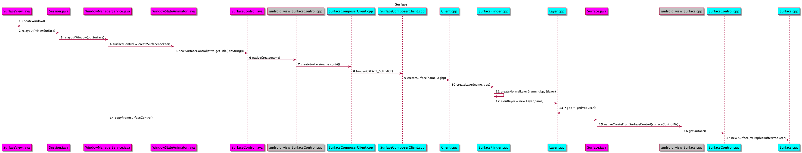


Surface extends ANativeWindow, ANativeWindow是根据EGL规范定义的, 所以它要支持EGL的一系列操作

```c
// Initialize the ANativeWindow function pointers.
ANativeWindow::setSwapInterval  = hook_setSwapInterval;
ANativeWindow::dequeueBuffer    = hook_dequeueBuffer;
ANativeWindow::cancelBuffer     = hook_cancelBuffer;
ANativeWindow::queueBuffer      = hook_queueBuffer;
ANativeWindow::query            = hook_query;
ANativeWindow::perform          = hook_perform;
```

所以Surface就是Buffer的生产者, 通过queueBuffer来生产Buffer, 那么它对应的消费者是谁呢?


Layer在创建的时候, 会被调用onFirstRef函数, 这里会创建BufferQueue, 自然就有对应的Producer和Consumer

Producer其实是MonitoredProducer, 它继承IGraphicBufferProducer且包含了flinger, 所以可以通知flinger


### 小结

EGL, GLES,  ANativeWindow, BufferProducer, BufferConsumer之间的关系 

* 调用eglGetDisplay会加载opengl es的实现库, 和egl实现库. mstar方案都是用libGLES_mali.so来实现, 所以初始化好egl之后, 就是用opengl es的api来绘制图画
* 调用eglCreateWindowSurface会将本地窗口ANativeWindow与EGL关联起来, ANativeWindow提供了dequeueBuffer和queueBuffer等接口给EGL调用
* 先回顾BufferQueue的相关类, 再继续


## 回顾BufferQueue相关类

### Application的BufferQueue

创建过程在Layer::onFirstRef

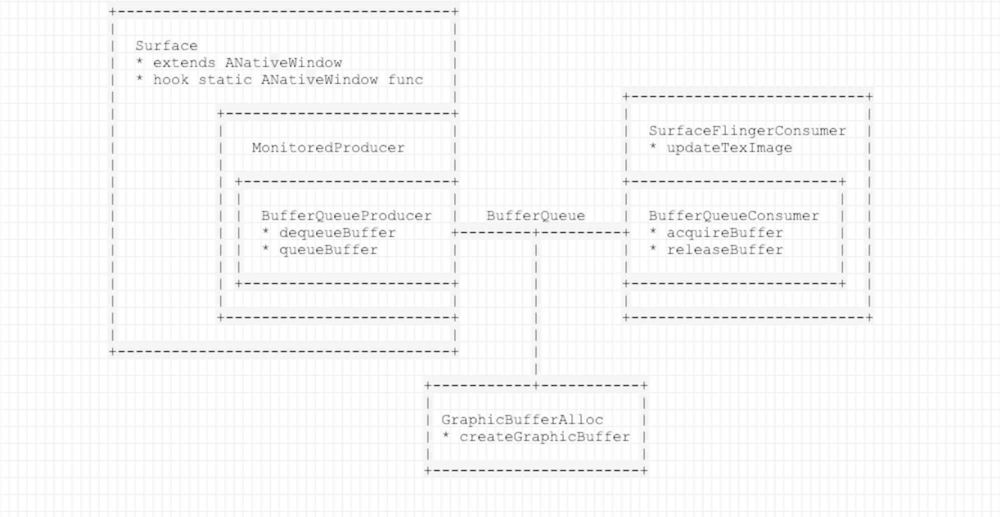


### SurfaceFlinger的BufferQueue

创建过程在SurfaceFlinger::init

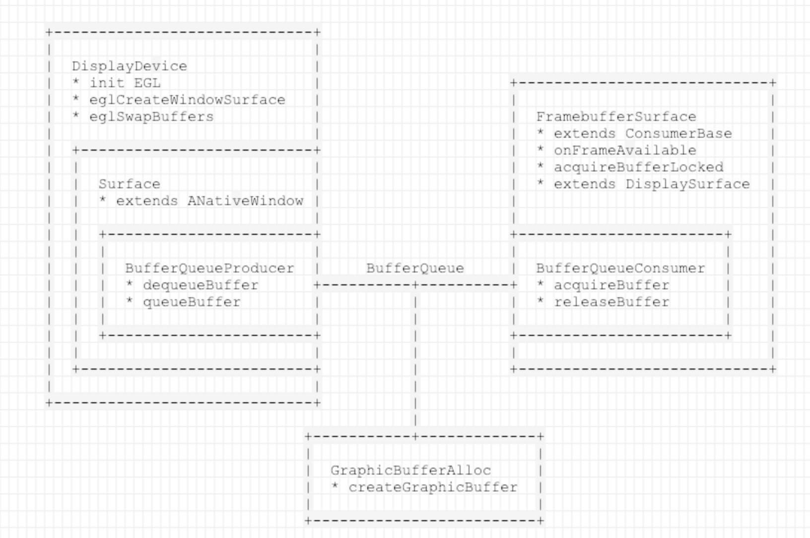


### 小结

* 每个BufferQueue对应有一个Producer和一个Consumer

* Surface是本地窗口, 继承ANativeWindow, 提供dequeueBuffer和queueBuffer接口, 用来渲染图像数据

* App可能有多个本地窗口, 其中ViewRoot必须要有, SurfaceView或者SurfaceTexture或者GLSurfaceView也是一个, 也可能同时存在多个App, 所以App的Surface是可以存在多个的, 每个Surface都是一个Producer, 都有一个SurfaceFlingerConsumer与之对应

* SurfaceFlinger一般只有一个本地窗口, 也是Surface, 被封装在DispDevice里边. 为什么说一般, 而不是绝对? 因为一个DispDevice对应了一个显示设备, 手机或者电视一般只有一个屏, 所以用了一般. 与主屏幕的DispDevice对应消费者是FrameBufferSurface

* 这里可以看到, App和SurfaceFlinger的Producer都是Surface, 但是Consumer不一样, App是SurfaceFlingerConsumer, SurfaceFlinger则是FrameBufferSurface

* 进一步回顾App的producer生产flow和consumer消费flow
* 进一步回顾SurfaceFlinger的producer生产flow和consumer消费flow


## 回顾App的图像数据生产消费flow

### SurfaceView & ACodec Case

Producer的主体flow

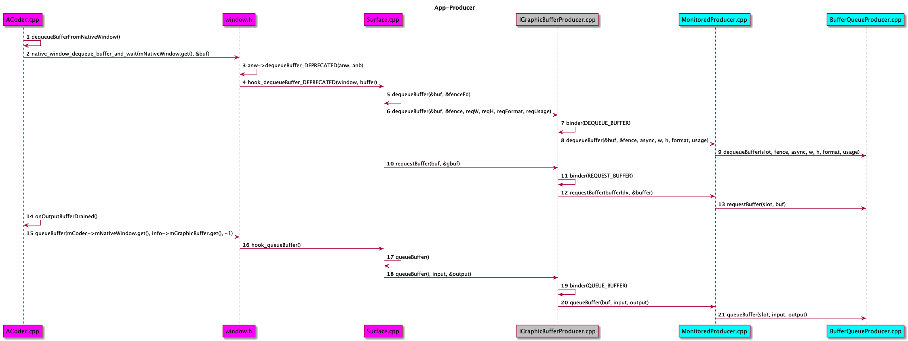


简述

BufferQueueProducer的3支api, (dequeueBuffer, requestBuffer, queueBuffer)

dequeueBuffer

* 出参是mSlots的index, 入参有width, height, format, usage
* 查找mSlots里边最适合的index, 结合BufferState(FREE)和FrameNumber(最小)
* 如果是Video, index会改成BufferState是QUEUED的那个
* 确定好width, height, 如果入参传的是0, 就是default的width和height
* 修改mSlots[index]的BufferState为DEQUEUED
* 判断是否需要reallocate, 如果要求的width, height, format, usage跟mSlots[index]原本的不一样, 就需要
* mCore->mAllocator->createGraphicBuffer(width, height, format, usage, &error)去重新分配buffer
* 为mSlots[index]的mGraphicBuffer重新赋值
* 如果是Video, 每次dequeue的时候, 会call MS_Video_Disp_Wait(MS_Win_ID(dff.OverlayID), MS_WAIT_FRAME_DONE, &dff)

requestBuffer

* 虽然dequeueBuffer里边已经allocate到buffer了, 但是Surface跟BufferQueue是在不同进程里边, App进程只会拿到对应index号, 拿不到Buffer的真正地址
* Surface也有一个数组叫mSlots, 为了创造一份镜像对应BufferQueue的mSlots, 所以需要拿着返回的index和Surface边的mSlots[index].GraphicBuffer的二级指针去requestBuffer
* 返回的GraphicBuffer就跟之前的是同一块了
* Video在这支函数里边没有特别的处理

queueBuffer

* 入参是index(真正的数据已经在对应的GraphicBuffer中), QueueBufferInput(包含了一些buffer的信息, width, height, timestamp, usage等)
* 根据入参index, 修改对应的BufferState为QUEUED
* 根据入参index找到真正的GraphicBuffer, const sp<GraphicBuffer>& graphicBuffer(mSlots[slot].mGraphicBuffer);
* 如果是Video, 这里会去render, MS_Video_Disp_Flip(MS_Win_ID(dff1->OverlayID), (MS_DispFrameFormat*)vaddr);
* 封装成BufferItem, 把它放到FIFO的Queue里边, 供Consumer去acquired


Consumer的主体flow

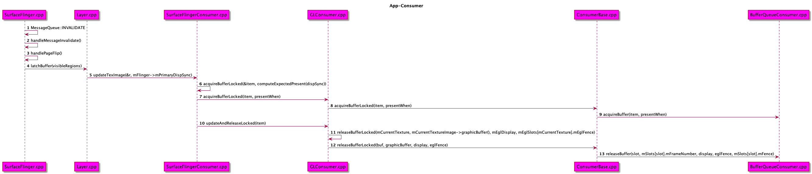


简述

acquireBuffer

* 从mQueue(专门是存放BufferState是QUEUED的元素)中取出第一个元素BufferItem
* 从而获取BufferItem里边的slot, 设置mSlots[slot]的BufferState为ACQUIRED
* 删除mQueue的对应元素
* 返回取出的BufferItem

releaseBufffer

* 入参有mSlots的索引号slot
* 设置mSlots[slot]的BufferState为FREE


### 小结

* producer在mediaserver进程中, queueBuffer的速率是看码流的framerate
* consumer在surfaceflinger进程中, 每次vsync都会去acquireBuffer, vsync的速度是60fps, 所以两边的速率可能不一样


## 回顾SurfaceFlinger的图像数据生产消费flow

Producer的主体flow

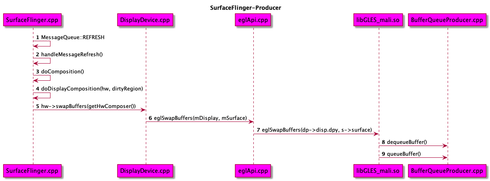

简述

* producer在surfaceflinger进程, 跟着vsync的节奏去产生数据
* EGL的api, eglSwapBuffers内部肯定会dequeueBuffer和queueBuffer, 可以参考看libagl.so的实现


Consumer的主体flow

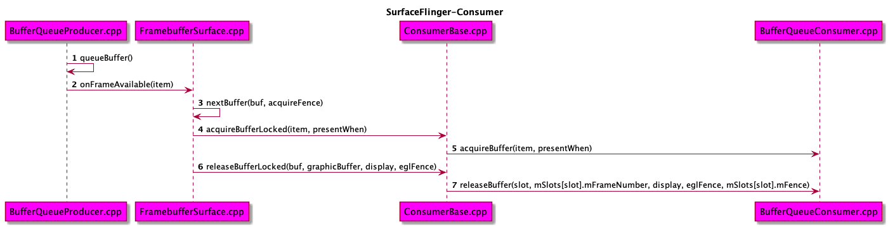

  简述

* 消费的速度跟生产的速度是一样的, 因为每次queueBuffer都会通知到FrameBufferSurface去acquireBuffer


### 小结

* SurfaceFlinger和App的producer, consumer处理时机还是有较大的区别
* 但是producer最终是dequeueBuffer和queueBuffer, consumer最终也是acquireBuffer和releaseBuffer


## 回顾VSync的产生

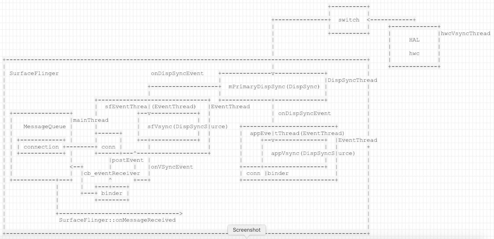


简述

* VSync信号从HAL层hwc模块的hwcVsyncThread发出
* 去到SurfaceFlinger的DisSyncThread再转发出来给EventThread
* 有两条EventThread, 一条给SurfaceFlinger用, 一条给App用
* 通知给App是跨进程的, 需要用到Event::Connection
* 通知到SurfaceFlinger就会最终回调到onMessageReceived的MessageQueue::INVALIDATE. 这也是App本地窗口的Consumer, SurfaceFlinger本地窗口的Producer和Consumer, 的触发时机


### 小结

* appEventThread一直存在
* 如果App需要接收到Vsync, 就需要与appEventThread中间有connection, 创建过程如下

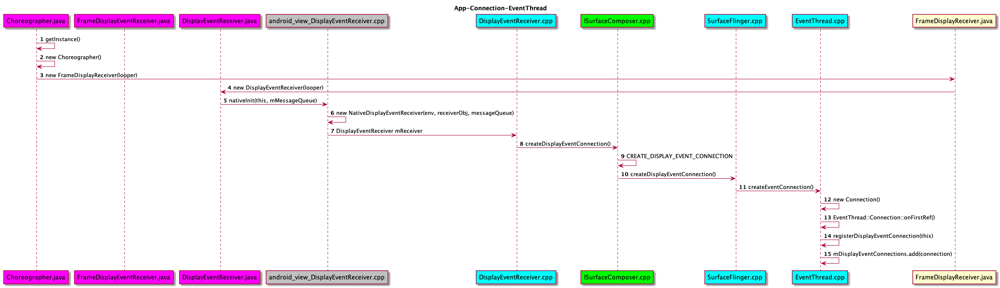


* sfEventThread也是一直存在
* 创建过程如下

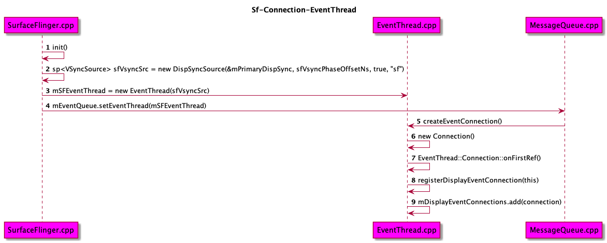

* sf是一直都感兴趣的人


## 回顾VSync的处理

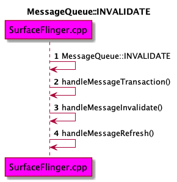

### handleMessageTranscation 安排业务


### handleMessageInvalidate 挑选数据


### handleMessageRefresh 刷新数据


### 小结


## 回顾HWComposer的flow


### 小结


## dumpsys SurfaceFlinger


### 小结


## SurfaceView, SurfaceTexture, GLSurfaceView


### 小结